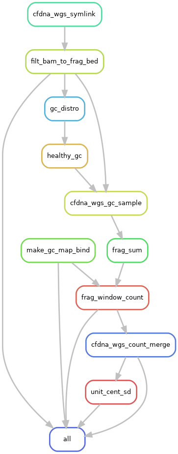

-   documentation
    -   getting started
        -   software in sing container, bild from docker- see
    -   limitations - no check on bwa memory fails

# Introduction

This repository has a snakemake workflow for basic processing of whole-genome sequencing reads from cell-free DNA.

Master branch of the repository contains most recent developments. Stable versions are saved as terminal branches (*e.g.* stable1.0.0).

Directory workflow contains process-focused snakefiles (reads.smk, cna.smk, frag.smk) suitable for integration into another snakemake pipeline using the :include command. The \_int\_test snakefiles are examples of such integration. See config/int\_test.yaml for necessary run conditions.

# Changelog

-   [2023-01-21 Sat]  - Version 8.0.0: Corrected rule filt\_bam\_to\_frag\_bed to fix mates of inputs, which seems to prevent errors in the bamtobed call. Frag\_window\_count now uses windows of consistent 5 Mb size, which are generated from rule make\_gc\_map\_bind. Added a merged fragment counts file and zero-centered unit SD counts.
-   [2022-12-07 Wed]  - Version 7.0.0: Added copy number alteration and DELFI fragmentomics.
-   [2022-10-17 Mon]  - Version 6.0.0: Using fastp for read trimming (replaces trimmomatic). Simplified naming schema. Removed downsampling (will reinstate in later version).
-   [2022-09-08 Thu]  - Version 5.3.0: some minor name changes
-   [2022-08-19 Fri]  - Version 5.2.0 validated: Adds bamCoverage and plotCoverage from deeptools. Benchmarks BWA.
-   [2022-08-09 Tue]  - Version 5.1.0 validated: Added cfdna wgs-specific container for each rule, referenced to config
-   [2022-08-05 Fri]  - Version 5.0.0 validated: Added a symlink rule based on python dictionary. Added repo-specific output naming, added checks for sequence type and file readability to input tsv.
-   [2022-06-27 Mon]  - Version 4 validated. Further expanded read\_qc.tsv table. Removed bam post-processing step and added a more expansive bam filtering step. Updated downsampling to work off filtered alignments.
-   [2022-06-26 Sun]  - Version 3.2 validated. Expanded the qc aggregate table and added some comments.
-   [2022-06-24 Fri]  - Validate version 3.1 which includes genome index build as a snakefile rule.
-   [2022-06-24 Fri]  - Validated version 3 with read number checkpoint for down-sampling.
-   [2022-05-31 Tue]  - Conforms to current biotools best practices.
-   [2022-04-29 Fri]  - Moved multiqc to integration testing as inputs are dependent on final sample labels. Integration testing works per this commit.
