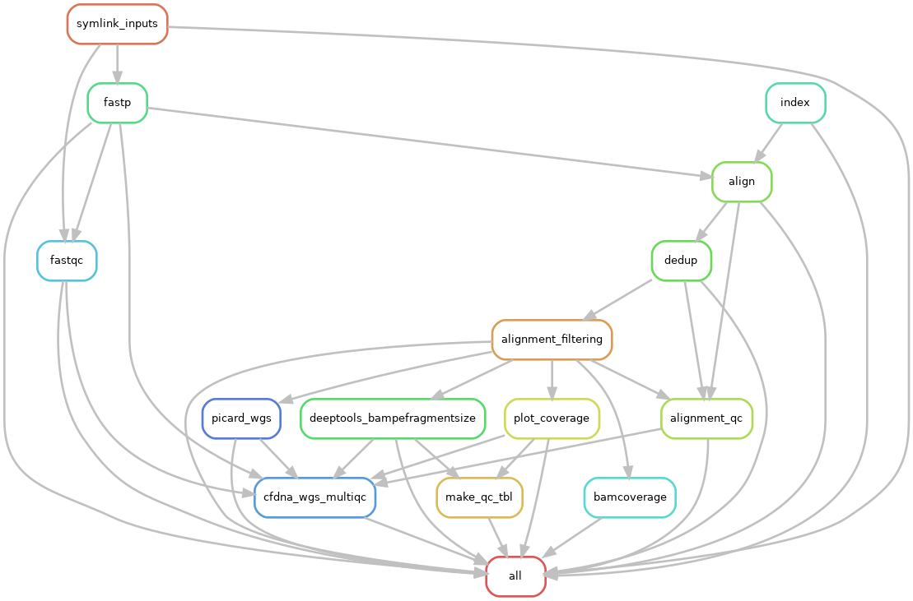

# Introduction

This repository has a snakemake workflow for basic processing of whole-genome sequencing reads from cell-free DNA.

Master branch of the repository contains most recent developments. Stable versions are saved as terminal branches (*e.g.* stable1.0.0).

Files labeled int\_test will run integration testing of all rules on a small dataset in test/inputs. See config/int\_test.yaml for necessary run conditions.

# Changlog

-   [2022-08-09 Tue]  - Version 5.1.0 validated: Added cfdna wgs-specific container for each rule, referenced to config
-   [2022-08-05 Fri]  - Version 5.0.0 validated: Added a symlink rule based on python dictionary. Added repo-specific output naming, added checks for sequence type and file readability to input tsv.
-   [2022-06-27 Mon]  - Version 4 validated. Further expanded read\_qc.tsv table. Removed bam post-processing step and added a more expansive bam filtering step. Updated downsampling to work off filtered alignments.
-   [2022-06-26 Sun]  - Version 3.2 validated. Expanded the qc aggregate table and added some comments.
-   [2022-06-24 Fri]  - Validate version 3.1 which includes genome index build as a snakefile rule.
-   [2022-06-24 Fri]  - Validated version 3 with read number checkpoint for down-sampling.
-   [2022-05-31 Tue]  - Conforms to current biotools best practices.
-   [2022-04-29 Fri]  - Moved multiqc to integration testing as inputs are dependent on final sample labels. Integration testing works per this commit.
