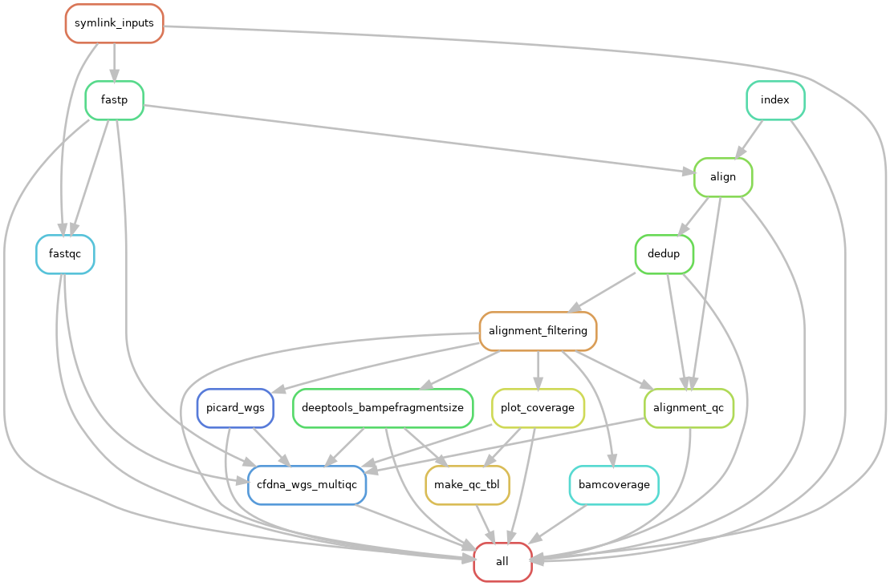

* Cell-free DNA Fragmentomics                                       :biopipe:
:PROPERTIES:
:header-args: :tangle no :mkdirp yes :tangle-mode (identity #o555)
:ID:       f0fbade8-2251-4aec-958f-ac1e1edd6c18
:END:
** [[elisp:(progn (org-babel-goto-named-src-block "git-workflow-up") (org-babel-execute-src-block))][Run git workflow up]]
** [[https://github.com/jeszyman/cfdna][GitHub url]]
** Repository setup and administration
:PROPERTIES:
:ID:       2b64f328-8636-4068-8d09-9d698cc26822
:END:

#+name: git-workflow-up
#+begin_src bash :results replace raw
source ~/repos/basecamp/lib/basecamp_functions.sh
cd ~/repos/emseq
output=$(git_wkflow_up 2>&1)
if [ $? -ne 0 ]; then
    echo "Error running git_wkflow_up"
    echo "$output"
    exit 1
fi

echo -e "$(date)\n$output"

#+end_src

#+RESULTS: git-workflow-up
Wed Jul  2 07:13:15 AM CDT 2025
[master 78d0110] .
 1 file changed, 5 insertions(+)
To github.com:jeszyman/emseq.git
   5461750..78d0110  master -> master

*** Conda environmental YAMLs
**** cfDNA CNA
#+begin_src yaml :tangle ./config/cfdna-cna-conda-env.yaml
name: cfdna_cna
channels:
  - conda-forge
  - bioconda

dependencies:
  - bioconductor-genomeinfodb
  - bioconductor-genomicranges
  - bioconductor-hmmcopy
  - hmmcopy
  - r-argparse
  - r-optparse
  - samtools
  - snakemake
  - r-plyr
#+end_src

**** cfDNA WGS
#+begin_src yaml :tangle ./config/cfdna-wgs-conda-env.yaml
name: cfdna_wgs
channels:
  - conda-forge
  - bioconda

dependencies:
  - bwa
  - deeptools
  - fastp
  - fastqc
  - samtools
  - snakemake
#+end_src

*** Bash source
:PROPERTIES:
:ID:       1d8ba95c-8206-4b6b-9086-e9503193ec86
:END:
#+begin_src bash :tangle ./config/bash_src
data_dir="/mnt/ris/szymanski/Active/test"
#+end_src
*** Setup inputs for testing
:PROPERTIES:
:ID:       439cfd95-f124-4597-95b3-085a912bc5b9
:END:
- blacklist
  #+begin_src bash
source config/bash_src
wget --directory-prefix="${data_dir}/inputs" \
     --no-clobber \
     wget https://github.com/Boyle-Lab/Blacklist/raw/master/lists/hg38-blacklist.v2.bed.gz
#+end_src
- hg38
  #+begin_src bash
source config/bash_src
wget --directory-prefix="${data_dir}/inputs" \
     --no-clobber \
     ftp://ftp.ncbi.nlm.nih.gov/genomes/all/GCA/000/001/405/GCA_000001405.15_GRCh38/seqs_for_alignment_pipelines.ucsc_ids/GCA_000001405.15_GRCh38_no_alt_analysis_set.fna.gz
#+end_src
- cfDNA WGS fastqs
  #+begin_src bash
source config/bash_src

mntpt=/mnt/ris/aadel/Active

fq_size=1000000

zcat ${mntpt}/mpnst/inputs/seq/MPNST/19_2_082_R1.fastq.gz | head -n $fq_size > ${data_dir}/inputs/19_2_082_R1.fastq.gz
zcat ${mntpt}/mpnst/inputs/seq/MPNST/19_2_082_R2.fastq.gz | head -n $fq_size > ${data_dir}/inputs/19_2_082_R2.fastq.gz

zcat ${mntpt}/mpnst/inputs/seq/MPNST/25_2_072_R1.fastq.gz | head -n $fq_size > ${data_dir}/inputs/25_2_072_R1.fastq
zcat ${mntpt}/mpnst/inputs/seq/MPNST/25_2_072_R2.fastq.gz | head -n $fq_size > ${data_dir}/inputs/25_2_072_R2.fastq

zcat ${mntpt}/mpnst/inputs/seq/PN/37_JS0050CD112717_R1.fastq.gz | head -n $fq_size > ${data_dir}/inputs/JS0050CD112717_R1.fastq
zcat ${mntpt}/mpnst/inputs/seq/PN/37_JS0050CD112717_R2.fastq.gz | head -n $fq_size > ${data_dir}/inputs/JS0050CD112717_R2.fastq

zcat ${mntpt}/mpnst/inputs/seq/KO_10_23_17_R1.fastq.gz | head -n $fq_size > ${data_dir}/inputs/KO_10_23_17_R1.fastq.gz
zcat ${mntpt}/mpnst/inputs/seq/KO_10_23_17_R2.fastq.gz | head -n $fq_size > ${data_dir}/inputs/KO_10_23_17_R2.fastq.gz

zcat ${mntpt}/mpnst/inputs/seq/TS_36M_R1.fastq.gz | head -n $fq_size > ${data_dir}/inputs/TS_36M_R1.fastq.gz
zcat ${mntpt}/mpnst/inputs/seq/TS_36M_R2.fastq.gz | head -n $fq_size > ${data_dir}/inputs/TS_36M_R2.fastq.gz

zcat ${mntpt}/mpnst/inputs/seq/KS_30F_R1.fastq.gz | head -n $fq_size > ${data_dir}/inputs/KS_30F_R1.fastq.gz
zcat ${mntpt}/mpnst/inputs/seq/KS_30F_R2.fastq.gz | head -n $fq_size > ${data_dir}/inputs/KS_30F_R2.fastq.gz

for file in ${data_dir}/inputs/*.fastq; do gzip -f $file; done
#+end_src
- frag_ligs.tsv [[file:/mnt/ris/szymanski/Active/test/inputs/frag_libs.tsv]]
  | library | r1_basename             | cohort    |
  |---------+-------------------------+-----------|
  | lib001  | 19_2_082_R1.fastq.gz    | mpnst     |
  | lib002  | 25_2_072_R1.fastq       | mpnst     |
  | lib003  | JS0050CD112717_R1.fastq | plexiform |
  | lib004  | KO_10_23_17_R1.fastq.gz | plexiform |
  | lib005  | TS_36M_R1.fastq.gz      | healthy   |
  | lib006  | KS_30F_R1.fastq.gz      | healthy   |
*** [[file:config/frag_env.yaml][Fragmentomics environment YAML]]
:PROPERTIES:
:ID:       4e606db9-72e7-4c62-acdc-224c34e4bc3d
:END:
#+begin_src fundamental :tangle ./config/frag_env.yaml
name: frag
channels:
  - conda-forge
  - bioconda

dependencies:
  - bwa
  - r-tidyverse
  - samtools
  - snakemake
#+end_src
*** [[file:config/int_test.yaml][Snakemake configuration YAML]]
:PROPERTIES:
:header-args:bash: :tangle ./config/int_test.yaml
:ID:       7b9f7d71-ef63-4980-90ce-21903eacbef7
:END:
#+begin_src bash

##############################
###   Configuration Yaml   ###
##############################

###   Parameters Intended To Be Common Across Workflows    ###

blklist: "/mnt/ris/szymanski/Active/test/inputs/hg38-blacklist.v2.bed.gz"
data_dir: "/mnt/ris/szymanski/Active/test"
genome_fasta: "/mnt/ris/szymanski/Active/test/inputs/GCA_000001405.15_GRCh38_no_alt_analysis_set.fna.gz"
threads: 4

###   Unique properties from this repo   ###

frag_repo: "/home/jszymanski/repos/cfdna-wgs"

frag_distro: "90_150"

gc5mb: "test/inputs/gc5mb.bed"

#+end_src
** README
:PROPERTIES:
:export_file_name: ./README.md
:export_options: toc:nil ^:nil
:ID:       a94fc0ef-ea37-4ebb-9cce-4760fd637d15
:END:
- Note that ichor reference files are in UCSC ("chr"-prefixed) format

*** Introduction
:PROPERTIES:
:ID:       0a8a24f4-7c5f-47d0-b057-026ebfddf4dc
:END:
This repository hosts a snakemake workflow for basic processing of whole-genome sequencing reads from cell-free DNA.

*** Organization
:PROPERTIES:
:ID:       b826f026-70d1-480e-be6c-f829207124f0
:END:
Master branch of the repository contains most recent developments while stable versions are saved as terminal branches (/e.g./ stable.1.0.0).

Directory ~workflow~ contains two types of workflows- process-focused snakefiles (reads.smk, cna.smk, frag.smk) suitable for integration into another snakemake pipeline using the :include command, and the _int_test snakefile with examples of such integration using the repository test data.
*** Use
:PROPERTIES:
:ID:       b9eadaa0-d3ba-4c23-97a1-095f1cefcf6d
:END:
- All software needed for the pipeline is present within the associated docker container (see ~docker~ and https://hub.docker.com/repository/docker/jeszyman/frag/general).
- See the example configuration yaml ~config/int_test.yaml~ and wrapper workflow ~workflow/int_test.smk~ for necessary run conditions.
*** Changelog
:PROPERTIES:
:ID:       dbe230c9-b8a6-44f3-b9a1-67fd70f47895
:END:
- [2023-01-26 Thu] - Version 9.1.0: Repo cleanup
- [2023-01-26 Thu] - Version 9.0.0: Removed -f 3 flag for perfectly matched pairs in samtools filtering as the flag from BWA removes some fragments at a set max length. Added framework for benchmark analysis. Added conditional execution of downsampling. Removed (temporarily) final wig and ichor commands of CNA as these don't currently run correctly without full genome alignment, so can't be validated on test data. Added local documentation of cfdna-wgs dockerfile.
- [2023-01-21 Sat] - Version 8.0.0: Corrected rule filt_bam_to_frag_bed to fix mates of inputs, which seems to prevent errors in the bamtobed call. Frag_window_count now uses windows of consistent 5 Mb size, which are generated from rule make_gc_map_bind. Added a merged fragment counts file and zero-centered unit SD counts.
- [2022-12-07 Wed] - Version 7.0.0: Added copy number alteration and DELFI fragmentomics.
- [2022-10-17 Mon] - Version 6.0.0: Using fastp for read trimming (replaces trimmomatic). Simplified naming schema. Removed downsampling (will reinstate in later version).
- [2022-09-08 Thu] - Version 5.3.0: some minor name changes
- [2022-08-19 Fri] - Version 5.2.0 validated: Adds bamCoverage and plotCoverage from deeptools. Benchmarks BWA.
- [2022-08-09 Tue] - Version 5.1.0 validated: Added cfdna wgs-specific container for each rule, referenced to config
- [2022-08-05 Fri] - Version 5.0.0 validated: Added a symlink rule based on python dictionary. Added repo-specific output naming, added checks for sequence type and file readability to input tsv.
- [2022-06-27 Mon] - Version 4 validated. Further expanded read_qc.tsv table. Removed bam post-processing step and added a more expansive bam filtering step. Updated downsampling to work off filtered alignments.
- [2022-06-26 Sun] - Version 3.2 validated. Expanded the qc aggregate table and added some comments.
- [2022-06-24 Fri] - Validate version 3.1 which includes genome index build as a snakefile rule.
- [2022-06-24 Fri] - Validated version 3 with read number checkpoint for down-sampling.
- [2022-05-31 Tue] - Conforms to current biotools best practices.
- [2022-04-29 Fri] - Moved multiqc to integration testing as inputs are dependent on final sample labels. Integration testing works per this commit.
** cfDNA WGS
:PROPERTIES:
:header-args:snakemake: :tangle ./workflows/cfdna_wgs.smk
:END:
[[file:workflows/cfdna_wgs.smk]]
*** Preamble
#+begin_src snakemake
###############################
###   cfDNA WGS Snakefile   ###
###############################

#########1#########2#########3#########4#########5#########6#########7#########8
# A snakefile for basic processing of cell-free DNA whole-genome sequecing data.

# ---   Dependencies   --- #
# ------------------------ #

# ./config/cfdna-wgs-conda-env.yaml, a conda environment file
# Scripts within ./scripts

# ---   Configuration Parameters   --- #
# ------------------------------------ #

# Parameters to be defined at the configuration yaml include:
#
# available_concurrency:
# data-temp-dir:
# mosdepth-quant-levels:
#
# ref_assemblies:
#   <ASSEMBLY ID>:
#     url:
#     name:
#     input:

# Example minimal configuration yaml:
# This is a nested map, e.g.:
# ref_assemblies:
#   ncbi_decoy_hg38:
#     url: https://ftp.ncbi.nlm.nih.gov/genomes/all/GCA/000/001/405/GCA_000001405.15_GRCh38/seqs_for_alignment_pipelines.ucsc_ids/GCA_000001405.15_GRCh38_no_alt_plus_hs38d1_analysis_set.fna.gz
#     name: ncbi_decoy_hg38
#     input: GCA_000001405.15_GRCh38_no_alt_plus_hs38d1_analysis_set.fa.gz

# {Parameters} to be defined at the level of the snakefile include
#
# data_dir
# config['cfdna-scripts-dir']

# {{Wildcards}} to be defined in the wrapper snakefile rule all include:
#
# library_id
# processing
# read
# ref_name
# align_method

#<#~/repos/basecamp/basecamp.org:smk_comment_modular()#>

#<#~/repos/basecamp/basecamp.org:smk_comment_datadir()#>

# Specifically here, most ouputs will return to {data_dir}/cfdna-wgs

#<#~/repos/basecamp/basecamp.org:smk_comment_conda()#>

#<#~/repos/basecamp/basecamp.org:smk_comment_concurrency()#>

#+end_src

*** Fastq processing with fastp
#+begin_src snakemake

rule cfdna_wgs_fastp:
    #
    # fastp for cfDNA WGS. Uses a set thread count of 8. Adapters are
    # auto-detected.
    #
    conda:
        "../config/cfdna-wgs-conda-env.yaml"
    input:
        r1 = f"{config['cfdna-wgs-dir']}/fastqs/{{library_id}}.raw_R1.fastq.gz",
        r2 = f"{config['cfdna-wgs-dir']}/fastqs/{{library_id}}.raw_R2.fastq.gz",
    log:
        html = f"{config['log-dir']}/{{library_id}}_cfdna_wgs_fastp.html",
        json = f"{config['log-dir']}/{{library_id}}_cfdna_wgs_fastp.json",
        run = f"{config['log-dir']}/{{library_id}}_cfdna_wgs_fastp.log",
    output:
        failed = f"{config['cfdna-wgs-dir']}/fastqs/{{library_id}}.failed.fastq.gz",
        r1 = f"{config['cfdna-wgs-dir']}/fastqs/{{library_id}}.processed_R1.fastq.gz",
        r2 = f"{config['cfdna-wgs-dir']}/fastqs/{{library_id}}.processed_R2.fastq.gz",
        up1 = f"{config['cfdna-wgs-dir']}/fastqs/{{library_id}}.unpaired_R1.fastq.gz",
        up2 = f"{config['cfdna-wgs-dir']}/fastqs/{{library_id}}.unpaired_R2.fastq.gz",
    resources:
        concurrency=12,
    threads:
        10
    shell:
        """
        fastp --detect_adapter_for_pe \
        --failed_out {output.failed} \
        --in1 {input.r1} --in2 {input.r2} \
        --html {log.html} --json {log.json} \
        --out1 {output.r1} --out2 {output.r2} \
        --unpaired1 {output.up1} --unpaired2 {output.up2} \
        --thread {threads} &> {log.run}
        """
#+end_src
*** FastQC
#+begin_src snakemake
rule cfdna_wgs_fastqc:
    conda:
        "../config/cfdna-wgs-conda-env.yaml"
    input:
        f"{config['cfdna-wgs-dir']}/fastqs/{{library_id}}.{{processing}}_{{read}}.fastq.gz",
    log:
        f"{config['log-dir']}/{{library_id}}.{{processing}}_{{read}}_cfdna_wgs_fastqc.log",
    output:
        f"{config['cfdna-wgs-dir']}/qc/{{library_id}}.{{processing}}_{{read}}_fastqc.html",
        f"{config['cfdna-wgs-dir']}/qc/{{library_id}}.{{processing}}_{{read}}_fastqc.zip",
    params:
        outdir = f"{config['cfdna-wgs-dir']}/qc",
    resources:
        concurrency = 25,
    threads:
        2
    shell:
        """
        fastqc \
        --outdir {params.outdir} \
        --quiet \
        --svg \
        --threads {threads} \
        {input} &> {log}
        """

#+end_src
*** BWA index
#+begin_src snakemake

#########1#########2#########3#########4#########5#########6#########7#########8
rule cfdna_wgs_bwa_index:
    #
    # Builds BWA reference off of an existing fasta file in the
    # {data_dir}/inputs directory. Uses a nested map from the config yaml. Also
    # created are a fasta index (.fai) and a bed file of the primary assembly
    # (numbered chromosomes and X and Y, no mitochondria or other contigs).
    #
    conda:
        "../config/cfdna-wgs-conda-env.yaml"
    input:
        lambda wildcards: f"{config['data-dir']}/inputs/{config['ref_assemblies'][wildcards.name]['input']}",
    output:
        fa = f"{config['data-dir']}/ref/bwa/{{name}}/{{name}}.fa",
        fai = f"{config['data-dir']}/ref/bwa/{{name}}/{{name}}.fa.fai",
        bed = f"{config['data-dir']}/ref/bwa/{{name}}/{{name}}.primary.bed",
        amb = f"{config['data-dir']}/ref/bwa/{{name}}/{{name}}.amb",
        ann = f"{config['data-dir']}/ref/bwa/{{name}}/{{name}}.ann",
        bwt = f"{config['data-dir']}/ref/bwa/{{name}}/{{name}}.bwt",
        pac = f"{config['data-dir']}/ref/bwa/{{name}}/{{name}}.pac",
        sa  = f"{config['data-dir']}/ref/bwa/{{name}}/{{name}}.sa",
    params:
        bwa_prefix = lambda wildcards: f"{config['data-dir']}/ref/bwa/{wildcards.name}/{wildcards.name}",
        script = f"{config['cfdna-scripts-dir']}/cfdna_wgs_bwa_index.sh",
    log:
        f"{config['log-dir']}/{{name}}_bwa_index.log"
    shell:
        """
        {params.script} \
        {input} \
        {output.fa} \
        {output.fai} \
        {output.bed} \
        {params.bwa_prefix} \
        {log}
        """

#+end_src

- Shell script
  #+begin_src bash :tangle ./scripts/cfdna_wgs_bwa_index.sh
#!/usr/bin/env bash
set -o errexit
set -o nounset
set -o pipefail

print_usage() {
    cat <<EOF
USAGE: bwa_index.sh <INPUT_FASTA_GZ> <OUTPUT_FASTA> <OUTPUT_FAI> <OUTPUT_BED> <BWA_PREFIX> <LOG_FILE>

DESCRIPTION:
  Prepare a BWA index from a gzipped FASTA input, including .fai indexing and BED file generation.

REQUIRED ARGUMENTS:
  <INPUT_FASTA_GZ>   Path to input .fa.gz file
  <OUTPUT_FASTA>     Ungzipped target FASTA output path
  <OUTPUT_FAI>       Output .fai file (samtools faidx)
  <OUTPUT_BED>       Output BED file for primary chromosomes
  <BWA_PREFIX>       Prefix for BWA index files
  <LOG_FILE>         Log file for BWA index command

OPTIONS:
  -h, --help         Show this help message

EXAMPLE:
  bwa_index.sh hg38.fa.gz ref/hg38/hg38.fa ref/hg38/hg38.fa.fai ref/hg38/hg38.primary.bed ref/hg38/hg38 ref/hg38/bwa_index.log
EOF
}

main() {
    parse_args "$@"
    make_index_dir
    decompress_fasta
    index_fasta
    generate_bed
    run_bwa_index
}

parse_args() {
    if [[ "${1:-}" == "-h" || "${1:-}" == "--help" ]]; then
        print_usage
        exit 0
    fi

    if [[ $# -ne 6 ]]; then
        echo "Error: Expected 6 arguments."
        print_usage
        exit 1
    fi

    declare -g input_fasta_gz="$1"
    declare -g output_fasta="$2"
    declare -g output_fai="$3"
    declare -g output_bed="$4"
    declare -g bwa_prefix="$5"
    declare -g log_file="$6"
}

make_index_dir() {
    mkdir -p "$(dirname "$output_fasta")"
}

decompress_fasta() {
    echo "Decompressing $input_fasta_gz to $output_fasta"
    gzip -dc "$input_fasta_gz" > "$output_fasta"
}

index_fasta() {
    echo "Indexing $output_fasta with samtools faidx"
    samtools faidx "$output_fasta"
}

generate_bed() {
    echo "Generating BED file: $output_bed"
    cut -f1,2 "$output_fai" \
        | grep -E '^chr([1-9]|1[0-9]|2[0-2]|X|Y)\s' \
        | awk '{print $1 "\t0\t" $2}' > "$output_bed"
}

run_bwa_index() {
    echo "Running bwa index: $bwa_prefix"
    bwa index -p "$bwa_prefix" "$output_fasta" > "$log_file" 2>&1
}

main "$@"

#+end_src

*** BWA align
- [ ] ensure the tmps go to local
#+begin_src snakemake

rule cfdna_wgs_bwa_mem:
    conda:
        "../config/cfdna-wgs-conda-env.yaml"
    input:
        r1 = f"{config['cfdna-wgs-dir']}/fastqs/{{library_id}}.processed_R1.fastq.gz",
        r2 = f"{config['cfdna-wgs-dir']}/fastqs/{{library_id}}.processed_R2.fastq.gz",
        sa_check = f"{config['data-dir']}/ref/bwa/{{ref_name}}/{{ref_name}}.sa",
    output:
        bam = f"{config['cfdna-wgs-dir']}/bams/{{library_id}}.{{ref_name}}.bwa.coorsort.bam",
    params:
        ref = f"{config['data-dir']}/ref/bwa/{{ref_name}}/{{ref_name}}",
    resources:
        concurrency = 100,
    threads:
        50
    shell:
        """
        bwa mem -M -t {threads} \
        {params.ref} {input.r1} {input.r2} \
        | samtools view -@ 4 -Sb - -o - \
        | samtools sort -@ 4 - -o {output.bam}
        samtools index -@ 4 {output.bam}
        """

#+end_src

*** De-duplicate bams
#+begin_src snakemake

rule cfdna_wgs_bam_dedup:
    #
    # 1) Name sort, required by fixmate
    # 2) Fixmate adds mate-pair info needed for deduping
    # 3) Coordinate sorting, required by markdup
    # 4) Markdup REMOVING PCR duplicates
    #
    conda:
        "../config/cfdna-wgs-conda-env.yaml",
    input:
        f"{config['cfdna-wgs-dir']}/bams/{{library_id}}.{{ref_name}}.{{align_method}}.coorsort.bam",
    log:
        f"{config['log-dir']}/{{library_id}}.{{ref_name}}.{{align_method}}_cfdna_wgs_bam_dedup.log",
    output:
        bam = f"{config['cfdna-wgs-dir']}/bams/{{library_id}}.{{ref_name}}.{{align_method}}.dedup.coorsort.bam",
        bai = f"{config['cfdna-wgs-dir']}/bams/{{library_id}}.{{ref_name}}.{{align_method}}.dedup.coorsort.bam.bai",
    params:
        tmp_dir = config["local-tmp-dir"]
    shell:
        """
        rm -rf  {params.tmp_dir}/{wildcards.library_id}.namesort
        mkdir -p {params.tmp_dir}/{wildcards.library_id}.namesort
        samtools sort -@ 8 -n -T {params.tmp_dir}/{wildcards.library_id}.namesort -o - {input} \
        | samtools fixmate -@ 8 -m - - \
        | samtools sort -@ 8 -T {params.tmp_dir}/{wildcards.library_id}.namesort -o - - \
        | samtools markdup -@ 8 -r -T {params.tmp_dir}/{wildcards.library_id}.namesort - {output.bam}
        samtools index -@ 4 {output.bam}
        """

#+end_src
*** Filter bams
#+begin_src snakemake
rule cfdna_wgs_bam_filt:
    #
    # Excludes any unmapped (0x4),
    #  not primary alignment (0x100),
    #  or duplicates (0x400)
    #
    # Only MAPQ > 20
    #
    # Restrict to primary chromosomes
    #
    # DO NOT restrict to "proper pairs"- this clips long cfDNA fragments!
    #
    conda:
        "../config/cfdna-wgs-conda-env.yaml",
    input:
        bam = f"{config['cfdna-wgs-dir']}/bams/{{library_id}}.{{ref_name}}.{{align_method}}.dedup.coorsort.bam",
        bed = f"{config['data-dir']}/ref/bwa/{{ref_name}}/{{ref_name}}.primary.bed",
    log:
        f"{config['log-dir']}/{{library_id}}.{{ref_name}}.{{align_method}}_cfdna_wgs_bam_filt.log",
    output:
        bam = f"{config['cfdna-wgs-dir']}/bams/{{library_id}}.{{ref_name}}.{{align_method}}.dedup.coorsort.filt.bam",
        bai = f"{config['cfdna-wgs-dir']}/bams/{{library_id}}.{{ref_name}}.{{align_method}}.dedup.coorsort.filt.bam.bai",
    shell:
        """
        samtools view -@ 8 -b -F 1284 -h -q 20 -L {input.bed} -o {output.bam} {input.bam}
        samtools index {output.bam}
        """
#+end_src
*** Alignment QC
**** Samtools
#+begin_src snakemake
rule cfdna_wgs_samtools_alignment_qc:
    conda:
        "../config/cfdna-wgs-conda-env.yaml",
    input:
        f"{config['cfdna-wgs-dir']}/bams/{{library_id}}.{{ref_name}}.{{align_method}}.{{processing}}.bam",
    log:
        flagstat = f"{config['log-dir']}/{{library_id}}.{{ref_name}}.{{align_method}}.{{processing}}_cfdna_wgs_flagstat.log",
        samstat = f"{config['log-dir']}/{{library_id}}.{{ref_name}}.{{align_method}}.{{processing}}_cfdna_wgs_samstat.log",
    output:
        flagstat = f"{config['cfdna-wgs-dir']}/qc/{{library_id}}.{{ref_name}}.{{align_method}}.{{processing}}_flagstat.txt",
        samstat = f"{config['cfdna-wgs-dir']}/qc/{{library_id}}.{{ref_name}}.{{align_method}}.{{processing}}_samstat.txt",
    params:
        script = f"{config['cfdna-scripts-dir']}/samtools_alignment_qc.sh",
        threads = 8,
    shell:
        """
        {params.script} \
        {input} \
        {log.flagstat} \
        {log.samstat} \
        {output.flagstat} \
        {output.samstat} \
        {params.threads}
        """
#+end_src

- [[file:scripts/alignment_qc.sh][Shell script]]
  #+begin_src bash :tangle ./scripts/samtools_alignment_qc.sh
#!/usr/bin/env bash
set -o errexit   # abort on nonzero exitstatus
set -o nounset   # abort on unbound variable
set -o pipefail  # don't hide errors within pipes

# Script variables
input="${1}"
log_flagstat="${2}"
log_samstat="${3}"
output_flagstat="${4}"
output_samstat="${5}"
threads="${6}"

# Functions
main(){
    flagstat $input $output_flagstat $log_flagstat $threads
    samstats $input $output_samstat $log_samstat $threads
}

flagstat(){
    local input="${1}"
    local output="${2}"
    local log="${3}"
    local threads="${4}"
    #
    samtools flagstat -@ $threads $input > $output 2>$log
}

samstats(){
    local input="${1}"
    local output="${2}"
    local log="${3}"
    local threads="${4}"
    #
    samtools stats -@ $threads $input > $output 2>$log
}

# Run
main "$@"
#+end_src

**** Mosdepth
#+begin_src snakemake
rule cfdna_wgs_mosdepth:
    conda:
        "../config/cfdna-wgs/conda-env.yaml",
    input:
        bam = f"{config['cfdna-wgs-dir']}/bams/{{library_id}}.{{ref_name}}.{{align_method}}.dedup.coorsort.filt.bam",
        index = f"{config['cfdna-wgs-dir']}/bams/{{library_id}}.{{ref_name}}.{{align_method}}.dedup.coorsort.filt.bam",
    output:
        summary = f"{config['cfdna-wgs-dir']}/qc/mosdepth_{{library_id}}.{{ref_name}}.{{align_method}}.mosdepth.summary.txt",
        global_dist = f"{config['cfdna-wgs-dir']}/qc/mosdepth_{{library_id}}.{{ref_name}}.{{align_method}}.mosdepth.global.dist.txt",
        region_dist = f"{config['cfdna-wgs-dir']}/qc/mosdepth_{{library_id}}.{{ref_name}}.{{align_method}}.mosdepth.region.dist.txt",
        regions = f"{config['cfdna-wgs-dir']}/qc/mosdepth_{{library_id}}.{{ref_name}}.{{align_method}}.regions.bed.gz",
        regions_idx = f"{config['cfdna-wgs-dir']}/qc/mosdepth_{{library_id}}.{{ref_name}}.{{align_method}}.regions.bed.gz.csi",
        quantized = f"{config['cfdna-wgs-dir']}/qc/mosdepth_{{library_id}}.{{ref_name}}.{{align_method}}.quantized.bed.gz",
        quantized_idx = f"{config['cfdna-wgs-dir']}/qc/mosdepth_{{library_id}}.{{ref_name}}.{{align_method}}.quantized.bed.gz.csi",
        thresholds = f"{config['cfdna-wgs-dir']}/qc/mosdepth_{{library_id}}.{{ref_name}}.{{align_method}}.thresholds.bed.gz",
        thresholds_idx = f"{config['cfdna-wgs-dir']}/qc/mosdepth_{{library_id}}.{{ref_name}}.{{align_method}}.thresholds.bed.gz.csi",
    params:
        script = f"{config['cfdna-scripts-dir']}/cdfna_wgs_mosdepth.sh",
        quant_levels = config["mosdepth-quant-levels"],
        out_dir = f"{config['cfdna-wgs-dir']}/qc",
    threads: 8,
    resources:
        concurrency = 20,
    shell:
        """
        {params.script} \
        {input.bam} \
        {params.out_dir} \
        {wildcards.library_id}.{wildcards.ref_name}.{wildcards.align_method} \
        '{params.quant_levels}' \
        {threads}
        """

#+end_src
  #+begin_src bash :tangle ./scripts/cdfna_wgs_mosdepth.sh :tangle-mode (identity #o555)
#!/usr/bin/env bash
set -euo pipefail

# -----------------------------------------------------------------------------
# mosdepth-wrapper.sh
#
# This script wraps the `mosdepth` tool to compute read depth over a BAM file,
# optimized for EM-seq cfDNA data. It configures the run to:
#   - use median depth (`--use-median`)
#   - run in fast mode (no per-base depth)
#   - report thresholds and quantized bins
#   - generate output in 1000bp windows
#
# Output files are written using a prefix of "mosdepth_<OUT_PREFIX>" in <OUT_DIR>.
# Designed for use in explicit I/O workflows like Snakemake or manual batch calls.
# -----------------------------------------------------------------------------

print_usage() {
    cat <<EOF
USAGE: mosdepth-wrapper.sh <BAM> <OUT_DIR> <OUT_PREFIX> <QUANT_LEVELS> [THREADS]

DESCRIPTION:
  Run mosdepth on a BAM file with EM-seq-appropriate settings.
  QUANT_LEVELS is a comma-separated string of coverage cutoffs (e.g. 1,5,10,20).
  The OUT_PREFIX will be prepended with 'mosdepth_' before being passed to mosdepth.
  Output files (e.g. mosdepth_<OUT_PREFIX>.summary.txt) will be written to OUT_DIR.
  THREADS is optional (default: 8).
EOF
}

main() {
    parse_args "$@"
    run_mosdepth
}

parse_args() {
    if [[ "${1:-}" == "-h" || "${1:-}" == "--help" ]]; then
        print_usage
        exit 0
    fi

    if [[ $# -lt 4 ]]; then
        echo "Error: Missing required arguments." >&2
        print_usage
        exit 1
    fi

    declare -g bam_file="$1"                         # Input BAM file
    declare -g out_dir="$2"                          # Output directory
    declare -g user_prefix="$3"                      # Base prefix from user
    declare -g quant_levels="$4"                     # Coverage thresholds (e.g. 1,5,10)
    declare -g threads="${5:-8}"                     # Optional threads param (default: 8)

    [[ -f "$bam_file" ]] || { echo "Error: BAM file not found: $bam_file" >&2; exit 1; }

    mkdir -p "$out_dir"

    declare -g out_prefix="mosdepth_${user_prefix}"  # Final output prefix
    declare -g out_path="${out_dir%/}/${out_prefix}" # Full path to output base
    declare -g quant_str="0:${quant_levels//,/:}"    # Convert to colon-delimited format
}

run_mosdepth() {
    echo "[INFO] PID $$ running mosdepth on $bam_file" >&2
    echo "[INFO] Output prefix: $out_path" >&2
    echo "[INFO] Quantize string: $quant_str" >&2
    echo "[INFO] Threads: $threads" >&2

    mosdepth \
        --threads "$threads" \
        --no-per-base \
        --fast-mode \
        --use-median \
        --quantize "$quant_str" \
        --by 1000 \
        --thresholds "$quant_levels" \
        "$out_path" "$bam_file"

    echo "[INFO] mosdepth complete for PID $$" >&2
}

main "$@"
#+end_src

**** deepTools fragment sizes
:PROPERTIES:
:ID:       6c4c06ac-f963-426a-95e9-2d4772374035
:END:
#+begin_src snakemake

# Get fragment sizes using deepTools
rule cfdna_wgs_frag_bampefragsize:
    conda:
        "../config/cfdna-wgs-conda-env.yaml",
    input:
        lambda wildcards: expand(f"{config['data-dir']}/cfdna_wgs/bams/{{library}}.{{ref_name}}.{{align_method}}.dedup.coorsort.filt.bam",
                                 library = cdfna_wgs_map[wildcards.lib_set]['libs'],
                                 build = lib_map[wildcards.lib_set]['build']),
    log: f"{config['log-dir']}/{{lib_set}}_cfdna_wgs_bampefragsize.log",
    output:
        raw = f"{config['data-dir']}/cfdna_wgs/qc/{{lib_set}}_bampefragsize.txt",
        hist = f"{config['data-dir']}/cfdna_wgs/qc/{{lib_set}}_bampefragsize.png",
    params:
        blacklist = lambda wildcards: lib_map[wildcards.lib_set]['blacklist'],
        script = f"{config['cfdna-scripts-dir']}/bampefragsize.sh",
    shell:
        """
        {params.script} \
        "{input}" \
        {log} \
        {output.hist} \
        {output.raw} \
        {params.blacklist} \
        12
        """
#+end_src
- [[file:scripts/bampefragsize.sh][Shell script]]
  #+begin_src bash :tangle ./scripts/bampefragsize.sh
#!/usr/bin/env bash
#!/usr/bin/env bash
set -o errexit   # abort on nonzero exitstatus
set -o nounset   # abort on unbound variable
set -o pipefail  # don't hide errors within pipes

# Script variables

input="${1}"
log="${2}"
output_hist="${3}"
output_raw="${4}"
blacklist="${5}"
threads="${6}"

bamPEFragmentSize --bamfiles $input \
                  --numberOfProcessors $threads \
                  --blackListFileName $blacklist \
                  --histogram $output_hist \
                  --maxFragmentLength 1000 \
                  --outRawFragmentLengths $output_raw
#+end_src

** OLD cfDNA WGS
:PROPERTIES:
:END:
*** Preamble
#+begin_src snakemake
###############################
###   cfDNA WGS Snakefile   ###
###############################

#########1#########2#########3#########4#########5#########6#########7#########8
# A snakefile for basic processing of cell-free DNA whole-genome sequecing data.

# ---   Dependencies   --- #
# ------------------------ #

# ./config/cfdna-wgs-conda-env.yaml, a conda environment file
# Scripts within ./scripts

# ---   Configuration Parameters   --- #
# ------------------------------------ #

# Parameters to be defined at the configuration yaml include:
#
# available_concurrency:
# data-temp-dir:
# mosdepth-quant-levels:
#
# cfdna_wgs_ref_assemblies:
#   <ASSEMBLY ID>:
#     url:
#     name:
#     input:

# Example minimal configuration yaml:
# This is a nested map, e.g.:
# cfdna_wgs_ref_assemblies:
#   ncbi_decoy_hg38:
#     url: https://ftp.ncbi.nlm.nih.gov/genomes/all/GCA/000/001/405/GCA_000001405.15_GRCh38/seqs_for_alignment_pipelines.ucsc_ids/GCA_000001405.15_GRCh38_no_alt_plus_hs38d1_analysis_set.fna.gz
#     name: ncbi_decoy_hg38
#     input: GCA_000001405.15_GRCh38_no_alt_plus_hs38d1_analysis_set.fa.gz

# {Parameters} to be defined at the level of the snakefile include
#
# data_dir
# cfdna_script_dir

# {{Wildcards}} to be defined in the wrapper snakefile rule all include:
#
# library_id
# processing
# read
# ref_name
# align_method

<#~/repos/basecamp/basecamp.org:smk_comment_modular()#>

<#~/repos/basecamp/basecamp.org:smk_comment_datadir()#>

# Specifically here, most ouputs will return to {data_dir}/cfdna-wgs

<#~/repos/basecamp/basecamp.org:smk_comment_conda()#>

<#~/repos/basecamp/basecamp.org:smk_comment_concurrency()#>

#+end_src

*** Fastq processing with fastp
#+begin_src snakemake

rule cfdna_wgs_fastp:
    #
    # fastp for cfDNA WGS. Uses a set thread count of 8. Adapters are
    # auto-detected.
    #
    conda:
        "../config/cfdna-wgs-conda-env.yaml"
    input:
        r1 = f"{data_dir}/cfdna-wgs/fastqs/{{library_id}}.raw_R1.fastq.gz",
        r2 = f"{data_dir}/cfdna-wgs/fastqs/{{library_id}}.raw_R2.fastq.gz",
    log:
        html = f"{data_dir}/logs/{{library_id}}_cfdna_wgs_fastp.html",
        json = f"{data_dir}/logs/{{library_id}}_cfdna_wgs_fastp.json",
        run = f"{data_dir}/logs/{{library_id}}_cfdna_wgs_fastp.log",
    output:
        failed = f"{data_dir}/cfdna-wgs/fastqs/{{library_id}}.failed.fastq.gz",
        r1 = f"{data_dir}/cfdna-wgs/fastqs/{{library_id}}.processed_R1.fastq.gz",
        r2 = f"{data_dir}/cfdna-wgs/fastqs/{{library_id}}.processed_R2.fastq.gz",
        up1 = f"{data_dir}/cfdna-wgs/fastqs/{{library_id}}.unpaired_R1.fastq.gz",
        up2 = f"{data_dir}/cfdna-wgs/fastqs/{{library_id}}.unpaired_R2.fastq.gz",
    resources:
        concurrency=12,
    shell:
        """
        fastp --detect_adapter_for_pe \
        --failed_out {output.failed} \
        --in1 {input.r1} --in2 {input.r2} \
        --html {log.html} --json {log.json} \
        --out1 {output.r1} --out2 {output.r2} \
        --unpaired1 {output.up1} --unpaired2 {output.up2} \
        --thread 8 &> {log.run}
        """

#+end_src
*** FastQC
#+begin_src snakemake

rule cfdna_wgs_fastqc:
    conda:
        "../config/cfdna-wgs-conda-env.yaml"
    input:
        f"{data_dir}/cfdna-wgs/fastqs/{{library_id}}.{{processing}}_{{read}}.fastq.gz",
    log:
        f"{data_dir}/logs/{{library_id}}.{{processing}}_{{read}}_cfdna_wgs_fastqc.log",
    output:
        f"{data_dir}/cfdna-wgs/qc/{{library_id}}.{{processing}}_{{read}}_fastqc.html",
        f"{data_dir}/cfdna-wgs/qc/{{library_id}}.{{processing}}_{{read}}_fastqc.zip",
    params:
        outdir = f"{data_dir}/cfdna-wgs/qc",
        threads = 2,
    resources:
        concurrency = 25,
    shell:
        """
        fastqc \
        --outdir {params.outdir} \
        --quiet \
        --svg \
        --threads {params.threads} \
        {input} &> {log}
        """

#+end_src
*** BWA index
#+begin_src snakemake

#########1#########2#########3#########4#########5#########6#########7#########8
rule cfdna_wgs_bwa_index:
    #
    # Builds BWA reference off of an existing fasta file in the
    # {data_dir}/inputs directory. Uses a nested map from the config yaml. Also
    # created are a fasta index (.fai) and a bed file of the primary assembly
    # (numbered chromosomes and X and Y, no mitochondria or other contigs).
    #
    conda:
        "../config/cfdna-wgs-conda-env.yaml"
    input:
        lambda wildcards: f"{data_dir}/inputs/{config['cfdna_wgs_ref_assemblies'][wildcards.name]['input']}",
    output:
        fa = f"{data_dir}/ref/bwa/{{name}}/{{name}}.fa",
        fai = f"{data_dir}/ref/bwa/{{name}}/{{name}}.fa.fai",
        bed = f"{data_dir}/ref/bwa/{{name}}/{{name}}.primary.bed",
        amb = f"{data_dir}/ref/bwa/{{name}}/{{name}}.amb",
        ann = f"{data_dir}/ref/bwa/{{name}}/{{name}}.ann",
        bwt = f"{data_dir}/ref/bwa/{{name}}/{{name}}.bwt",
        pac = f"{data_dir}/ref/bwa/{{name}}/{{name}}.pac",
        sa  = f"{data_dir}/ref/bwa/{{name}}/{{name}}.sa",
    params:
        bwa_prefix = lambda wildcards: f"{data_dir}/ref/bwa/{wildcards.name}/{wildcards.name}",
        script = f"{config['cfdna-scripts-dir']}/cfdna_wgs_bwa_index.sh",
    log:
        f"{data_dir}/logs/{{name}}_bwa_index.log"
    shell:
        """
        {params.script} \
        {input} \
        {output.fa} \
        {output.fai} \
        {output.bed} \
        {params.bwa_prefix} \
        {log}
        """

#+end_src

- Shell script
  #+begin_src bash :tangle ./scripts/cfdna_wgs_bwa_index.sh
#!/usr/bin/env bash
set -o errexit
set -o nounset
set -o pipefail

print_usage() {
    cat <<EOF
USAGE: bwa_index.sh <INPUT_FASTA_GZ> <OUTPUT_FASTA> <OUTPUT_FAI> <OUTPUT_BED> <BWA_PREFIX> <LOG_FILE>

DESCRIPTION:
  Prepare a BWA index from a gzipped FASTA input, including .fai indexing and BED file generation.

REQUIRED ARGUMENTS:
  <INPUT_FASTA_GZ>   Path to input .fa.gz file
  <OUTPUT_FASTA>     Ungzipped target FASTA output path
  <OUTPUT_FAI>       Output .fai file (samtools faidx)
  <OUTPUT_BED>       Output BED file for primary chromosomes
  <BWA_PREFIX>       Prefix for BWA index files
  <LOG_FILE>         Log file for BWA index command

OPTIONS:
  -h, --help         Show this help message

EXAMPLE:
  bwa_index.sh hg38.fa.gz ref/hg38/hg38.fa ref/hg38/hg38.fa.fai ref/hg38/hg38.primary.bed ref/hg38/hg38 ref/hg38/bwa_index.log
EOF
}

main() {
    parse_args "$@"
    make_index_dir
    decompress_fasta
    index_fasta
    generate_bed
    run_bwa_index
}

parse_args() {
    if [[ "${1:-}" == "-h" || "${1:-}" == "--help" ]]; then
        print_usage
        exit 0
    fi

    if [[ $# -ne 6 ]]; then
        echo "Error: Expected 6 arguments."
        print_usage
        exit 1
    fi

    declare -g input_fasta_gz="$1"
    declare -g output_fasta="$2"
    declare -g output_fai="$3"
    declare -g output_bed="$4"
    declare -g bwa_prefix="$5"
    declare -g log_file="$6"
}

make_index_dir() {
    mkdir -p "$(dirname "$output_fasta")"
}

decompress_fasta() {
    echo "Decompressing $input_fasta_gz to $output_fasta"
    gzip -dc "$input_fasta_gz" > "$output_fasta"
}

index_fasta() {
    echo "Indexing $output_fasta with samtools faidx"
    samtools faidx "$output_fasta"
}

generate_bed() {
    echo "Generating BED file: $output_bed"
    cut -f1,2 "$output_fai" \
        | grep -E '^chr([1-9]|1[0-9]|2[0-2]|X|Y)\s' \
        | awk '{print $1 "\t0\t" $2}' > "$output_bed"
}

run_bwa_index() {
    echo "Running bwa index: $bwa_prefix"
    bwa index -p "$bwa_prefix" "$output_fasta" > "$log_file" 2>&1
}

main "$@"

#+end_src

*** BWA align
- [ ] ensure the tmps go to local
#+begin_src snakemake

rule cfdna_wgs_bwa_mem:
    conda:
        "../config/cfdna-wgs-conda-env.yaml"
    input:
        r1 = f"{data_dir}/cfdna-wgs/fastqs/{{library_id}}.processed_R1.fastq.gz",
        r2 = f"{data_dir}/cfdna-wgs/fastqs/{{library_id}}.processed_R2.fastq.gz",
        sa_check = f"{data_dir}/ref/bwa/{{ref_name}}/{{ref_name}}.sa",
    output:
        bam = f"{data_dir}/cfdna-wgs/bams/{{library_id}}.{{ref_name}}.bwa.coorsort.bam",
    params:
        ref = f"{data_dir}/ref/bwa/{{ref_name}}/{{ref_name}}",
        threads = 80,
    resources:
        concurrency = 100,
    shell:
        """
        bwa mem -M -t {params.threads} \
        {params.ref} {input.r1} {input.r2} \
        | samtools view -@ 4 -Sb - -o - \
        | samtools sort -@ 4 - -o {output.bam}
        samtools index -@ 4 {output.bam}
        """

#+end_src

*** De-duplicate bams
#+begin_src snakemake

rule cfdna_wgs_bam_dedup:
    #
    # 1) Name sort, required by fixmate
    # 2) Fixmate adds mate-pair info needed for deduping
    # 3) Coordinate sorting, required by markdup
    # 4) Markdup REMOVING PCR duplicates
    #
    conda:
        "../config/cfdna-wgs-conda-env.yaml",
    input:
        f"{data_dir}/cfdna-wgs/bams/{{library_id}}.{{ref_name}}.{{align_method}}.coorsort.bam",
    log:
        f"{data_dir}/logs/{{library_id}}.{{ref_name}}.{{align_method}}_cfdna_wgs_bam_dedup.log",
    output:
        bam = f"{data_dir}/cfdna-wgs/bams/{{library_id}}.{{ref_name}}.{{align_method}}.dedup.coorsort.bam",
        bai = f"{data_dir}/cfdna-wgs/bams/{{library_id}}.{{ref_name}}.{{align_method}}.dedup.coorsort.bam.bai",
    params:
        tmp_dir = config["data-tmp-dir"]
    shell:
        """
        rm -rf  {params.tmp_dir}/{wildcards.library_id}.namesort
        mkdir -p {params.tmp_dir}/{wildcards.library_id}.namesort
        samtools sort -@ 8 -n -T {params.tmp_dir}/{wildcards.library_id}.namesort -o - {input} \
        | samtools fixmate -@ 8 -m - - \
        | samtools sort -@ 8 -T {params.tmp_dir}/{wildcards.library_id}.namesort -o - - \
        | samtools markdup -@ 8 -r -T {params.tmp_dir}/{wildcards.library_id}.namesort - {output.bam}
        samtools index -@ 4 {output.bam}
        """

#+end_src
*** Filter bams
#+begin_src snakemake
rule cfdna_wgs_bam_filt:
    #
    # Excludes any unmapped (0x4),
    #  not primary alignment (0x100),
    #  or duplicates (0x400)
    #
    # Only MAPQ > 20
    #
    # Restrict to primary chromosomes
    #
    # DO NOT restrict to "proper pairs"- this clips long cfDNA fragments!
    #
    conda:
        "../config/cfdna-wgs-conda-env.yaml",
    input:
        bam = f"{data_dir}/cfdna-wgs/bams/{{library_id}}.{{ref_name}}.{{align_method}}.dedup.coorsort.bam",
        bed = f"{data_dir}/ref/bwa/{{ref_name}}/{{ref_name}}.primary.bed",
    log:
        f"{data_dir}/logs/{{library_id}}.{{ref_name}}.{{align_method}}_cfdna_wgs_bam_filt.log",
    output:
        bam = f"{data_dir}/cfdna-wgs/bams/{{library_id}}.{{ref_name}}.{{align_method}}.dedup.coorsort.filt.bam",
        bai = f"{data_dir}/cfdna-wgs/bams/{{library_id}}.{{ref_name}}.{{align_method}}.dedup.coorsort.filt.bam.bai",
    shell:
        """
        samtools view -@ 8 -b -F 1284 -h -q 20 -L {input.bed} -o {output.bam} {input.bam}
        samtools index {output.bam}
        """
#+end_src
*** Alignment QC
**** Samtools
#+begin_src snakemake
rule cfdna_wgs_samtools_alignment_qc:
    conda:
        "../config/cfdna-wgs-conda-env.yaml",
    input:
        f"{data_dir}/cfdna-wgs/bams/{{library_id}}.{{ref_name}}.{{align_method}}.{{processing}}.bam",
    log:
        flagstat = f"{data_dir}/logs/{{library_id}}.{{ref_name}}.{{align_method}}.{{processing}}_cfdna_wgs_flagstat.log",
        samstat = f"{data_dir}/logs/{{library_id}}.{{ref_name}}.{{align_method}}.{{processing}}_cfdna_wgs_samstat.log",
    output:
        flagstat = f"{data_dir}/cfdna-wgs/qc/{{library_id}}.{{ref_name}}.{{align_method}}.{{processing}}_flagstat.txt",
        samstat = f"{data_dir}/cfdna-wgs/qc/{{library_id}}.{{ref_name}}.{{align_method}}.{{processing}}_samstat.txt",
    params:
        script = f"{cfdna_script_dir}/samtools_alignment_qc.sh",
        threads = 8,
    shell:
        """
        {params.script} \
        {input} \
        {log.flagstat} \
        {log.samstat} \
        {output.flagstat} \
        {output.samstat} \
        {params.threads}
        """
#+end_src

- [[file:scripts/alignment_qc.sh][Shell script]]
  #+begin_src bash :tangle ./scripts/samtools_alignment_qc.sh
#!/usr/bin/env bash
set -o errexit   # abort on nonzero exitstatus
set -o nounset   # abort on unbound variable
set -o pipefail  # don't hide errors within pipes

# Script variables
input="${1}"
log_flagstat="${2}"
log_samstat="${3}"
output_flagstat="${4}"
output_samstat="${5}"
threads="${6}"

# Functions
main(){
    flagstat $input $output_flagstat $log_flagstat $threads
    samstats $input $output_samstat $log_samstat $threads
}

flagstat(){
    local input="${1}"
    local output="${2}"
    local log="${3}"
    local threads="${4}"
    #
    samtools flagstat -@ $threads $input > $output 2>$log
}

samstats(){
    local input="${1}"
    local output="${2}"
    local log="${3}"
    local threads="${4}"
    #
    samtools stats -@ $threads $input > $output 2>$log
}

# Run
main "$@"
#+end_src

**** Mosdepth
#+begin_src snakemake
rule cfdna_wgs_mosdepth:
    conda:
        "../config/cfdna-wgs/conda-env.yaml",
    input:
        bam = f"{data_dir}/cfdna-wgs/bams/{{library_id}}.{{ref_name}}.{{align_method}}.dedup.coorsort.filt.bam",
        index = f"{data_dir}/cfdna-wgs/bams/{{library_id}}.{{ref_name}}.{{align_method}}.dedup.coorsort.filt.bam",
    output:
        summary = f"{data_dir}/cfdna-wgs/qc/mosdepth_{{library_id}}.{{ref_name}}.{{align_method}}.mosdepth.summary.txt",
        global_dist = f"{data_dir}/cfdna-wgs/qc/mosdepth_{{library_id}}.{{ref_name}}.{{align_method}}.mosdepth.global.dist.txt",
        region_dist = f"{data_dir}/cfdna-wgs/qc/mosdepth_{{library_id}}.{{ref_name}}.{{align_method}}.mosdepth.region.dist.txt",
        regions = f"{data_dir}/cfdna-wgs/qc/mosdepth_{{library_id}}.{{ref_name}}.{{align_method}}.regions.bed.gz",
        regions_idx = f"{data_dir}/cfdna-wgs/qc/mosdepth_{{library_id}}.{{ref_name}}.{{align_method}}.regions.bed.gz.csi",
        quantized = f"{data_dir}/cfdna-wgs/qc/mosdepth_{{library_id}}.{{ref_name}}.{{align_method}}.quantized.bed.gz",
        quantized_idx = f"{data_dir}/cfdna-wgs/qc/mosdepth_{{library_id}}.{{ref_name}}.{{align_method}}.quantized.bed.gz.csi",
        thresholds = f"{data_dir}/cfdna-wgs/qc/mosdepth_{{library_id}}.{{ref_name}}.{{align_method}}.thresholds.bed.gz",
        thresholds_idx = f"{data_dir}/cfdna-wgs/qc/mosdepth_{{library_id}}.{{ref_name}}.{{align_method}}.thresholds.bed.gz.csi",
    params:
        script = f"{cfdna_script_dir}/cdfna_wgs_mosdepth.sh",
        quant_levels = config["mosdepth-quant-levels"],
        out_dir = f"{data_dir}/cfdna-wgs/qc",
    threads: 8,
    resources:
        concurrency = 20,
    shell:
        """
        {params.script} \
        {input.bam} \
        {params.out_dir} \
        {wildcards.library_id}.{wildcards.ref_name}.{wildcards.align_method} \
        '{params.quant_levels}' \
        {threads}
        """

#+end_src
  #+begin_src bash :tangle ./scripts/cdfna_wgs_mosdepth.sh :tangle-mode (identity #o555)
#!/usr/bin/env bash
set -euo pipefail

# -----------------------------------------------------------------------------
# mosdepth-wrapper.sh
#
# This script wraps the `mosdepth` tool to compute read depth over a BAM file,
# optimized for EM-seq cfDNA data. It configures the run to:
#   - use median depth (`--use-median`)
#   - run in fast mode (no per-base depth)
#   - report thresholds and quantized bins
#   - generate output in 1000bp windows
#
# Output files are written using a prefix of "mosdepth_<OUT_PREFIX>" in <OUT_DIR>.
# Designed for use in explicit I/O workflows like Snakemake or manual batch calls.
# -----------------------------------------------------------------------------

print_usage() {
    cat <<EOF
USAGE: mosdepth-wrapper.sh <BAM> <OUT_DIR> <OUT_PREFIX> <QUANT_LEVELS> [THREADS]

DESCRIPTION:
  Run mosdepth on a BAM file with EM-seq-appropriate settings.
  QUANT_LEVELS is a comma-separated string of coverage cutoffs (e.g. 1,5,10,20).
  The OUT_PREFIX will be prepended with 'mosdepth_' before being passed to mosdepth.
  Output files (e.g. mosdepth_<OUT_PREFIX>.summary.txt) will be written to OUT_DIR.
  THREADS is optional (default: 8).
EOF
}

main() {
    parse_args "$@"
    run_mosdepth
}

parse_args() {
    if [[ "${1:-}" == "-h" || "${1:-}" == "--help" ]]; then
        print_usage
        exit 0
    fi

    if [[ $# -lt 4 ]]; then
        echo "Error: Missing required arguments." >&2
        print_usage
        exit 1
    fi

    declare -g bam_file="$1"                         # Input BAM file
    declare -g out_dir="$2"                          # Output directory
    declare -g user_prefix="$3"                      # Base prefix from user
    declare -g quant_levels="$4"                     # Coverage thresholds (e.g. 1,5,10)
    declare -g threads="${5:-8}"                     # Optional threads param (default: 8)

    [[ -f "$bam_file" ]] || { echo "Error: BAM file not found: $bam_file" >&2; exit 1; }

    mkdir -p "$out_dir"

    declare -g out_prefix="mosdepth_${user_prefix}"  # Final output prefix
    declare -g out_path="${out_dir%/}/${out_prefix}" # Full path to output base
    declare -g quant_str="0:${quant_levels//,/:}"    # Convert to colon-delimited format
}

run_mosdepth() {
    echo "[INFO] PID $$ running mosdepth on $bam_file" >&2
    echo "[INFO] Output prefix: $out_path" >&2
    echo "[INFO] Quantize string: $quant_str" >&2
    echo "[INFO] Threads: $threads" >&2

    mosdepth \
        --threads "$threads" \
        --no-per-base \
        --fast-mode \
        --use-median \
        --quantize "$quant_str" \
        --by 1000 \
        --thresholds "$quant_levels" \
        "$out_path" "$bam_file"

    echo "[INFO] mosdepth complete for PID $$" >&2
}

main "$@"
#+end_src

**** deepTools fragment sizes
:PROPERTIES:
:ID:       6c4c06ac-f963-426a-95e9-2d4772374035
:END:
#+begin_src snakemake

# Get fragment sizes using deepTools
rule cfdna_wgs_frag_bampefragsize:
    conda:
        "../config/cfdna-wgs-conda-env.yaml",
    input:
        lambda wildcards: expand(f"{data_dir}/cfdna_wgs/bams/{{library}}.{{ref_name}}.{{align_method}}.dedup.coorsort.filt.bam",
                                 library = cdfna_wgs_map[wildcards.lib_set]['libs'],
                                 build = lib_map[wildcards.lib_set]['build']),
    log: f"{data_dir}/logs/{{lib_set}}_cfdna_wgs_bampefragsize.log",
    output:
        raw = f"{data_dir}/cfdna_wgs/qc/{{lib_set}}_bampefragsize.txt",
        hist = f"{data_dir}/cfdna_wgs/qc/{{lib_set}}_bampefragsize.png",
    params:
        blacklist = lambda wildcards: lib_map[wildcards.lib_set]['blacklist'],
        script = f"{cfdna_script_dir}/bampefragsize.sh",
    shell:
        """
        {params.script} \
        "{input}" \
        {log} \
        {output.hist} \
        {output.raw} \
        {params.blacklist} \
        12
        """
#+end_src
- [[file:scripts/bampefragsize.sh][Shell script]]
  #+begin_src bash :tangle ./scripts/bampefragsize.sh
#!/usr/bin/env bash
#!/usr/bin/env bash
set -o errexit   # abort on nonzero exitstatus
set -o nounset   # abort on unbound variable
set -o pipefail  # don't hide errors within pipes

# Script variables

input="${1}"
log="${2}"
output_hist="${3}"
output_raw="${4}"
blacklist="${5}"
threads="${6}"

bamPEFragmentSize --bamfiles $input \
                  --numberOfProcessors $threads \
                  --blackListFileName $blacklist \
                  --histogram $output_hist \
                  --maxFragmentLength 1000 \
                  --outRawFragmentLengths $output_raw
#+end_src
** Example configurations and wrappers
*** cfDNA copy number
#+begin_src yaml :tangle ./config/TEST_cfdna_cna.yaml

cfdna-cna-conda-env: "~/repos/cfdna/config/cfdna-cna-conda-env.yaml"
cfdna-cna-dir: "/mnt/data/projects/cfdna/cfdna-cna"
cfdna-scripts-dir: "~/repos/cfdna/scripts"
cfdna-repo-dir: "~/repos/cfdna"
ichor_repo: "~/repos/ichorCNA-patched"
local-tmp-dir: "/mnt/data/projects/cfdna/tmp"
log-dir: "/mnt/data/projects/cfdna/logs"

input-tsv: "~/repos/cfdna/data/TEST_cfdna_cna.tsv"
input-samples:
  - kh_01

samples-tsv: "~/repos/cfdna/data/TEST_cfdna_cna.tsv"

input-bams-dir: "/mnt/data/projects/cfdna/cfdna-cna/input_bams"

envs:
  cfdna-cna: "~/repos/cfdna/config/cfdna-cna-conda-env.yaml"

project-data-dir: "/mnt/data/projects/cfdna"

cfdna-repo: "~/repos/cfdna"

#+end_src
[[file:workflows/TEST_cfdna_cna.smk]]

| library_id |
|------------|
| kh_01      |

#+begin_src snakemake :tangle ./workflows/TEST3_cfdna_cna.smk
import pandas as pd
import os

configfile: "./config/TEST_cfdna_cna.yaml"

shell.executable("/bin/bash")

def resolve_config_paths(config_dict):
    for k, v in config_dict.items():
        if isinstance(v, str):
            config_dict[k] = os.path.expandvars(os.path.expanduser(v))
        elif isinstance(v, dict):
            resolve_config_paths(v)
        elif isinstance(v, list):
            config_dict[k] = [os.path.expandvars(os.path.expanduser(i)) if isinstance(i, str) else i for i in v]

resolve_config_paths(config)

# Directories
D_PROJECT = config['project-data-dir']
D_CFDNA_CNA = f"{D_PROJECT}/cfdna-cna"
D_LOGS = f"{D_PROJECT}/logs"
D_LOCAL_TMP = f"{D_PROJECT}/tmp"
R_CFDNA = config['cfdna-repo']

# Sample info
SAMPLES = config["samples-tsv"]
LIBS = sorted(pd.read_csv(SAMPLES, sep="\t")["library_id"].unique())

# Parameters
FRAGS = config.get("frag_distros", ["90_150", "_all"])
MILS = config.get("ds_mil_reads", ["2", "_none"])

# ichor_map presets consumed by the Snakemake rule via {wildcards.ichor_set}
# Values are strings when interpolated directly into the CLI.
ichor_map = {
    'base': {
        # Genome / scope
        'genome': "hg38",                       # genomeBuild passed to ichorCNA

        # Copy-state space
        'includeHOMD': "FALSE",                 # omit CN=0 state (reduces spurious deep losses at low TF)
        'maxCN': 4,                             # cfDNA-friendly cap; limits overfitting / WGD “explanations”

        # Priors (fit TF around high-normal; keep baseline near diploid)
        'normal_prior': "c(0.60,0.70,0.80,0.90,0.95,0.97,0.99)",  # cheap to try wide; pick best by likelihood
        'ploidy_prior': "c(2)",                 # search around 2N; prevents drift toward ~3N

        # Chromosome sets
        'chrs': "c(paste0('chr',1:22),'chrX')", # segment/report X, but…
        'chrTrain': "paste0('chr',1:22)",       # …train HMM on autosomes only (stable baseline)
        'chrNormalize': "paste0('chr',1:22)",   # …normalize on autosomes only (avoid sex-chrom bias)

        # Panel of Normals
        'normalPanel': None,                    # None → omit --normalPanel (PoN OFF)

        # HMM smoothing
        'txnE': "0.995",                        # transition prob (higher = smoother, fewer breakpoints)
        'txnStrength': "250",                   # segmentation penalty (higher = smoother)

        # Estimation flags
        'estimateNormal': "TRUE",               # fit normal fraction (i.e., TF)
        'estimatePloidy': "TRUE",               # allow small drift around 2 (e.g., 2.02)
        'estimateScPrevalence': "FALSE",        # keep subclones off until clonal fit is clean
    },

    'cfDNA_PoN_guard': {
        # Same as base but with a *guarded* PoN + tighter normal grid
        'genome': "hg38",

        'includeHOMD': "FALSE",
        'maxCN': 4,

        'normal_prior': "c(0.90,0.95,0.97,0.99)",  # high-normal grid stabilizes TF at low fractions
        'ploidy_prior': "c(2)",

        'chrs': "c(paste0('chr',1:22),'chrX')",
        'chrTrain': "paste0('chr',1:22)",
        'chrNormalize': "paste0('chr',1:22)",

        'normalPanel': 'inst/extdata/HD_ULP_PoN_1Mb_median_normAutosome_mapScoreFiltered_median.rds',
        # NOTE: Use this only if PoN is processed identically to samples (same bins, fragment window, chr style).

        'txnE': "0.995",
        'txnStrength': "250",

        'estimateNormal': "TRUE",
        'estimatePloidy': "TRUE",
        'estimateScPrevalence': "FALSE",
    },

    'ha_low_tumor': {

        # Genome / naming (stock ichor defaults)
        'genome': "hg38",

        # Copy-state space
        'includeHOMD': "FALSE",           # default
        'maxCN': 3,

        # Priors
        'normal_prior': "c(0.5)",         # default (single start at 50% normal)
        'ploidy_prior': "c(0.95, 0.99, 0.995, 0.999)",

        # Chromosome sets (stock uses non-‘chr’ names)
        'chrs': "c(paste0('chr',1:22),'chrX')",
        'chrTrain': "paste0('chr',1:22)",
        'chrNormalize': "paste0('chr',1:22)",

        # Panel of Normals
        'normalPanel': "DEFAULT",

        # HMM smoothing (very aggressive by default)
        'txnE': "0.9999999",              # default
        'txnStrength': "10000000",        # default (1e7)

        # Estimation flags
        'estimateNormal': "TRUE",         # default
        'estimatePloidy': "TRUE",         # default
        'estimateScPrevalence': "FALSE",
    },
        'TEST': {

        # Genome / naming (stock ichor defaults)
        'genome': "hg38",

        # Copy-state space
        'includeHOMD': "FALSE",           # default
        'maxCN': 3,

        # Priors
        'normal_prior': "c(0.5)",         # default (single start at 50% normal)
        'ploidy_prior': "c(0.95, 0.99, 0.995, 0.999)",

        # Chromosome sets (stock uses non-‘chr’ names)
        'chrs': "c(paste0('chr',1:22),'chrX')",
        'chrTrain': "paste0('chr',1:22)",
        'chrNormalize': "paste0('chr',1:22)",

        # Panel of Normals
        'normalPanel': f"{D_CFDNA_CNA}/pon/test_median.rds",

        # HMM smoothing (very aggressive by default)
        'txnE': "0.9999999",              # default
        'txnStrength': "10000000",        # default (1e7)

        # Estimation flags
        'estimateNormal': "TRUE",         # default
        'estimatePloidy': "TRUE",         # default
        'estimateScPrevalence': "FALSE",
    },

}

# --- Preamble: define PoN sets here (no config) ------------------------------
# Each key is a pon_id that will produce D_CFDNA_CNA/pon/{pon_id}_median.txt
PON_SETS = {
    "test": {
        "libs": ["kh_01", "kh_02"],  # library_id values
        "frag": "90_150",
        "ds": "_none",
    },
    # add more sets if needed
    # "pon2": {"libs": [...], "frag": "90_150", "ds": "_none"},
}

wildcard_constraints:
    frag=r"(?:_all|\d+_\d+)",
    mil_reads=r"(?:_none|\d+)"

# All final outputs
rule all:
    input:
        # Fragment filter
        expand(f"{D_CFDNA_CNA}/bams/filt/{{lib}}.frag{{frag}}.bam",
               lib=LIBS, frag=FRAGS),
        #
        # Downsample
        expand(f"{D_CFDNA_CNA}/bams/ds/{{lib}}.frag{{frag}}.ds{{mil_reads}}.bam",
               lib=LIBS, frag=FRAGS, mil_reads=MILS),
        #
        #Bam -> Wiggle
        expand(f"{D_CFDNA_CNA}/wigs/{{lib}}.frag{{frag}}.ds{{mil_reads}}.wig",
               lib=LIBS, frag=FRAGS, mil_reads=MILS),
        #
        # Make PoNs
        expand(f"{D_CFDNA_CNA}/pon/{{pon_id}}_normals_list.txt",
               pon_id=["test"]),
        expand(f"{D_CFDNA_CNA}/pon/{{pon_id}}_median.rds",
               pon_id=["test"]),

        expand(f"{D_CFDNA_CNA}/pon/{{pon_id}}_median.txt",
               pon_id=["test"]),

        #
        # NEW ichor
        expand(f"{D_CFDNA_CNA}/ichor/{{ichor_set}}/{{lib}}.frag{{frag}}.ds{{mil_reads}}.ichor_{{ichor_set}}.cna.seg",
               lib=LIBS, frag=FRAGS, mil_reads=MILS, ichor_set=['base','cfDNA_PoN_guard','ha_low_tumor', 'TEST']),

include: f"{config['cfdna-repo']}/workflows/cfdna_cna.current.smk"

#+end_src

**** Wrapper
[[id:3d555402-d898-437f-bdd8-c6a5bae55f17][Normalize configuration yaml paths]]

#+begin_example
|-- main data directory
    |-- cfdna-cna
        |-- bams
	    |-- input
	        |-- lib001.input.bam
	    |-- frag
	        |-- lib001.frag90_150.bam
		|-- lib001.frag_all.bam
	    |-- ds
	        |-- lib001.frag90_150.ds2.bam
	        |-- lib001.frag90_150.ds_none.bam
	        |-- lib001.frag_all.ds2.bam
	        |-- lib001.frag_all.ds_none.bam
	|-- wigs
	    |-- lib001.frag90_150.ds2.wig
	    |-- lib001.frag90_150.ds_none.wig
	    |-- lib001.frag_all.ds2.wig
	    |-- lib001.frag_all.ds_none.wig
	|-- ichor
	    |-- base
	        |-- lib001.frag90_150.ds2.ichor_base.cna.seg
                |-- lib001.frag90_150.ds_none.ichor_base.cna.seg
                |-- lib001.frag_all.ds2.ichor_base.cna.seg
                |-- lib001.frag_all.ds_none.ichor_base.cna.seg
	    |-- pon
	        |-- lib001.frag90_150.ds2.ichor_pon.cna.seg
                |-- lib001.frag90_150.ds_none.ichor_pon.cna.seg
                |-- lib001.frag_all.ds2.ichor_pon.cna.seg
                |-- lib001.frag_all.ds_none.ichor_pon.cna.seg

#+end_example

#+begin_src snakemake :tangle ./workflows/TEST2_cfdna_cna.smk
import pandas as pd
import os

configfile: "./config/TEST_cfdna_cna.yaml"

shell.executable("/bin/bash")

def resolve_config_paths(config_dict):
    for k, v in config_dict.items():
        if isinstance(v, str):
            config_dict[k] = os.path.expandvars(os.path.expanduser(v))
        elif isinstance(v, dict):
            resolve_config_paths(v)
        elif isinstance(v, list):
            config_dict[k] = [os.path.expandvars(os.path.expanduser(i)) if isinstance(i, str) else i for i in v]

resolve_config_paths(config)

# Directories
D_PROJECT = config['project-data-dir']
D_CFDNA_CNA = f"{D_PROJECT}/cfdna-cna"
D_LOGS = f"{D_PROJECT}/logs"
D_LOCAL_TMP = f"{D_PROJECT}/tmp"
R_CFDNA = config['cfdna-repo']

# Sample info
SAMPLES = config["samples-tsv"]
LIBS = sorted(pd.read_csv(SAMPLES, sep="\t")["library_id"].unique())

# Parameters
FRAGS = config.get("frag_distros", ["90_150", "_all"])
MILS = config.get("ds_mil_reads", ["2", "_none"])

# ichor_map presets consumed by the Snakemake rule via {wildcards.ichor_set}
# Values are strings when interpolated directly into the CLI.
ichor_map = {
    'base': {
        # Genome / scope
        'genome': "hg38",                       # genomeBuild passed to ichorCNA

        # Copy-state space
        'includeHOMD': "FALSE",                 # omit CN=0 state (reduces spurious deep losses at low TF)
        'maxCN': 4,                             # cfDNA-friendly cap; limits overfitting / WGD “explanations”

        # Priors (fit TF around high-normal; keep baseline near diploid)
        'normal_prior': "c(0.60,0.70,0.80,0.90,0.95,0.97,0.99)",  # cheap to try wide; pick best by likelihood
        'ploidy_prior': "c(2)",                 # search around 2N; prevents drift toward ~3N

        # Chromosome sets
        'chrs': "c(paste0('chr',1:22),'chrX')", # segment/report X, but…
        'chrTrain': "paste0('chr',1:22)",       # …train HMM on autosomes only (stable baseline)
        'chrNormalize': "paste0('chr',1:22)",   # …normalize on autosomes only (avoid sex-chrom bias)

        # Panel of Normals
        'normalPanel': None,                    # None → omit --normalPanel (PoN OFF)

        # HMM smoothing
        'txnE': "0.995",                        # transition prob (higher = smoother, fewer breakpoints)
        'txnStrength': "250",                   # segmentation penalty (higher = smoother)

        # Estimation flags
        'estimateNormal': "TRUE",               # fit normal fraction (i.e., TF)
        'estimatePloidy': "TRUE",               # allow small drift around 2 (e.g., 2.02)
        'estimateScPrevalence': "FALSE",        # keep subclones off until clonal fit is clean
    },

    'cfDNA_PoN_guard': {
        # Same as base but with a *guarded* PoN + tighter normal grid
        'genome': "hg38",

        'includeHOMD': "FALSE",
        'maxCN': 4,

        'normal_prior': "c(0.90,0.95,0.97,0.99)",  # high-normal grid stabilizes TF at low fractions
        'ploidy_prior': "c(2)",

        'chrs': "c(paste0('chr',1:22),'chrX')",
        'chrTrain': "paste0('chr',1:22)",
        'chrNormalize': "paste0('chr',1:22)",

        'normalPanel': 'inst/extdata/HD_ULP_PoN_1Mb_median_normAutosome_mapScoreFiltered_median.rds',
        # NOTE: Use this only if PoN is processed identically to samples (same bins, fragment window, chr style).

        'txnE': "0.995",
        'txnStrength': "250",

        'estimateNormal': "TRUE",
        'estimatePloidy': "TRUE",
        'estimateScPrevalence': "FALSE",
    },

    'ha_low_tumor': {

        # Genome / naming (stock ichor defaults)
        'genome': "hg38",

        # Copy-state space
        'includeHOMD': "FALSE",           # default
        'maxCN': 3,

        # Priors
        'normal_prior': "c(0.5)",         # default (single start at 50% normal)
        'ploidy_prior': "c(0.95, 0.99, 0.995, 0.999)",

        # Chromosome sets (stock uses non-‘chr’ names)
        'chrs': "c(paste0('chr',1:22),'chrX')",
        'chrTrain': "paste0('chr',1:22)",
        'chrNormalize': "paste0('chr',1:22)",

        # Panel of Normals
        'normalPanel': "DEFAULT",

        # HMM smoothing (very aggressive by default)
        'txnE': "0.9999999",              # default
        'txnStrength': "10000000",        # default (1e7)

        # Estimation flags
        'estimateNormal': "TRUE",         # default
        'estimatePloidy': "TRUE",         # default
        'estimateScPrevalence': "FALSE",
    },
        'TEST': {

        # Genome / naming (stock ichor defaults)
        'genome': "hg38",

        # Copy-state space
        'includeHOMD': "FALSE",           # default
        'maxCN': 3,

        # Priors
        'normal_prior': "c(0.5)",         # default (single start at 50% normal)
        'ploidy_prior': "c(0.95, 0.99, 0.995, 0.999)",

        # Chromosome sets (stock uses non-‘chr’ names)
        'chrs': "c(paste0('chr',1:22),'chrX')",
        'chrTrain': "paste0('chr',1:22)",
        'chrNormalize': "paste0('chr',1:22)",

        # Panel of Normals
        'normalPanel': f"{D_CFDNA_CNA}/pon/test_median.rds",

        # HMM smoothing (very aggressive by default)
        'txnE': "0.9999999",              # default
        'txnStrength': "10000000",        # default (1e7)

        # Estimation flags
        'estimateNormal': "TRUE",         # default
        'estimatePloidy': "TRUE",         # default
        'estimateScPrevalence': "FALSE",
    },

}

# --- Preamble: define PoN sets here (no config) ------------------------------
# Each key is a pon_id that will produce D_CFDNA_CNA/pon/{pon_id}_median.txt
PON_SETS = {
    "test": {
        "libs": ["kh_01", "kh_02"],  # library_id values
        "frag": "90_150",
        "ds": "_none",
    },
    # add more sets if needed
    # "pon2": {"libs": [...], "frag": "90_150", "ds": "_none"},
}

wildcard_constraints:
    frag=r"(?:_all|\d+_\d+)",
    mil_reads=r"(?:_none|\d+)"

# All final outputs
rule all:
    input:
        # # Fragment filter
        # expand(f"{D_CFDNA_CNA}/bams/filt/{{lib}}.frag{{frag}}.bam",
        #        lib=LIBS, frag=FRAGS),
        # #
        # # Downsample
        # expand(f"{D_CFDNA_CNA}/bams/ds/{{lib}}.frag{{frag}}.ds{{mil_reads}}.bam",
        #        lib=LIBS, frag=FRAGS, mil_reads=MILS),
        #
        # Bam -> Wiggle
        # expand(f"{D_CFDNA_CNA}/wigs/{{lib}}.frag{{frag}}.ds{{mil_reads}}.wig",
        #        lib=LIBS, frag=FRAGS, mil_reads=MILS),
        #
        # Make PoNs
        expand(f"{D_CFDNA_CNA}/pon/{{pon_id}}_normals_list.txt",
               pon_id=["test"]),
        expand(f"{D_CFDNA_CNA}/pon/{{pon_id}}_median.rds",
               pon_id=["test"]),

        expand(f"{D_CFDNA_CNA}/pon/{{pon_id}}_median.txt",
               pon_id=["test"]),

        #
        # NEW ichor
        expand(f"{D_CFDNA_CNA}/ichor/{{ichor_set}}/{{lib}}.frag{{frag}}.ds{{mil_reads}}.ichor_{{ichor_set}}.cna.seg",
               lib=LIBS, frag=FRAGS, mil_reads=MILS, ichor_set=['base','cfDNA_PoN_guard','default','ha_low_tumor', 'TEST']),

rule fragment_filter:
    conda: f"{config['envs']['cfdna-cna']}"
    input:
        bam = f"{D_CFDNA_CNA}/bams/input/{{lib}}.input.bam"
    output:
        bam = f"{D_CFDNA_CNA}/bams/filt/{{lib}}.frag{{frag}}.bam",
        bai = f"{D_CFDNA_CNA}/bams/filt/{{lib}}.frag{{frag}}.bam.bai"
    log:
        f"{D_LOGS}/{{lib}}.frag{{frag}}_filter.log"
    params:
        script = f"{R_CFDNA}/scripts/cfdna_frag_filt.sh",
        tmp = f"{D_LOCAL_TMP}/frag"
    threads: 12
    resources:
        concurrency = 25
    shell:
        r"""
        set -euo pipefail
        mkdir -p "$(dirname {output.bam})" "{params.tmp}/{wildcards.lib}"
        if [ "{wildcards.frag}" = "_all" ]; then
            cp {input.bam} {output.bam}
            samtools index -@ {threads} {output.bam}
        else
            {params.script} \
              {input.bam} \
              {params.tmp}/{wildcards.lib}.frag{wildcards.frag}.nohead \
              $(echo {wildcards.frag} | cut -d_ -f1) \
              $(echo {wildcards.frag} | cut -d_ -f2) \
              {threads} \
              {params.tmp}/{wildcards.lib}/frag{wildcards.frag}.onlyhead \
              {output.bam} \
              {params.tmp} &> {log}
            samtools index -@ {threads} {output.bam}
        fi
        """

rule cfdna_cna_downsample_bam:
    conda: f"{config['envs']['cfdna-cna']}"
    input:
        bam = f"{D_CFDNA_CNA}/bams/filt/{{lib}}.frag{{frag}}.bam",
        bai = f"{D_CFDNA_CNA}/bams/filt/{{lib}}.frag{{frag}}.bam.bai",
    log:
        f"{D_LOGS}/{{lib}}.frag{{frag}}.ds{{mil_reads}}_cfdna_cna_downsample_bam.log",
    output:
        bam = f"{D_CFDNA_CNA}/bams/ds/{{lib}}.frag{{frag}}.ds{{mil_reads}}.bam",
        bai = f"{D_CFDNA_CNA}/bams/ds/{{lib}}.frag{{frag}}.ds{{mil_reads}}.bam.bai",
    params:
        milreads = lambda wildcards: wildcards.mil_reads,
        script = f"{config['cfdna-scripts-dir']}/downsample_bam.sh",
    shell:
        r"""
        if [ "{wildcards.mil_reads}" = "_none" ]; then
            cp {input.bam} {output.bam}
            samtools index {output.bam}
        else
            {params.script} \
              {input.bam} \
              {params.milreads} \
              {output.bam} &> {log}
            samtools index {output.bam}
        fi
        """

# WIG generation - handles all BAM types
rule make_wig:
    conda: f"{config['envs']['cfdna-cna']}"
    input:
        f"{D_CFDNA_CNA}/bams/ds/{{lib}}.frag{{frag}}.ds{{mil_reads}}.bam",
    output:
        f"{D_CFDNA_CNA}/wigs/{{lib}}.frag{{frag}}.ds{{mil_reads}}.wig",
    log:
        f"{D_LOGS}/{{lib}}.frag{{frag}}.ds{{mil_reads}}_make_wig.log",
    params:
        window = "1000000",
        quality = 20,
        ichor_wig_dir = f"{D_CFDNA_CNA}/wigs",
    shell:
        """
        mkdir -p "{params.ichor_wig_dir}"
        readCounter \
        --window {params.window} \
        --quality {params.quality} \
	--chromosome "chr1,chr2,chr3,chr4,chr5,chr6,chr7,chr8,chr9,chr10,chr11,chr12,chr13,chr14,chr15,chr16,chr17,chr18,chr19,chr20,chr21,chr22,chrX,chrY" \
        {input} > {output}
        """

rule cfdna_ichor_pon_list:
    conda: f"{config['envs']['cfdna-cna']}"
    input:
        wigs=lambda wc: [
            f"{D_CFDNA_CNA}/wigs/{lib}.frag{PON_SETS[wc.pon_id]['frag']}.ds{PON_SETS[wc.pon_id]['ds']}.wig"
            for lib in PON_SETS[wc.pon_id]["libs"]
        ]
    output:
        f"{D_CFDNA_CNA}/pon/{{pon_id}}_normals_list.txt"
    log:
        f"{D_LOGS}/pon_{{pon_id}}_wiglist.log"
    shell:
        r"""
        rm -f {output}
        for f in {input}; do
          [ -s "$f" ] && readlink -f "$f"
        done | sort -u > {output}
        if [ ! -s {output} ]; then
          echo "No WIGs found for pon_id={wildcards.pon_id}" >&2
          exit 2
        fi
        """

rule cfdna_ichor_pon:
    conda: f"{config['envs']['cfdna-cna']}"
    input:
        f"{D_CFDNA_CNA}/pon/{{pon_id}}_normals_list.txt",
    output:
        txt = f"{D_CFDNA_CNA}/pon/{{pon_id}}_median.txt",
        rds = f"{D_CFDNA_CNA}/pon/{{pon_id}}_median.rds",
    log:
        f"{D_LOGS}/pon_{{pon_id}}_build.log",
    params:
        out_prefix = lambda wc: f"{D_CFDNA_CNA}/pon/{wc.pon_id}",
        ichor_repo = config["ichor_repo"],
    shell:
        r"""
        set -euo pipefail
        Rscript {params.ichor_repo}/scripts/createPanelOfNormals.R \
          --filelist {input} \
          --chrNormalize "paste0('chr',1:22)" \
          --chrs "c(paste0('chr',1:22),'chrX')" \
          --gcWig {params.ichor_repo}/inst/extdata/gc_hg38_1000kb.wig \
          --mapWig {params.ichor_repo}/inst/extdata/map_hg38_1000kb.wig \
          --centromere {params.ichor_repo}/inst/extdata/GRCh38.GCA_000001405.2_centromere_acen.txt \
          --libdir {params.ichor_repo} \
          --outfile {params.out_prefix} &> {log}
        # Ensure both artifacts exist (script should produce both)
        test -s {output.txt} && test -s {output.rds}
        """

rule cfdna_ichor:
    conda: f"{config['envs']['cfdna-cna']}"
    input:
        wig = f"{D_CFDNA_CNA}/wigs/{{lib}}.frag{{frag}}.ds{{mil_reads}}.wig",
    output:
        seg = f"{D_CFDNA_CNA}/ichor/{{ichor_set}}/{{lib}}.frag{{frag}}.ds{{mil_reads}}.ichor_{{ichor_set}}.cna.seg",
    params:
        ichor_out_main_dir = lambda wc: f"{D_CFDNA_CNA}/ichor/{wc.ichor_set}",
        ichor_repo   = config["ichor_repo"],
        genome       = lambda wc: ichor_map[wc.ichor_set]['genome'],
        includeHOMD  = lambda wc: ichor_map[wc.ichor_set]['includeHOMD'],
        maxCN        = lambda wc: ichor_map[wc.ichor_set]['maxCN'],
        normal_prior = lambda wc: ichor_map[wc.ichor_set]['normal_prior'],
        ploidy_prior = lambda wc: ichor_map[wc.ichor_set]['ploidy_prior'],
        chrs         = lambda wc: ichor_map[wc.ichor_set]['chrs'],
        chrTrain     = lambda wc: ichor_map[wc.ichor_set]['chrTrain'],
        chrNormalize = lambda wc: ichor_map[wc.ichor_set]['chrNormalize'],
        txnE         = lambda wc: ichor_map[wc.ichor_set]['txnE'],
        txnStrength  = lambda wc: ichor_map[wc.ichor_set]['txnStrength'],
        estimateNormal        = lambda wc: ichor_map[wc.ichor_set]['estimateNormal'],
        estimatePloidy        = lambda wc: ichor_map[wc.ichor_set]['estimatePloidy'],
        estimateScPrevalence  = lambda wc: ichor_map[wc.ichor_set]['estimateScPrevalence'],
        normal_panel_opt = lambda wc: (
            (lambda repo, val: (
                "" if (val is None or val == "" or val == "OFF") else
                f'--normalPanel "{repo}/inst/extdata/HD_ULP_PoN_1Mb_median_normAutosome_mapScoreFiltered_median.rds"' if val == "DEFAULT" else
                (f'--normalPanel "{val}"' if val.startswith(("/", "~")) else
                 f'--normalPanel "{repo}/{val}"')
            ))(config.get("ichor_repo", config.get("ichor-repo")), ichor_map[wc.ichor_set].get("normalPanel"))
        ),
    log:
        f"{D_LOGS}/{{lib}}.frag{{frag}}.ds{{mil_reads}}.{{ichor_set}}_ichor.log",
    shell:
        r"""
        mkdir -p {params.ichor_out_main_dir}
        Rscript {params.ichor_repo}/scripts/runIchorCNA.R \
          --id {wildcards.lib}.frag{wildcards.frag}.ds{wildcards.mil_reads}.ichor_{wildcards.ichor_set} \
          --WIG {input.wig} \
          --genomeBuild "{params.genome}" \
          --gcWig {params.ichor_repo}/inst/extdata/gc_hg38_1000kb.wig \
          --mapWig {params.ichor_repo}/inst/extdata/map_hg38_1000kb.wig \
          --centromere {params.ichor_repo}/inst/extdata/GRCh38.GCA_000001405.2_centromere_acen.txt \
          {params.normal_panel_opt} \
          --includeHOMD {params.includeHOMD} \
          --ploidy "{params.ploidy_prior}" \
          --normal "{params.normal_prior}" \
          --maxCN {params.maxCN} \
          --chrs "{params.chrs}" \
          --chrTrain "{params.chrTrain}" \
          --chrNormalize "{params.chrNormalize}" \
          --estimateNormal {params.estimateNormal} \
          --estimatePloidy {params.estimatePloidy} \
          --estimateScPrevalence {params.estimateScPrevalence} \
          --txnE {params.txnE} \
          --txnStrength {params.txnStrength} \
          --outDir {params.ichor_out_main_dir} \
          --libdir {params.ichor_repo}
        """

#+end_src

#+begin_src R
# Robust parse of ichorCNA *.params.txt into a summary table
# Fixes GC-MAP MAD extraction.

suppressPackageStartupMessages({
  library(tidyverse)
  library(fs)
})

ichor_root <- "/mnt/gcs/jeszyman/projects/nf1/cfdna-cna/ichor"  # adjust as needed
out_csv    <- "/tmp/test.csv"

param_files <- dir_ls(ichor_root, recurse = TRUE, type = "file",
                      regexp = "\\.params\\.txt$")

parse_params <- function(f) {
  lines <- readr::read_lines(f)

  # Top 2-line TSV block
  hdr_i <- which(stringr::str_detect(lines, "^Sample\\tTumor Fraction\\tPloidy"))[1]
  stopifnot(!is.na(hdr_i), length(lines) >= hdr_i + 1)
  tsv <- readr::read_tsv(paste(lines[hdr_i:(hdr_i + 1)], collapse = "\n"),
                         show_col_types = FALSE)

  # GC-Map correction MAD (tolerate different hyphen chars)
  # Match: GC-Map|GC-Map|GC–Map etc., then number
  m <- stringr::str_match(lines, "GC[\\--–—]Map correction MAD:\\s*([0-9\\.eE\\+\\-]+)")
  gc_mad <- suppressWarnings(as.numeric(stats::na.omit(m[, 2])[1]))
  if (is.na(gc_mad)) gc_mad <- NA_real_

  sample <- tsv$Sample[1]
  parts  <- strsplit(sample, "\\.")[[1]]
  # Expect: {lib}.frag{frag_range}.ds{downsample}.ichor_{ichor_set}
  stopifnot(length(parts) >= 4)
  lib        <- parts[1]
  frag_range <- sub("^frag_", "", parts[2])
  downsample <- sub("^ds", "", parts[3])
  downsample <- ifelse(downsample %in% c("none","_none","NONE","_NONE","None"), "none", downsample)
  ichor_set  <- sub("^ichor_", "", parts[4])

  tibble(
    library        = lib,
    frag_range     = frag_range,
    downsample     = downsample,
    ichor_set      = ichor_set,
    tumor_fraction = tsv$`Tumor Fraction`[1],
    ploidy         = tsv$Ploidy[1],
    gc_mad         = gc_mad,
    params_file    = f
  )
}

summary_tbl <- purrr::map_dfr(param_files, parse_params) |>
  arrange(library, frag_range, downsample, ichor_set)

#readr::write_csv(summary_tbl, out_csv)
print(summary_tbl, n = 50)

# Visualizing how tumor fraction groups by settings and what associates with it
library(tidyverse)
library(ggrepel)
library(broom)

df <- summary_tbl %>%
  mutate(
    downsample = factor(downsample, levels = c("none","1","2","3","4","5"), ordered = TRUE),
    frag_range = factor(frag_range),
    ichor_set  = factor(ichor_set),
    library    = factor(library)
  )

# 1) Overall distribution (log scale helps)
p_hist <- ggplot(df, aes(tumor_fraction)) +
  geom_histogram(bins = 30) +
  scale_x_log10() +
  labs(x = "Tumor fraction (log10)", y = "Count") +
  theme_bw()

# 2) By categorical settings (beeswarm-style jitter)
p_by_frag <- ggplot(df, aes(frag_range, tumor_fraction, color = ichor_set, shape = downsample)) +
  geom_jitter(width = 0.15, height = 0, size = 2, alpha = 0.85) +
  scale_y_log10() +
  labs(y = "Tumor fraction (log10)") +
  theme_bw()

p_by_ds <- ggplot(df, aes(downsample, tumor_fraction, color = frag_range)) +
  geom_jitter(width = 0.1, height = 0, size = 2, alpha = 0.85) +
  facet_wrap(~ ichor_set) +
  scale_y_log10() +
  labs(y = "Tumor fraction (log10)") +
  theme_bw()

# 3) Associations with continuous params
p_tf_gc <- ggplot(df, aes(gc_mad, tumor_fraction, color = ichor_set, shape = frag_range)) +
  geom_point(size = 2) +
  geom_smooth(method = "lm", se = FALSE) +
  scale_y_log10() +
  labs(x = "GC-Map correction MAD", y = "Tumor fraction (log10)") +
  theme_bw()

p_tf_ploidy <- ggplot(df, aes(ploidy, tumor_fraction, color = ichor_set, shape = frag_range)) +
  geom_point(size = 2) +
  geom_smooth(method = "lm", se = FALSE) +
  scale_y_log10() +
  labs(x = "Ploidy", y = "Tumor fraction (log10)") +
  theme_bw()

# 4) Within-library contrasts: connect conditions to see shifts
#   a) Effect of ichor_set (lines within lib×frag×downsample)
p_lines_ichor <- ggplot(df, aes(ichor_set, tumor_fraction,
                                group = interaction(library, frag_range, downsample),
                                color = frag_range)) +
  geom_line(alpha = 0.4) +
  geom_point(size = 2) +
  facet_wrap(~ downsample) +
  scale_y_log10() +
  labs(y = "Tumor fraction (log10)") +
  theme_bw()

#   b) Effect of downsample (lines within lib×frag×ichor_set)
p_lines_ds <- ggplot(df, aes(downsample, tumor_fraction,
                             group = interaction(library, frag_range, ichor_set),
                             color = ichor_set)) +
  geom_line(alpha = 0.4) +
  geom_point(size = 2) +
  facet_wrap(~ frag_range) +
  scale_y_log10() +
  labs(y = "Tumor fraction (log10)") +
  theme_bw()

# 5) Quick model to screen associations (optional but useful)
#m <- lm(log10(tumor_fraction) ~ ploidy + gc_mad + frag_range + downsample + ichor_set, data = df)
#assoc_table <- tidy(m) %>% arrange(p.value)

# 6) Correlations by group (helps interpret the scatter plots)
cors <- df %>%
  group_by(ichor_set) %>%
  summarize(
    cor_gc     = cor(gc_mad, log10(tumor_fraction), use = "pairwise.complete.obs"),
    cor_ploidy = cor(ploidy, log10(tumor_fraction), use = "pairwise.complete.obs"),
    .groups = "drop"
  )

# Print or ggsave(p_hist), etc., as needed. Use p_lines_* to see grouping shifts clearly.
p_hist
p_by_frag
p_by_ds
p_tf_gc
p_tf_ploidy
p_lines_ichor
#m
cors
#+end_src

#+begin_src snakemake :tangle no
import pandas as pd
import os
from tabulate import tabulate

configfile: "./config/TEST_cfdna_cna.yaml"

from pathlib import Path

def resolve_config_paths(config_dict):
    for k, v in config_dict.items():
        if isinstance(v, str):
            # Expand ~ and env vars
            config_dict[k] = os.path.expandvars(os.path.expanduser(v))
        elif isinstance(v, dict):
            resolve_config_paths(v)  # Recurse into nested dicts
        elif isinstance(v, list):
            config_dict[k] = [os.path.expandvars(os.path.expanduser(i)) if isinstance(i, str) else i for i in v]

resolve_config_paths(config)

# Directories
D_PROJECT       = config['project-data-dir']
D_CFDNA_CNA     = f"{D_PROJECT}/cfdna-cna"
D_LOGS          = f"{D_PROJECT}/logs"
D_LOCAL_TMP     = f"{D_PROJECT}/tmp"
R_CFDNA         = config['cfdna-repo']

SAMPLES  = config["samples-tsv"]
LIBS     = sorted(pd.read_csv(SAMPLES, sep="\t")["library_id"].unique())

FRAGS = config.get("frag_distros", ["90_150"])
MILS  = config.get("ds_mil_reads", ["1"])

ENABLE_RAW  = config.get("enable_raw", True)
ENABLE_FRAG = config.get("enable_frag", True)
ENABLE_DS   = config.get("enable_frag_ds", True)

# # choose finals: wigs or segs
# TARGETS = []
# if ENABLE_RAW:
#     TARGETS += [f"{DATA}/wigs/raw/{lib}.wig" for lib in LIBS]
# if ENABLE_FRAG:
#     TARGETS += [f"{DATA}/wigs/frag/{frag}/{lib}.wig" for lib in LIBS for frag in FRAGS]
# if ENABLE_DS:
#     TARGETS += [f"{DATA}/wigs/ds/{frag}/ds{mil}/{lib}.wig"
#                 for lib in LIBS for frag in FRAGS for mil in MILS]

# Concrete targets (no unresolved wildcards)
TESTS = []
TESTS += expand(f"{D_CFDNA_CNA}/bams/frag/{{lib}}.frag{{frag}}.bam", lib=LIBS, frag=FRAGS)

TESTS += expand(f"{D_CFDNA_CNA}/bams/ds/{{lib}}.ds{{m}}.bam", lib=LIBS, m=MILS)

#TESTS += expand(f"{D_CFDNA_CNA}/bams/ds/frag/{{frag}}/ds{{m}}/{{lib}}.bam", lib=LIBS, frag=FRAGS, m=MILS)

#TESTS += expand(f"{D_CFDNA_CNA}/bams/{{source}}/{{lib}}.ds{{mils}}.bam", lib=LIBS, frag=FRAGS, mils=MILS)

rule all:
    input:
        sorted(set(TESTS))
        #sorted(set(TARGETS))

rule cfdna_frag_filt:
    conda: f"{config['envs']['cfdna-cna']}"
    wildcard_constraints:
        frag_distro = r"\d+_\d+",
    input:
        bam = f"{D_CFDNA_CNA}/bams/input/{{rule_id}}.bam",
    output:
        bam = f"{D_CFDNA_CNA}/bams/frag/{{rule_id}}.frag{{frag_distro}}.bam",
        bai = f"{D_CFDNA_CNA}/bams/frag/{{rule_id}}.frag{{frag_distro}}.bam.bai",
    log:
        f"{D_LOGS}/{{rule_id}}_{{frag_distro}}_frag_filt.log"
    params:
        script = f"{R_CFDNA}/scripts/cfdna_frag_filt.sh",
        tmp    = f"{D_LOCAL_TMP}/frag",
        bam    = f"{D_CFDNA_CNA}/bams/frag",
    threads: 12
    resources:
        concurrency = 25
    shell:
        """
        {params.script} \
        {input} \
        {params.tmp}/{wildcards.rule_id}.frag{wildcards.frag_distro}.nohead \
        $(echo {wildcards.frag_distro} | cut -d_ -f1) \
        $(echo {wildcards.frag_distro} | cut -d_ -f2) \
        {threads} \
        {params.tmp}/{wildcards.rule_id}/frag{wildcards.frag_distro}.onlyhead \
        {output.bam} \
        {params.tmp} &> {log}
        samtools index {output.bam}
        """

rule cfdna_cna_downsample_bam:
    conda: f"{config['envs']['cfdna-cna']}"
    input:  f"{D_CFDNA_CNA}/bams/{{source}}/{{lib}}.bam"
    log:
        f"{D_LOGS}/{{rule_id}}.{{mil_reads}}_cfdna_cna_downsample.log",
    output:
        bam = f"{D_CFDNA_CNA}/bams/ds/{{rule_id}}.ds{{mil_reads}}.bam",
        bai = f"{D_CFDNA_CNA}/bams/ds/{{rule_id}}.ds{{mil_reads}}.bam.bai",
    params:
        milreads = lambda wildcards: wildcards.mil_reads,
        script = f"{R_CFDNA}/scripts/downsample_bam.sh",
    shell:
        """
        {params.script} \
        {input} \
        {params.milreads} \
        {output.bam} &> {log}
        """

# # 3) Downsample (from frag)
# rule downsample:
#     input:
#         src = f"{DATA}/bams/frag/{{frag}}/{{lib}}.bam"
#     output:
#         bam = f"{DATA}/bams/ds/{{frag}}/ds{{mil}}/{{lib}}.bam",
#         bai = f"{DATA}/bams/ds/{{frag}}/ds{{mil}}/{{lib}}.bam.bai"
#     params:
#         script = f"{config['cfdna-scripts-dir']}/downsample_bam.sh"
#     shell:
#         r"""
#         mkdir -p {DATA}/bams/ds/{wildcards.frag}/ds{wildcards.mil}
#         {params.script} {input.src} {wildcards.mil} {output.bam}
#         samtools index {output.bam} {output.bai}
#         """

# # 4) Make WIGs (three variants mirror the dirs)
# rule wig_raw:
#     input:
#         bam = f"{DATA}/bams/raw/{{lib}}.bam"
#     output:
#         wig = f"{DATA}/wigs/raw/{{lib}}.wig"
#     shell:
#         "make_wig_from_bam {input.bam} > {output.wig}"

# rule wig_frag:
#     input:
#         bam = f"{DATA}/bams/frag/{{frag}}/{{lib}}.bam"
#     output:
#         wig = f"{DATA}/wigs/frag/{{frag}}/{{lib}}.wig"
#     shell:
#         "make_wig_from_bam {input.bam} > {output.wig}"

# rule wig_ds:
#     input:
#         bam = f"{DATA}/bams/ds/{{frag}}/ds{{mil}}/{{lib}}.bam"
#     output:
#         wig = f"{DATA}/wigs/ds/{{frag}}/ds{{mil}}/{{lib}}.wig"
#     shell:
#         "make_wig_from_bam {input.bam} > {output.wig}"

# # 5) Optional ichor (same mirroring)
# rule ichor_raw:
#     input:
#         wig = f"{DATA}/wigs/raw/{{lib}}.wig"
#     output:
#         seg = f"{DATA}/ichor/raw/{{lib}}/{{lib}}.cna.seg"
#     shell:
#         r"""
#         run_ichorCNA --WIG {input.wig} \
#                      --outDir $(dirname {output.seg}) \
#                      --outFile {wildcards.lib}.cna
#         """

# rule ichor_frag:
#     input:
#         wig = f"{DATA}/wigs/frag/{{frag}}/{{lib}}.wig"
#     output:
#         seg = f"{DATA}/ichor/frag/{{frag}}/{{lib}}/{{lib}}.cna.seg"
#     shell:
#         r"""
#         run_ichorCNA --WIG {input.wig} \
#                      --outDir $(dirname {output.seg}) \
#                      --outFile {wildcards.lib}.cna
#         """

# rule ichor_ds:
#     input:
#         wig = f"{DATA}/wigs/ds/{{frag}}/ds{{mil}}/{{lib}}.wig"
#     output:
#         seg = f"{DATA}/ichor/ds/{{frag}}/ds{{mil}}/{{lib}}/{{lib}}.cna.seg"
#     shell:
#         r"""
#         run_ichorCNA --WIG {input.wig} \
#                      --outDir $(dirname {output.seg}) \
#                      --outFile {wildcards.lib}.cna
#         """

#+end_src

#+begin_src snakemake :tangle ./workflows/TEST_cfdna_cna.smk
import pandas as pd
import os
from tabulate import tabulate

configfile: "./config/TEST_cfdna_cna.yaml"

from pathlib import Path

def resolve_config_paths(config_dict):
    for k, v in config_dict.items():
        if isinstance(v, str):
            # Expand ~ and env vars
            config_dict[k] = os.path.expandvars(os.path.expanduser(v))
        elif isinstance(v, dict):
            resolve_config_paths(v)  # Recurse into nested dicts
        elif isinstance(v, list):
            config_dict[k] = [os.path.expandvars(os.path.expanduser(i)) if isinstance(i, str) else i for i in v]

resolve_config_paths(config)

class SampleTable:

    def __init__(self, tsv_path, selected_ids):
        # Load and filter the table to only include selected merged library IDs
        df = pd.read_csv(tsv_path, sep="\t")
        df = df[df["library_id"].isin(selected_ids)].copy()
        self.df = df

    @property
    def library_ids(self):
        return sorted(self.df["library_id"].unique())

    @property
    def frag_filt_ids(self):
        return sorted(f"{lib}.frag90_150" for lib in self.df["library_id"].unique())

#library_ids = ["kh_01"]

samples = SampleTable(config['input-tsv'], config['input-samples'])
print("Samples loaded:", samples.df["library_id"].unique().tolist())

rule all:
    input:
        # Filter cfDNA fragments to a length range (Rule cfdna_frag_filt)
        expand(f"{config['cfdna-cna-dir']}/bams/{{wkflow_id}}.frag{{frag_distro}}.bam",
               wkflow_id = samples.library_ids,
               frag_distro = ["90_150"]),
        #
        # Downsample length-filtered fragments (Rule cfdna_cna_downsample_bam)
        expand(f"{config['cfdna-cna-dir']}/ds-bams/{{wkflow_id}}.ds{{mil_reads}}.{{ext}}",
               wkflow_id = samples.library_ids,
               mil_reads = ["1"],
               ext = ["bam","bam.bai"]),

        expand(f"{config['cfdna-cna-dir']}/ds-bams/{{wkflow_id}}.ds{{mil_reads}}.{{ext}}",
               wkflow_id = samples.frag_filt_ids,
               mil_reads = ["1"],
               ext = [".bam",".bam.bai"]),

        #
        # Make wiggle file of coverage (Rule make_wig)
        expand(f"{config['cfdna-cna-dir']}/wigs/{{wkflow_id}}.frag{{frag_distro}}.ds{{mil_reads}}.wig",
               wkflow_id = samples.library_ids,
               frag_distro = ["90_150"],
               mil_reads = ["1"]),

        expand(f"{config['cfdna-cna-dir']}/wigs/{{wkflow_id}}.ds{{mil_reads}}.wig",
               wkflow_id = samples.library_ids,
               mil_reads = ["1"]),

        #
        # Run ichorCNA (Rule cfdna_ichor)
        expand(f"{config['cfdna-cna-dir']}/ichor/{{wkflow_id}}.frag{{frag_distro}}.ds{{mil_reads}}/{{wkflow_id}}.frag{{frag_distro}}.ds{{mil_reads}}.cna.seg",
               wkflow_id = samples.library_ids,
               frag_distro = ["90_150"],
               mil_reads = ["1"]),

include: f"{config['cfdna-repo-dir']}/workflows/cfdna_cna.smk"

#+end_src
***** Ideas
- DRY the ichor map https://gemini.google.com/app/fb7a7bd7aa4dcabe
*** Ideas
- build in bin size
** cfDNA copy number
:PROPERTIES:
:ID:       ebc6e8c7-cb23-4f88-a66f-c412401eec8b
:header-args:snakemake: :tangle ./workflows/cfdna_cna.current.smk
:END:

[[file:workflows/cfdna_cna.current.smk]]

This workflow uses a modified version of the ichorCNA R package to avoid UCSC internet fallback and ensure consistent genome metadata.

- The script scripts/runIchorCNA.R has been modified to skip UCSC fallback and instead load a pre-saved Seqinfo object from inst/extdata/seqinfo_hg38_ucsc.rds

Repository:
The modified version is available at:

https://github.com/jeszyman/ichorCNA-patched

#+NAME: cfdna_cna_config_keys
#+begin_src python :results output replace
import re
from pathlib import Path

snakefile = Path("./workflows/cfdna_cna.current.smk").read_text()

# Matches: config["..."] or config['...']
matches = re.findall(r"config\[['\"]([^'\"]+)['\"]\]", snakefile)

# Deduplicate and sort
unique_keys = sorted(set(matches))

print("Config keys required:")
for key in unique_keys:
    print(f"- {key}")

#+end_src

#+RESULTS: cfdna_cna_config_keys
: Config keys required:
: - cfdna-repo
: - cfdna-scripts-dir
: - envs
: - ichor_repo
: - project-data-dir
: - samples-tsv

*** Filter cfDNA fragments by length range

#+begin_src snakemake
rule fragment_filter:
    conda: f"{config['envs']['cfdna-cna']}"
    input:
        bam = f"{D_CFDNA_CNA}/bams/input/{{lib}}.input.bam"
    output:
        bam = f"{D_CFDNA_CNA}/bams/filt/{{lib}}.frag{{frag}}.bam",
        bai = f"{D_CFDNA_CNA}/bams/filt/{{lib}}.frag{{frag}}.bam.bai"
    log:
        f"{D_LOGS}/{{lib}}.frag{{frag}}_filter.log"
    params:
        script = f"{R_CFDNA}/scripts/cfdna_frag_filt.sh",
        tmp = f"{D_LOCAL_TMP}/frag"
    threads: 12
    resources:
        concurrency = 25
    shell:
        r"""
        set -euo pipefail
        mkdir -p "$(dirname {output.bam})" "{params.tmp}/{wildcards.lib}"
        if [ "{wildcards.frag}" = "_all" ]; then
            cp {input.bam} {output.bam}
            samtools index -@ {threads} {output.bam}
        else
            {params.script} \
              {input.bam} \
              {params.tmp}/{wildcards.lib}.frag{wildcards.frag}.nohead \
              $(echo {wildcards.frag} | cut -d_ -f1) \
              $(echo {wildcards.frag} | cut -d_ -f2) \
              {threads} \
              {params.tmp}/{wildcards.lib}/frag{wildcards.frag}.onlyhead \
              {output.bam} \
              {params.tmp} &> {log}
            samtools index -@ {threads} {output.bam}
        fi
        """

#+end_src

#+begin_src bash :tangle ./scripts/cfdna_frag_filt.sh
#!/usr/bin/env bash
set -o errexit
set -o nounset
set -o pipefail

print_usage() {
    cat <<EOF
USAGE: cfdna_frag_filt.sh <IN_BAM> <NOHEAD_OUT> <MIN_TLEN> <MAX_TLEN> <THREADS> <HEADER_OUT> <FINAL_BAM> <TMPDIR>

DESCRIPTION:
  Filters BAM by absolute TLEN (template length) and outputs a sorted, filtered BAM.

REQUIRED ARGUMENTS:
  <IN_BAM>        Input BAM file
  <NOHEAD_OUT>    Output path for filtered alignments without header
  <MIN_TLEN>      Minimum TLEN (exclusive)
  <MAX_TLEN>      Maximum TLEN (exclusive)
  <THREADS>       Number of threads for samtools
  <HEADER_OUT>    Output path for BAM header
  <FINAL_BAM>     Output path for final sorted BAM
  <TMPDIR>        Temporary directory for samtools sort

EXAMPLE:
  cfdna_frag_filt.sh sample.bam filtered.sam 100 400 8 header.sam filtered_sorted.bam /tmp

EOF
}

parse_args() {
    if [[ "$#" -ne 8 ]] || [[ "$1" == "-h" ]] || [[ "$1" == "--help" ]]; then
        print_usage
        exit 1
    fi

    in_bam="$1"
    nohead="$2"
    min_tlen="$3"
    max_tlen="$4"
    threads="$5"
    header_out="$6"
    final_bam="$7"
    tmpdir="$8"
}

main() {
    # Strip trailing slash if present
    tmpdir="${tmpdir%/}"

    mkdir -p "$tmpdir"  # <- Add this line

    # Ensure output directories exist
    mkdir -p "$(dirname "$nohead")" "$(dirname "$header_out")" "$(dirname "$final_bam")"

    # Filter reads by |TLEN| between min and max
    samtools view -@ "$threads" "$in_bam" |
        awk -F'\t' -v min="$min_tlen" -v max="$max_tlen" '{
            len = sqrt($9 * $9);
            if (len > min && len < max) print
        }' > "$nohead"

    # Extract header
    samtools view -@ "$threads" --header-only "$in_bam" > "$header_out"

    # Combine and sort
    cat "$header_out" "$nohead" |
	samtools view -@ "$threads" -Sb - |
	samtools sort -@ "$threads" -T "$tmpdir/sorttemp" -o "$final_bam" -
}

parse_args "$@"
main

#+end_src
*** Downsample all bam files to a consistent read pair count

Downsample bam files on a per-directory basis

Note: The associated shell script will not result downsampled bams if sufficent reads do not exist in the original. Sufficient reads need to be confirmed externally.

#+begin_src snakemake
rule cfdna_cna_downsample_bam:
    conda: f"{config['envs']['cfdna-cna']}"
    input:
        bam = f"{D_CFDNA_CNA}/bams/filt/{{lib}}.frag{{frag}}.bam",
        bai = f"{D_CFDNA_CNA}/bams/filt/{{lib}}.frag{{frag}}.bam.bai",
    log:
        f"{D_LOGS}/{{lib}}.frag{{frag}}.ds{{mil_reads}}_cfdna_cna_downsample_bam.log",
    output:
        bam = f"{D_CFDNA_CNA}/bams/ds/{{lib}}.frag{{frag}}.ds{{mil_reads}}.bam",
        bai = f"{D_CFDNA_CNA}/bams/ds/{{lib}}.frag{{frag}}.ds{{mil_reads}}.bam.bai",
    params:
        milreads = lambda wildcards: wildcards.mil_reads,
        script = f"{config['cfdna-scripts-dir']}/downsample_bam.sh",
    shell:
        r"""
        if [ "{wildcards.mil_reads}" = "_none" ]; then
            cp {input.bam} {output.bam}
            samtools index {output.bam}
        else
            {params.script} \
              {input.bam} \
              {params.milreads} \
              {output.bam} &> {log}
            samtools index {output.bam}
        fi
        """

#+end_src

#+begin_src bash :tangle ./scripts/downsample_bam.sh
#!/usr/bin/env bash
set -o errexit
set -o nounset
set -o pipefail

print_usage() {
    cat <<EOF
USAGE: cfdna_downsample.sh <IN_BAM> <MILLION_READS> <OUT_BAM>

DESCRIPTION:
  Downsamples BAM to an approximate target number of reads (in millions) using samtools -s.

REQUIRED ARGUMENTS:
  <IN_BAM>          Input BAM file
  <MILLION_READS>   Target number of reads, in millions (e.g. 10 for ~10 million reads)
  <OUT_BAM>         Output BAM filename

EXAMPLE:
  cfdna_downsample.sh sample_filt.bam 10 sample_ds10.bam
EOF
}

parse_args() {
    if [[ "$#" -ne 3 ]] || [[ "$1" == "-h" ]] || [[ "$1" == "--help" ]]; then
        print_usage
        exit 1
    fi

    in_bam="$1"
    million_reads="$2"
    out_bam="$3"
}

main() {
    reads=$(awk -v m="$million_reads" 'BEGIN { print m * 1000000 }')

    factor=$(samtools idxstats "$in_bam" | cut -f3 |
        awk -v count="$reads" 'BEGIN { total = 0 } { total += $1 } END { print count / total }')

    samtools view -@ 4 -s "$factor" -b "$in_bam" > "$out_bam"
    samtools index "$out_bam"
}

parse_args "$@"
main

#+end_src
*** Make wig
#+begin_src snakemake
# WIG generation - handles all BAM types
rule make_wig:
    conda: f"{config['envs']['cfdna-cna']}"
    input:
        f"{D_CFDNA_CNA}/bams/ds/{{lib}}.frag{{frag}}.ds{{mil_reads}}.bam",
    output:
        f"{D_CFDNA_CNA}/wigs/{{lib}}.frag{{frag}}.ds{{mil_reads}}.wig",
    log:
        f"{D_LOGS}/{{lib}}.frag{{frag}}.ds{{mil_reads}}_make_wig.log",
    params:
        window = "1000000",
        quality = 20,
        ichor_wig_dir = f"{D_CFDNA_CNA}/wigs",
    shell:
        """
        mkdir -p "{params.ichor_wig_dir}"
        readCounter \
        --window {params.window} \
        --quality {params.quality} \
	--chromosome "chr1,chr2,chr3,chr4,chr5,chr6,chr7,chr8,chr9,chr10,chr11,chr12,chr13,chr14,chr15,chr16,chr17,chr18,chr19,chr20,chr21,chr22,chrX,chrY" \
        {input} > {output}
        """

#+end_src
*** Make panel of normals
#+begin_src snakemake

rule cfdna_ichor_pon_list:
    conda: f"{config['envs']['cfdna-cna']}"
    input:
        wigs=lambda wc: [
            f"{D_CFDNA_CNA}/wigs/{lib}.frag{PON_SETS[wc.pon_id]['frag']}.ds{PON_SETS[wc.pon_id]['ds']}.wig"
            for lib in PON_SETS[wc.pon_id]["libs"]
        ]
    output:
        f"{D_CFDNA_CNA}/pon/{{pon_id}}_normals_list.txt"
    log:
        f"{D_LOGS}/pon_{{pon_id}}_wiglist.log"
    shell:
        r"""
        rm -f {output}
        for f in {input}; do
          [ -s "$f" ] && readlink -f "$f"
        done | sort -u > {output}
        if [ ! -s {output} ]; then
          echo "No WIGs found for pon_id={wildcards.pon_id}" >&2
          exit 2
        fi
        """

rule cfdna_ichor_pon:
    conda: f"{config['envs']['cfdna-cna']}"
    input:
        f"{D_CFDNA_CNA}/pon/{{pon_id}}_normals_list.txt",
    output:
        txt = f"{D_CFDNA_CNA}/pon/{{pon_id}}_median.txt",
        rds = f"{D_CFDNA_CNA}/pon/{{pon_id}}_median.rds",
    log:
        f"{D_LOGS}/pon_{{pon_id}}_build.log",
    params:
        out_prefix = lambda wc: f"{D_CFDNA_CNA}/pon/{wc.pon_id}",
        ichor_repo = config["ichor_repo"],
    shell:
        r"""
        set -euo pipefail
        Rscript {params.ichor_repo}/scripts/createPanelOfNormals.R \
          --filelist {input} \
          --chrNormalize "paste0('chr',1:22)" \
          --chrs "c(paste0('chr',1:22),'chrX')" \
          --gcWig {params.ichor_repo}/inst/extdata/gc_hg38_1000kb.wig \
          --mapWig {params.ichor_repo}/inst/extdata/map_hg38_1000kb.wig \
          --centromere {params.ichor_repo}/inst/extdata/GRCh38.GCA_000001405.2_centromere_acen.txt \
          --libdir {params.ichor_repo} \
          --outfile {params.out_prefix} &> {log}
        # Ensure both artifacts exist (script should produce both)
        test -s {output.txt} && test -s {output.rds}
        """

#+end_src

*** ichor
#+begin_src snakemake

rule cfdna_ichor:
    conda: f"{config['envs']['cfdna-cna']}"
    input:
        wig = f"{D_CFDNA_CNA}/wigs/{{lib}}.frag{{frag}}.ds{{mil_reads}}.wig",
    output:
        seg = f"{D_CFDNA_CNA}/ichor/{{ichor_set}}/{{lib}}.frag{{frag}}.ds{{mil_reads}}.ichor_{{ichor_set}}.cna.seg",
    params:
        ichor_out_main_dir = lambda wc: f"{D_CFDNA_CNA}/ichor/{wc.ichor_set}",
        ichor_repo   = config["ichor_repo"],
        genome       = lambda wc: ichor_map[wc.ichor_set]['genome'],
        includeHOMD  = lambda wc: ichor_map[wc.ichor_set]['includeHOMD'],
        maxCN        = lambda wc: ichor_map[wc.ichor_set]['maxCN'],
        normal_prior = lambda wc: ichor_map[wc.ichor_set]['normal_prior'],
        ploidy_prior = lambda wc: ichor_map[wc.ichor_set]['ploidy_prior'],
        chrs         = lambda wc: ichor_map[wc.ichor_set]['chrs'],
        chrTrain     = lambda wc: ichor_map[wc.ichor_set]['chrTrain'],
        chrNormalize = lambda wc: ichor_map[wc.ichor_set]['chrNormalize'],
        txnE         = lambda wc: ichor_map[wc.ichor_set]['txnE'],
        txnStrength  = lambda wc: ichor_map[wc.ichor_set]['txnStrength'],
        estimateNormal        = lambda wc: ichor_map[wc.ichor_set]['estimateNormal'],
        estimatePloidy        = lambda wc: ichor_map[wc.ichor_set]['estimatePloidy'],
        estimateScPrevalence  = lambda wc: ichor_map[wc.ichor_set]['estimateScPrevalence'],
        normal_panel_opt = lambda wc: (
            (lambda repo, val: (
                "" if (val is None or val == "" or val == "OFF") else
                f'--normalPanel "{repo}/inst/extdata/HD_ULP_PoN_1Mb_median_normAutosome_mapScoreFiltered_median.rds"' if val == "DEFAULT" else
                (f'--normalPanel "{val}"' if val.startswith(("/", "~")) else
                 f'--normalPanel "{repo}/{val}"')
            ))(config.get("ichor_repo", config.get("ichor-repo")), ichor_map[wc.ichor_set].get("normalPanel"))
        ),
    log:
        f"{D_LOGS}/{{lib}}.frag{{frag}}.ds{{mil_reads}}.{{ichor_set}}_ichor.log",
    shell:
        r"""
        mkdir -p {params.ichor_out_main_dir}
        Rscript {params.ichor_repo}/scripts/runIchorCNA.R \
          --id {wildcards.lib}.frag{wildcards.frag}.ds{wildcards.mil_reads}.ichor_{wildcards.ichor_set} \
          --WIG {input.wig} \
          --genomeBuild "{params.genome}" \
          --gcWig {params.ichor_repo}/inst/extdata/gc_hg38_1000kb.wig \
          --mapWig {params.ichor_repo}/inst/extdata/map_hg38_1000kb.wig \
          --centromere {params.ichor_repo}/inst/extdata/GRCh38.GCA_000001405.2_centromere_acen.txt \
          {params.normal_panel_opt} \
          --includeHOMD {params.includeHOMD} \
          --ploidy "{params.ploidy_prior}" \
          --normal "{params.normal_prior}" \
          --maxCN {params.maxCN} \
          --chrs "{params.chrs}" \
          --chrTrain "{params.chrTrain}" \
          --chrNormalize "{params.chrNormalize}" \
          --estimateNormal {params.estimateNormal} \
          --estimatePloidy {params.estimatePloidy} \
          --estimateScPrevalence {params.estimateScPrevalence} \
          --txnE {params.txnE} \
          --txnStrength {params.txnStrength} \
          --outDir {params.ichor_out_main_dir} \
          --libdir {params.ichor_repo}
        """

#+end_src

** End motifs
*** Sample 5' motifs per filtered bam file
#+begin_src snakemake
rule end_motif_sample5motif:
    conda:
        "../config/end-motif-conda-env.yaml"
    input:
        bam = f"{data_dir}/end-motifs/bams/{{wkflow_id}}.bam",
    output: f"{data_dir}/end-motifs/motifs/{{wkflow_id}}.{{motif_len}}mer.{{k_sampled}}k.motifs.txt",
    params:
        genome_fasta = config["end-motif-fasta"],
        n_motif = "{motif_len}",
        n_reads = lambda wildcards: int(wildcards.k_sampled) * 1000,
        script = f"{frag_script_dir}/sample_motifs.sh",
        seed = .32,
        threads = 8,
    shell:
        """
        {params.script} \
        {input} \
        {params.genome_fasta} \
        {params.n_motif} \
        {params.n_reads} \
        {params.seed} \
        {params.threads} \
        {output}
        """
#+end_src
#+begin_src bash :tangle ./scripts/sample_motifs.sh
in_bam="${1}"
in_fasta="${2}"
n_motif="${3}"
n_reads="${4}"
seed="${5}"
threads="${6}"
out_merged="${7}"

main(){
    forward_motif \
        $in_bam \
        $seed \
        $threads \
        $n_reads \
        $in_fasta \
        $n_motif > $out_merged
    reverse_motif \
        $in_bam \
        $seed \
        $threads \
        $n_reads \
        $in_fasta \
        $n_motif >> $out_merged
}

#########1#########2#########3#########4#########5#########6#########7#########8
forward_motif(){
    #
    local in_bam="${1}"
    local seed="${2}"
    local threads="${3}"
    local n_reads="${4}"
    local in_fasta="${5}"
    local n_motif="${6}"
    #
    # Calculate the samtools sampling factor based on the intended number of
    # reads. This will be 2x the n_read input plus some margin of error as
    # the next set will only to forward reads.
    f_reads=$(( 3*$n_reads ))
    factor=$(samtools idxstats $in_bam |
                 cut -f3 |
                 awk -v nreads=$f_reads 'BEGIN {total=0} {total += $1} END {print nreads/total}')
    #
    # Take first read in mapped, paired, with normal FS orientation.
    # View perfect matching reads (for BWA), first in pair.
    samtools view \
             --with-header \
             --min-MQ 60 \
             --require-flags 65 \
             --subsample $factor \
             --subsample-seed $seed \
             --threads $threads $in_bam |
        # Fetch reference for n reads
        bedtools bamtobed -i stdin | head -n $n_reads |
        bedtools getfasta -bed stdin -fi $in_fasta |
        # Sed magic to extract motifs from fasta
        sed "1d; n; d" | sed -E "s/(.{$n_motif}).*/\1/"
}

#########1#########2#########3#########4#########5#########6#########7#########8
reverse_motif(){
    #
    local in_bam="${1}"
    local seed="${2}"
    local threads="${3}"
    local n_reads="${4}"
    local in_fasta="${5}"
    local n_motif="${6}"
    #
    # Calculate the samtools sampling factor based on the intended number of
    # reads. This will be 2x the n_read input plus some margin of error as
    # the next set will only to forward reads.
    f_reads=$(( 3*$n_reads ))
    factor=$(samtools idxstats $in_bam |
                 cut -f3 |
                 awk -v nreads=$f_reads 'BEGIN {total=0} {total += $1} END {print nreads/total}')
    #
    # Take SECOND read in mapped, paired, with normal FS orientation.
    # View perfect matching reads (for BWA).
    samtools view \
             --with-header \
             --min-MQ 60 \
             --require-flags 129 \
             --subsample $factor \
             --subsample-seed $seed \
             --threads $threads $in_bam |
        # Fetch reference for n reads
        bedtools bamtobed -i stdin | head -n $n_reads |
        bedtools getfasta -bed stdin -fi $in_fasta |
        # Sed magic to extract motifs from fasta
        sed "1d; n; d" | sed -E "s/.*(.{$n_motif})/\1/" |
        # Generate reverse compliment
        tr ACGT TGCA | rev
}

main "$@"
#+end_src

*** Make a single dataframe of libraries and motif frequencies
#+begin_src snakemake
rule end_motif_mat:
    conda:
        "../config/end-motif-conda-env.yaml"
    input:
        lambda wildcards: expand(f"{data_dir}/end-motifs/motifs/{{wkflow_id}}.{{motif_len}}mer.{{k_sampled}}k.motifs.txt",
                                 wkflow_id = end_motif_map[wildcards.lib_set]['libs'],
                                 motif_len = end_motif_map[wildcards.lib_set]['motif_len'],
                                 k_sampled = end_motif_map[wildcards.lib_set]['k_sampled']),
    log: f"{data_dir}/logs/{{lib_set}}.{{motif_len}}mer.{{k_sampled}}k_log_dir}_end_motif_mat..log",
    output: f"{data_dir}/end-motifs/{{lib_set}}.{{motif_len}}mer.{{k_sampled}}k_all_motifs.tsv",
    params: script = f"{frag_script_dir}/end_motif_mat.R",
    shell:
        """
        Rscript {params.script} '{input}' {output} > {log} 2>&1
        """
#+end_src
#+begin_src R :tangle ./scripts/end_motif_mat.R
#!/usr/bin/env Rscript

########################################
###   Make End Motif Single Matrix   ###
########################################

args = commandArgs(trailingOnly = TRUE)
motif_str = args[1]
motif_tsv = args[2]

# Load required packages, data, and functions
library(tidyverse)

# Define possible 4-mer motifs
possible_motifs =
  expand.grid(rep(list(c('A', 'G', 'T', 'C')), 4)) %>%
  as_tibble() %>%
  mutate(motif = paste0(Var1,Var2,Var3,Var4)) %>%
  select(motif) %>% arrange(motif)
possible_motifs

# Define motif files list
#motif_str = "~/mpnst/analysis/frag/motifs/lib005_motifs.txt ~/mpnst/analysis/frag/motifs/lib507_motifs.txt"
(motif_files = strsplit(motif_str, " ")[[1]])
(names(motif_files) = substr(gsub("^.*lib","lib",motif_files), 1, 6))

#(motif_files = list.files(motif_samples_dir, full.names = TRUE, pattern = "^lib.*motifs.txt"))
#(names(motif_files)=substr(list.files(motif_samples_dir, pattern = "^lib.*motifs.txt"),1,6))

# Make per-libary motif frequencies
ingest_motif = function(motif_file){
  read_tsv(motif_file,
           col_names = c("motif")) %>%
    group_by(motif) %>%
    summarise(count = n()) %>%
    mutate(fract = count/sum(count)) %>%
    select(motif, fract)
}

motif_tibs = lapply(motif_files, ingest_motif)

# Make single matrix tsv
motifs = bind_rows(motif_tibs, .id = "library") %>% pivot_wider(names_from = library, values_from = fract) %>% filter(motif %in% possible_motifs$motif)

motifs %>% write_tsv(., motif_tsv)

#+end_src

*** Basic motifs
**** Sample 5' motifs from a bam file

#+begin_src python :tangle ./scripts/sample_motifs.py :tangle-mode (identity #o755) :comments no
#!/usr/bin/env python3
"""
Script to sample the end motifs at the 5' end of reads in a BAM file.

This script uses samtools and bedtools to extract motifs of a specified length at the 5' end
of reads in a BAM file, and then counts the occurrence of each unique motif.

Example usage:
    python3 sample_motifs.py --bam_file path/to/file.bam --output_file path/to/output.txt --motif_length 4 --threads 4 --num_reads 100000 --reference_genome path/to/reference.fasta
"""

import argparse
import itertools
import os
import logging
import sh
from collections import Counter

# --- Load Inputs --- #
# ------------------- #

def load_inputs():
    parser = argparse.ArgumentParser(description=__doc__)
    parser.add_argument("--bam_file", type=str, required=True, help="Path to BAM file")
    parser.add_argument("--output_file", type=str, required=True, help="Path to output file")
    parser.add_argument("--motif_length", type=int, required=False, default=4, help="Length of the motif to extract (default: 4)")
    parser.add_argument("--num_reads", type=int, required=False, help="Number of reads to process (default: all)")
    parser.add_argument("--threads", type=int, required=False, default=1, help="Number of threads to use with samtools (default: 1)")
    parser.add_argument("--reference_genome", type=str, required=True, help="Path to the reference genome")
    parser.add_argument("--seed", type=int, required=False, default=12345, help="Seed for subsampling (default: 12345)")

    args = parser.parse_args()

    if not os.path.exists(args.bam_file):
        raise FileNotFoundError(f"Input BAM file not found: {args.bam_file}")

    if args.reference_genome and not os.path.exists(args.reference_genome):
        raise FileNotFoundError(f"Reference genome not found: {args.reference_genome}")

    return args

# --- Main Function --- #
# --------------------- #

def main():
    args = load_inputs()
    logging.basicConfig(level=logging.INFO)
    logging.info(f"Processing BAM file: {args.bam_file}")

    factor = calculate_sampling_factor(args.bam_file, args.num_reads)
    logging.info(f"Calculated sampling factor: {factor}")

    # Initialize motifs with zero counts for all possible motifs
    all_possible_motifs = generate_all_possible_motifs(args.motif_length)
    all_motifs = Counter({motif: 0 for motif in all_possible_motifs})

    # Apply end motif sampler to both forward and reverse flags
    forward_motifs = end_motif_sampler(args.bam_file, args.motif_length, args.num_reads, args.threads, args.reference_genome, factor, args.seed, 65)
    reverse_motifs = end_motif_sampler(args.bam_file, args.motif_length, args.num_reads, args.threads, args.reference_genome, factor, args.seed, 129)
    all_motifs.update(forward_motifs)
    all_motifs.update(reverse_motifs)

    logging.info(f"Writing results to: {args.output_file}")
    write_output(args.output_file, all_motifs)

# --- Functions --- #
# ----------------- #

def generate_all_possible_motifs(motif_length):
    """Generate all possible motifs of a given length."""
    bases = 'ACGT'
    return [''.join(p) for p in itertools.product(bases, repeat=motif_length)]

def calculate_sampling_factor(bam_file, num_reads):
    """Calculate the samtools sampling factor based on the intended number of reads."""
    f_reads = 3 * num_reads

    # Run samtools idxstats and calculate total reads
    total_reads_cmd = f"samtools idxstats {bam_file} | cut -f3 | awk '{{total += $1}} END {{print total}}'"
    try:
        total_reads = int(sh.bash('-c', total_reads_cmd).strip())
    except Exception as e:
        logging.error(f"Error calculating total reads: {e}")
        raise

    # Calculate the sampling factor
    factor = f_reads / total_reads
    return factor

def end_motif_sampler(bam_file, motif_length, num_reads, threads, reference_genome, factor, seed, flags):
    """Extract motifs from the 5' end of reads in the BAM file using the specified flags."""
    logging.info(f"Extracting motifs with motif length {motif_length} and flags {flags}.")

    cmd = f"""
    samtools view \
        --with-header \
        --min-MQ 60 \
        --require-flags {flags} \
        --subsample {factor} \
        --subsample-seed {seed} \
        --threads {threads} {bam_file} |
    bedtools bamtobed -i stdin | head -n {num_reads} |
    bedtools getfasta -bed stdin -fi {reference_genome} |
    sed "1d; n; d" | sed -E "s/(.{{{motif_length}}}).*/\\1/"
    """

    try:
        result = sh.bash('-c', cmd)
        motifs = count_motifs(result, motif_length)
    except Exception as e:
        logging.error(f"Error extracting motifs with flags {flags}: {e}")
        raise

    return motifs

def count_motifs(result, motif_length):
    """Count motifs from the result stream."""
    motifs = Counter()
    for line in result.splitlines():
        motif = line.strip()
        if len(motif) == motif_length:
            motifs[motif] += 1
    return motifs

def write_output(output_file, motifs):
    with open(output_file, 'w') as f:
        for motif, count in sorted(motifs.items()):
            f.write(f"{motif}\t{count}\n")

# --- Main Guard --- #
# ------------------ #

if __name__ == "__main__":
    logging.basicConfig(level=logging.INFO)
    main()
#+end_src

#+begin_src bash
/tmp/test.py -h

/tmp/test.py --bam_file ~/repos/cfdna/data/bams/human1.bam --output_file /tmp/test1.txt --motif_length 6 --num_reads 10000 --threads 3 --reference_genome ~/pnst/inputs/GCA_000001405.15_GRCh38_no_alt_analysis_set.fna
#+end_src

**** Create matrix of all motif sampling from 5' sampling
better input sting handling?

beter column rename

argparse

#+begin_src R :tangle ./scripts/motif.mat.R
#!/usr/bin/env Rscript

########################################
###   Make End Motif Single Matrix   ###
########################################

args = commandArgs(trailingOnly = TRUE)
motif_str = args[1]
motif_tsv = args[2]

# Load required packages, data, and functions
library(tidyverse)

# Define possible 4-mer motifs
possible_motifs =
  expand.grid(rep(list(c('A', 'G', 'T', 'C')), 4)) %>%
  as_tibble() %>%
  mutate(motif = paste0(Var1,Var2,Var3,Var4)) %>%
  select(motif) %>% arrange(motif)
possible_motifs

# Define motif files list
#motif_str = "~/mpnst/analysis/frag/motifs/lib005_motifs.txt ~/mpnst/analysis/frag/motifs/lib507_motifs.txt"
(motif_files = strsplit(motif_str, " ")[[1]])
(names(motif_files) = substr(gsub("^.*lib","lib",motif_files), 1, 6))

#(motif_files = list.files(motif_samples_dir, full.names = TRUE, pattern = "^lib.*motifs.txt"))
#(names(motif_files)=substr(list.files(motif_samples_dir, pattern = "^lib.*motifs.txt"),1,6))

# Make per-libary motif frequencies
ingest_motif = function(motif_file){
  read_tsv(motif_file,
           col_names = c("motif")) %>%
    group_by(motif) %>%
    summarise(count = n()) %>%
    mutate(fract = count/sum(count)) %>%
    select(motif, fract)
}

motif_tibs = lapply(motif_files, ingest_motif)

# Make single matrix tsv
motifs = bind_rows(motif_tibs, .id = "library") %>% pivot_wider(names_from = library, values_from = fract) %>% filter(motif %in% possible_motifs$motif)

motifs %>% write_tsv(., motif_tsv)

#+end_src

**** t-SNE
#+begin_src R
library(tidyverse)

motif_mat_tsv = "~/repos/cfdna/data/motifs/all_motifs_mat.tsv"

motifs = read_tsv(motif_mat_tsv)

library(Rtsne)

mat = t(as.matrix(motifs[,-1]))
tsne = Rtsne(mat)

labels = c(rep("hboc", length(colnames(hboc_motifs))-1),
           rep("ctrl", length(colnames(ctrl_motifs))-1))

hboc_motifs=read_csv("/tmp/HBOC_endmotif_5prime_frequencies_2024-06-24 copy.csv")

ctrl_motifs=read_csv("/tmp/control_endmotif_5prime_frequencies_2024-06-24 copy.csv")

hboc_motifs
ctrl_motifs

motifs = full_join(hboc_motifs, ctrl_motifs, by = "motif")

motifs

labels

df <- data.frame(x = tsne$Y[,1],
                 y = tsne$Y[,2],
                 labels = labels,
                 id = c(colnames(hboc_motifs)[-1], colnames(ctrl_motifs)[-1]))

ggplot(df, aes(x, y, color = labels)) +
  geom_point(size = 2)

(outliers = as_tibble(df) %>% filter(labels == "hboc" & y < -10) %>% pull(id))

filt_motifs =motifs %>% select(-all_of(outliers))

mds =
  filt_motifs %>%
  pivot_longer(!motif, names_to = "library", values_to = "fract") %>%
  mutate(mds = -fract*log(fract)/log(256)) %>%
  group_by(library) %>%
  summarize(mds = sum(mds)) %>% left_join(df, by = c("library" = "id"))

ttest=t.test(mds ~ labels, data = mds)
ttest

ggplot(mds, aes(x = labels, y= mds, fill = labels)) +
  geom_boxplot(outlier.shape = NA) +
  ylab("Motif Diversity Score")

library(ComplexHeatmap)

motifs

outliers

motifs_long = motifs %>%
  pivot_longer(cols = !motif, names_to = "library", values_to = "fract") %>%
  mutate(cohort = ifelse(grepl("HBOC",library), "hboc", "ctrl")) %>%
  mutate(outlier = ifelse(library %in% outliers, "outlier", "inlier"))
motifs_long

premat = motifs_long %>% select(library, motif,fract) %>% pivot_wider(names_from = library, values_from = fract)

mat = as.matrix(premat[,-1])
row.names(mat) = premat$motif

(anno = motifs_long %>% filter(motif == "AAAA"))

ha = HeatmapAnnotation(Cohort = anno$cohort,
                       Outlier = anno$outlier)

Heatmap(t(scale(t(mat))),
        top_annotation = ha,
        show_column_names = F,
        show_row_names = F)

motifs
write_tsv(motifs, file = "/tmp/motifs.tsv")
#+end_src
**** Motif diversity score (MDS)
#+begin_src R
annotation = data.frame(library = c("lib1","lib2","lib3","lib4","lib5"),
                        cohort = c("healthy","cancer","healthy","cancer","healthy"))
annotation

colnames(motifs) = c("motif","lib1","lib2","lib3","lib4","lib5")

colnames(motifs)

motifs_long <-
  pivot_longer(motifs, cols = !motif, names_to = "library", values_to = "fraction") %>%
  left_join(annotation, by = "library") %>%
  select(motif, library, fraction, cohort)

motifs_long

mds = motifs_long %>%
  mutate(mds = -fraction*log(fraction)/log(256)) %>%
  group_by(library) %>% summarize(mds = sum(mds))

mds
#+end_src

*** F-profile NMF
- https://claude.ai/chat/3565c5c3-1204-497b-be1b-3abb0c207468

#+begin_src python :tangle /tmp/test.py
import numpy as np
from sklearn.decomposition import NMF
from scipy.optimize import nnls
import pandas as pd

# Load the motif frequency data from a TSV file
motifs_df = pd.read_csv('~/repos/cfdna/data/motifs/all_motifs_mat.tsv', delimiter='\t', dtype=str)

# Convert the DataFrame to a NumPy array, excluding the first column (motif names)
# and transposing so that rows are samples and columns are motifs
M = motifs_df.iloc[:, 1:].astype(float).T
print(M)
print(M.shape)

# Set the number of components (F-profiles)
n_components = 6

# Initialize the NMF model
model = NMF(n_components=n_components, init='random', random_state=0, max_iter=100000)

# Fit the NMF model to the data matrix M
# W will contain the weights of each F-profile for each sample
# F will contain the F-profiles themselves
W = model.fit_transform(M)
F = model.components_

# Perform deconvolution analysis using Non-Negative Least Squares (NNLS)
nnls_contributions_df = pd.DataFrame()

# Iterate over each sample (library) in the DataFrame
for lib in motifs_df.columns[1:]:  # Exclude the 'motif' column
    # Extract the motif frequencies for the current sample
    sample_motif_frequencies = motifs_df[lib].values.astype(float)

    # Perform NNLS to get the contributions of each F-profile for this sample
    P, _ = nnls(F.T, sample_motif_frequencies)

    # Normalize P so that the sum of contributions equals 100%
    P_normalized = 100 * P / np.sum(P)

    # Add the normalized contributions to the DataFrame
    nnls_contributions_df[lib] = P_normalized

# Add row labels corresponding to the F-profile names
nnls_contributions_df.index = ['fprof{}'.format(i) for i in range(1, n_components+1)]

# Display the contributions DataFrame
print(nnls_contributions_df)

# Save the contributions to a TSV file
nnls_contributions_df.to_csv('~/repos/cfdna/data/motifs/fprof_per_lib.tsv', sep='\t')

# Extract motif names from the original DataFrame
motif_names = motifs_df.iloc[:, 0]

# Normalize the F-profiles so that each row (F-profile) sums to 1
F_normalized = F / F.sum(axis=1, keepdims=True)

# Create a DataFrame of the normalized F-profiles
F_df_normalized = pd.DataFrame(F_normalized, columns=motif_names, index=[f'fprof{i+1}' for i in range(n_components)])

# Save the normalized F-profiles to a TSV file
F_df_normalized.to_csv('~/repos/cfdna/data/motifs/normalized_motif_in_fprof.tsv', sep='\t', index=True)
#+end_src

#+begin_src python :tangle /tmp/test.py
#!/usr/bin/env python3
"""
Script to perform Non-negative Matrix Factorization (NMF) on motif frequency data from a TSV file,
followed by deconvolution analysis using Non-Negative Least Squares (NNLS).
"""

import numpy as np
import pandas as pd
from sklearn.decomposition import NMF
from scipy.optimize import nnls
import logging
import argparse

# --- Load Inputs --- #
def load_inputs():
    parser = argparse.ArgumentParser(description=__doc__)
    parser.add_argument("--data_file", type=str, required=True, help="Path to the TSV file containing motif frequencies")
    parser.add_argument("--output_fprofiles", type=str, required=True, help="Path to output file for F-profiles per library")
    parser.add_argument("--output_normalized", type=str, required=True, help="Path to output file for normalized motif F-profiles")
    args = parser.parse_args()
    return args

# --- Helper Functions --- #
def load_data(filepath):
    """Load motif data from a TSV file."""
    return pd.read_csv(filepath, delimiter='\t', dtype=str)

def perform_nmf(data_matrix, n_components=6):
    """Perform NMF on the provided data matrix."""
    model = NMF(n_components=n_components, init='random', random_state=0, max_iter=100000)
    return model.fit_transform(data_matrix), model.components_

def perform_nnls(F, sample_motif_frequencies):
    """Perform NNLS to decompose sample motif frequencies into F-profile contributions."""
    P, _ = nnls(F.T, sample_motif_frequencies)
    return 100 * P / np.sum(P)

# --- Main Function --- #
def main():
    logging.basicConfig(level=logging.INFO)
    args = load_inputs()

    logging.info("Loading motif frequency data...")
    motifs_df = load_data(args.data_file)
    M = motifs_df.iloc[:, 1:].astype(float).T

    logging.info(f"Data loaded with shape {M.shape}. Performing NMF...")
    W, F = perform_nmf(M, n_components=6)  # Ensure n_components is defined or pass it as a parameter

    nnls_contributions_df = pd.DataFrame()
    for lib in motifs_df.columns[1:]:
        logging.info(f"Processing sample {lib}...")
        sample_motif_frequencies = motifs_df[lib].values.astype(float)
        P_normalized = perform_nnls(F, sample_motif_frequencies)
        nnls_contributions_df[lib] = P_normalized

    nnls_contributions_df.index = [f'fprof{i+1}' for i in range(F.shape[0])]
    nnls_contributions_df.to_csv(args.output_fprofiles, sep='\t')
    logging.info(f"NNLS contributions saved to {args.output_fprofiles}.")

    F_normalized = F / F.sum(axis=1, keepdims=True)
    F_df_normalized = pd.DataFrame(F_normalized, columns=motifs_df.iloc[:, 0], index=[f'fprof{i+1}' for i in range(F.shape[0])])
    F_df_normalized.to_csv(args.output_normalized, sep='\t', index=True)
    logging.info(f"Normalized motif profiles saved to {args.output_normalized}.")

# --- Main Guard --- #
if __name__ == "__main__":
    main()

#+end_src

#+begin_src python :tangle ./scripts/fprofiles.py :tangle-mode (identity #o755) :comments no
#!/usr/bin/env python3
"""
Script to perform Non-negative Matrix Factorization (NMF) on motif frequency data from a TSV file,
followed by deconvolution analysis using Non-Negative Least Squares (NNLS).
"""

import numpy as np
import pandas as pd
from sklearn.decomposition import NMF
from scipy.optimize import nnls
import logging
import argparse

# --- Load Arguments --- #
def load_arguments():
    parser = argparse.ArgumentParser(description=__doc__)
    parser.add_argument("--data_file", type=str, required=True, help="Path to the TSV file containing motif frequencies")
    parser.add_argument("--output_fprof_per_lib", type=str, required=True, help="Path to output file for F-profiles per library")
    parser.add_argument("--output_motif_per_fprof", type=str, required=True, help="Path to output file for normalized motif F-profiles")
    args = parser.parse_args()
    return args

# --- Helper Functions --- #
def load_data(filepath):
    """Load motif data from a TSV file."""
    return pd.read_csv(filepath, delimiter='\t', dtype=str)

def perform_nmf(data_matrix, n_components=6):
    """Perform NMF on the provided data matrix."""
    model = NMF(n_components=n_components, init='random', random_state=0, max_iter=100000)
    return model.fit_transform(data_matrix), model.components_

def perform_nnls(F, sample_motif_frequencies):
    """Perform NNLS to decompose sample motif frequencies into F-profile contributions."""
    P, _ = nnls(F.T, sample_motif_frequencies)
    return 100 * P / np.sum(P)

# --- Main Function --- #
def main():
    logging.basicConfig(level=logging.INFO)
    args = load_arguments()

    logging.info("Loading motif frequency data...")
    motifs_df = load_data(args.data_file)
    M = motifs_df.iloc[:, 1:].astype(float).T

    logging.info(f"Data loaded with shape {M.shape}. Performing NMF...")
    W, F = perform_nmf(M, n_components=6)  # Ensure n_components is defined or pass it as a parameter

    nnls_contributions_df = pd.DataFrame()
    for lib in motifs_df.columns[1:]:
        logging.info(f"Processing sample {lib}...")
        sample_motif_frequencies = motifs_df[lib].values.astype(float)
        P_normalized = perform_nnls(F, sample_motif_frequencies)
        nnls_contributions_df[lib] = P_normalized

    nnls_contributions_df.index = [f'fprof{i+1}' for i in range(F.shape[0])]
    nnls_contributions_df.to_csv(args.output_fprof_per_lib, sep='\t')
    logging.info(f"NNLS contributions saved to {args.output_fprof_per_lib}.")

    F_normalized = F / F.sum(axis=1, keepdims=True)
    F_df_normalized = pd.DataFrame(F_normalized, columns=motifs_df.iloc[:, 0], index=[f'fprof{i+1}' for i in range(F.shape[0])])
    F_df_normalized.to_csv(args.output_motif_per_fprof, sep='\t', index=True)
    logging.info(f"Normalized motif profiles saved to {args.output_motif_per_fprof}.")

# --- Main Guard --- #
if __name__ == "__main__":
    main()

#+end_src

*** End motif tutorial
:PROPERTIES:
:export_file_name: ./docs/end_motif_tutorial.pdf
:export_latex_class: empty
:export_latex_header+: \usepackage{/home/jeszyman/repos/latex/sty/tutorial}
:export_title: End Motif Tutorial
:header-args: :exports code
:ID:       bafa6e4d-e602-4983-b2a8-11194b1cdb3f
:CUSTOM_ID:       bafa6e4d-e602-4983-b2a8-11194b1cdb3f
:END:

**** Notes and Dependencies

- This is a minimal working example intended to be run from the main repo directory
- sample_motifs.py is currently designed _ONLY_ for use with BWA- other aligners will have different samtools flags called.
- R and python packages as specified per script.
- Small bam files human1-5 in data/bams
- Appropriate reference fasta, \texttt{GCA\_000001405.15\_GRCh38\_no\_alt\_analysis\_set.fna} (available from \url{ftp://ftp.ncbi.nlm.nih.gov/genomes/all/GCA/000/001/405/GCA\_000001405.15\_GRCh38/seqs\_for\_alignment\_pipelines.ucsc\_ids/GCA\_000001405.15\_GRCh38\_no\_alt\_analysis\_set.fna.gz})

**** 1. Clear motifs data directory if present:

#+begin_src bash
if [ -d data/motifs ]; then rm -rf data/motifs; fi
mkdir data/motifs
#+end_src

**** 2. Generate motifs from 5' ends of bams:

#+begin_src bash
scripts/sample_motifs.py -h

REFERENCE_GENOME="/home/jeszyman/pnst/inputs/GCA_000001405.15_GRCh38_no_alt_analysis_set.fna"

scripts/sample_motifs.py --bam_file data/bams/human1.bam \
			 --output_file data/motifs/human1_motifs.tsv \
			 --motif_length 4 \
			 --num_reads 10000 \
			 --threads 4 \
			 --reference_genome $REFERENCE_GENOME

for bam in data/bams/*.bam; do
    base_name=$(basename "$bam" .bam)

    output_file="data/motifs/${base_name}_motifs.tsv"

    scripts/sample_motifs.py --bam_file "$bam" --output_file "$output_file" \
                             --motif_length 4 --num_reads 10000 \
                             --threads 4 --reference_genome "$REFERENCE_GENOME"
done
#+end_src

**** 3. Consolidate to a single matrix:
(In R)
#+begin_src R
library(tidyverse)

# Function to read a file and format it for merging with counts
read_motif_file_counts <- function(file) {
  df <- read_tsv(file, col_names = c("motif", "count"))
  file_name <- tools::file_path_sans_ext(basename(file))
  df <- df %>% rename(!!file_name := count)
  return(df)
}

# Function to read a file and format it for merging with fractions
read_motif_file_fractions <- function(file) {
  df <- read_tsv(file, col_names = c("motif", "count"))
  total_count <- sum(df$count)
  df <- df %>% mutate(fraction = count / total_count)
  file_name <- tools::file_path_sans_ext(basename(file))
  df <- df %>% select(motif, fraction) %>% rename(!!file_name := fraction)
  return(df)
}

# List of files
files <- list.files(path = "data/motifs", pattern = "*.tsv", full.names = TRUE)

# Read and merge all files for counts
motif_data_counts <- files %>%
  map(read_motif_file_counts) %>%
  reduce(full_join, by = "motif")

# Read and merge all files for fractions
motif_data_fractions <- files %>%
  map(read_motif_file_fractions) %>%
  reduce(full_join, by = "motif")

# Save the resulting matrices
write_tsv(motif_data_counts, "data/combined_motif_counts_matrix.tsv")
write_tsv(motif_data_fractions, "data/combined_motif_fractions_matrix.tsv")
#+end_src

**** 4. Motif diversity score
(In R)
#+begin_src R
annotation = data.frame(library = c("human1_motifs","human2_motifs","human3_motifs","human4_motifs","human5_motifs"),
                        cohort = c("healthy","cancer","healthy","cancer","healthy"))
annotation

motifs = read_tsv("data/combined_motif_fractions_matrix.tsv")

motifs

motifs_long <-
  pivot_longer(motifs, cols = !motif, names_to = "library", values_to = "fraction") %>%
  left_join(annotation, by = "library") %>%
  select(motif, library, fraction, cohort)

motifs_long

mds = motifs_long %>%
  mutate(fraction = ifelse(fraction == 0, 1e-10, fraction)) %>%  # Add a small constant to avoid log(0)
  mutate(mds = -fraction * log(fraction) / log(256)) %>%
  group_by(library) %>%
  summarize(mds = sum(mds))

mds
#+end_src

**** 5. F-profiles

#+begin_src bash
scripts/fprofiles.py -h

scripts/fprofiles.py --data_file ./data/combined_motif_fractions_matrix.tsv --output_fprof_per_lib ./data/fprofiles.tsv --output_motif_per_fprof ./data/motif_per_fprofile.tsv
#+end_src
*** Notes and ideas
- f-profile optimization code [[https://mail.google.com/mail/u/0/#inbox/FMfcgzQXJGsbZwZXfGZbvDfNwVjCCJfk][gmail]]
- Do normalized motif frequency per
  [[cite:&zhou2023]] "An expected 4-mer end-motif frequency (E) was introduced for this normalization step, which was determined by simulating 4-mer end motifs from a reference genome using a 4-nucleotide sliding window across each chromosome. For the data generated using target-capture sequencing, the reference genome herein refers to the probe-targeted regions (42). The normalized end motif frequency was calculated as a ratio of observed and expected frequencies (O/E ratio) and then divided by the sum of all 256 normalized motif frequencies. The end motif frequency mentioned in this study was termed the normalized end motif frequency of which the sum is equal to 100%.
  - https://chat.openai.com/c/14fb9046-6465-46af-b8fa-f2057c9dcd4c
  - https://chat.openai.com/c/65bea85a-4065-45ef-9b88-92b8d9cb3157

** Fragment length fragmentomics                                        :smk:
:PROPERTIES:
:header-args:snakemake: :tangle ./workflow/frag.smk
:ID:       a72c2025-a18a-45a4-b4e7-efdafeaee80e
:END:
*** Preamble
:PROPERTIES:
:ID:       325d69b2-efcf-4695-a222-c9428a7d3d39
:END:
#+begin_src snakemake

#########1#########2#########3#########4#########5#########6#########7#########8
#                                                                              #
#     Fragmentomic Analysis of Cell-free DNA Whole Genome Sequencing           #
#                                                                              #
#########1#########2#########3#########4#########5#########6#########7#########8

#+end_src
*** Make GC and mappability restricted bins
:PROPERTIES:
:ID:       8976ec06-7aa2-40be-adfe-ee5a9df4feaf
:END:
- Snakemake
  #+begin_src snakemake
rule make_gc_map_bind:
    container: frag_container,
    input:
        gc5mb = config["gc5mb"],
        blklist = config["blklist"],
    log: logdir + "/make_gc_map_bind.log",
    output: refdir + "/keep_5mb.bed",
    params:
        script = "{frag_script_dir}/make_gc_map_bind.sh",
    shell:
        """
        {params.script} \
        {input.gc5mb} \
        {input.blklist} \
        {output} &> {log}
        """
#+end_src
- Shell script
  #+begin_src bash :tangle ./scripts/make_gc_map_bind.sh
gc5mb="${1}"
blklist="${2}"
keep="${3}"

bedtools intersect -a $gc5mb -b $blklist -v -wa |
    grep -v _ |
    awk '{ if ($4 >= 0.3) print $0 }' > $keep
#+end_src
*** Make bedfile from filtered bam                                 :smk_rule:
:PROPERTIES:
:ID:       8699bab9-85c6-4903-8f8b-35d6dca5a0d5
:END:
- error may be multimappers https://www.biostars.org/p/55149/
  - https://bioinformatics.stackexchange.com/questions/508/obtaining-uniquely-mapped-reads-from-bwa-mem-alignment
- [[./workflow/frag.smk::rule cfdna_wgs_filt_bam_to_frag_bed][Snakemake]]
  #+begin_src snakemake
# Make a bed file from filtered bam
rule filt_bam_to_frag_bed:
    benchmark: benchdir + "/{library}_filt_bam_to_frag_bed.benchmark.txt",
    container: frag_container,
    input: frag_bams + "/{library}_filt.bam",
    log: logdir + "/{library}_filt_bam_to_frag_bed.log",
    output: frag_frag_beds + "/{library}_filt.bed",
    params:
        fasta = genome_fasta,
        script = "{frag_script_dir}/filt_bam_to_frag_bed.sh",
        threads = frag_threads,
    shell:
        """
        {params.script} \
	{input} \
        {params.fasta} \
        {params.threads} \
        {output}
        """
#+end_src
- [[file:./scripts/filt_bam_to_frag_bed.sh][Shell script]]
  #+begin_src bash :tangle ./scripts/filt_bam_to_frag_bed.sh
#!/usr/bin/env bash

# Snakemake variables
input_bam="$1"
params_fasta="$2"
threads="${3}"
output_frag_bed="$4"

# Function
bam_to_frag(){
    # Ensure name-sorted bam file
    samtools sort -@ $threads -n -o - $1 |
    samtools fixmate -@ $threads -m -r - - |
    # Make bedpe
    bedtools bamtobed -bedpe -i - |
    # Filter any potential non-standard alignments
    awk '$1==$4 {print $0}' | awk '$2 < $6 {print $0}' |
    # Create full-fragment bed file
    awk -v OFS='\t' '{print $1,$2,$6}' |
    # Annotate with GC content and fragment length
    bedtools nuc -fi $2 -bed stdin |
    # Convert back to standard bed with additional columns
    awk -v OFS='\t' '{print $1,$2,$3,$5,$12}' |
    sed '1d' > $3
}

# Run command
bam_to_frag $input_bam \
            $params_fasta \
            $output_frag_bed

#+end_src
*** Make GC distributions                                          :smk_rule:
:PROPERTIES:
:ID:       9dd802f2-b7bc-44f6-a6a4-0c70da5ce763
:END:
- [[./workflow/frag.smk::rule cfdna_wgs_gc_distro][Snakemake]]
  #+begin_src snakemake
# Make GC distributions
rule gc_distro:
    benchmark: benchdir + "/{library}_frag_gc_distro.benchmark.txt",
    container: frag_container,
    input: frag_frag_beds + "/{library}_filt.bed",
    log: logdir + "/{library}_frag_gc_distro.log",
    output: frag_frag_gc_distros + "/{library}_gc_distro.csv",
    params:
        script = "{frag_script_dir}/gc_distro.R",
    shell:
        """
        Rscript {params.script} \
        {input} \
        {output} \
        > {log} 2>&1
        """
#+end_src
- [[file:./scripts/gc_distro.R][Rscript]]
  #+begin_src R :tangle ./scripts/gc_distro.R
#!/usr/bin/env Rscript
args = commandArgs(trailingOnly = TRUE)
bed_file = args[1]
distro_file = args[2]

library(tidyverse)

# Read in modified bed
bed = read.table(bed_file, sep = '\t')
names(bed) = c("chr","start","end","gc_raw","len")

# Generate distribution csv
distro =
  bed %>%
  # Round GC
  mutate(gc_strata = round(gc_raw, 2)) %>%
  # Count frags per strata
  count(gc_strata) %>%
  # Get fraction frags
  mutate(fract_frags = n/sum(n)) %>% mutate(library_id = gsub("_frag.bed", "", gsub("^.*lib", "lib", bed_file))) %>%
  select(library_id,gc_strata,fract_frags) %>%
  write.csv(file = distro_file, row.names = F)

#+end_src
*** Make healthy GC distributions summary file                     :smk_rule:
:PROPERTIES:
:ID:       8b87de70-1d6c-4d59-b15a-98e1acae6073
:END:
- [[./workflow/frag.smk::rule cfdna_wgs_healthy_gc][Snakemake]]
  #+begin_src snakemake
# Make healthy GC distributions summary file
rule healthy_gc:
    benchmark: benchdir + "/frag_healthy_gc.benchmark.txt",
    container: frag_container,
    input: expand(frag_frag_gc_distros + "/{library}_gc_distro.csv", library = FRAG_HEALTHY_LIBRARIES),
    log: logdir + "/frag_healthy_gc.log",
    output: frag_frag_gc_distros + "/healthy_med.rds",
    params:
        distro_dir = frag_frag_gc_distros,
        script = "{frag_script_dir}/healthy_gc.R",
    shell:
        """
        Rscript {params.script} \
        {params.distro_dir} \
        "{input}" \
        {output} > {log} 2>&1
        """
#+end_src
- [[file:./scripts/healthy_gc.R][Rscript]]
  #+begin_src R :tangle ./scripts/healthy_gc.R
#!/usr/bin/env Rscript
args = commandArgs(trailingOnly = TRUE)
distro_dir = args[1]
healthy_libs_str = args[2]
healthy_med_file = args[3]

library(tidyverse)

healthy_libs_distros = unlist(strsplit(healthy_libs_str, " "))

read_in_gc = function(gc_csv){
  read.csv(gc_csv, header = T)
}

healthy_list = lapply(healthy_libs_distros, read_in_gc)

# Bind
healthy_all = do.call(rbind, healthy_list)

# Summarize
healthy_med =
  healthy_all %>%
  group_by(gc_strata) %>%
  summarise(med_frag_fract = median(fract_frags))

# Save
saveRDS(healthy_med, file = healthy_med_file)
#+end_src
*** Sample fragments by healthy GC proportions                     :smk_rule:
:PROPERTIES:
:ID:       0e6e2eae-8a46-499e-a9fc-4168bdddeb09
:END:
- [[./workflow/frag.smk::rule cfdna_wgs_gc_sample][Snakemake]]
  #+begin_src snakemake
# Sample fragments by healthy GC proportions
rule frag_gc_sample:
    benchmark: benchdir + "/{library}_frag_gc_sample.benchmark.txt",
    container: frag_container,
    input:
        frag_bed = frag_frag_beds + "/{library}_filt.bed",
        healthy_med = frag_frag_gc_distros + "/healthy_med.rds",
    log: logdir + "/{library}_frag_gc_sample.log",
    output: frag_frag_beds + "/{library}_sampled_frag.bed",
    params:
        script = "{frag_script_dir}/gc_sample.R",
    shell:
        """
        Rscript {params.script} \
        {input.healthy_med} \
        {input.frag_bed} \
        {output} > {log} 2>&1
        """
#+end_src
- [[file:./scripts/gc_sample.R][Rscript]]
  #+begin_src R :tangle ./scripts/gc_sample.R
#!/usr/bin/env Rscript
args = commandArgs(trailingOnly = TRUE)
healthy_med = args[1]
frag_file = args[2]
sampled_file = args[3]

library(tidyverse)

healthy_fract = readRDS(healthy_med)
frag_file = read.table(frag_file, sep = '\t', header = F)

frag_bed = frag_file
names(frag_bed) = c("chr", "start", "end", "gc_raw", "len")

frag = frag_bed %>%
  # Round off the GC strata
  mutate(gc_strata = round(gc_raw, 2)) %>%
  # Join the median count of fragments per strata in healthies
  # Use this later as sampling weight
  left_join(healthy_fract, by = "gc_strata")

# Determine frags to sample by counts in strata for which healthies had highest count
stratatotake = frag$gc_strata[which.max(frag$med_frag_fract)]
fragsinmaxstrata = length(which(frag$gc_strata == stratatotake))
fragstotake = round(fragsinmaxstrata/stratatotake)

sampled = frag %>%
  filter(!is.na(med_frag_fract)) %>%
  slice_sample(., n = nrow(.), weight_by = med_frag_fract, replace = T) %>% select(chr, start, end, len, gc_strata)

write.table(sampled, sep = "\t", col.names = F, row.names = F, quote = F, file = sampled_file)
#+end_src
*** Sum fragments in genomic windows by length                     :smk_rule:
:PROPERTIES:
:ID:       d14368b2-2ab0-4f04-bf51-faf66971d3cf
:END:
- [[./workflow/frag.smk::rule cfdna_wgs_frag_window_sum][Snakemake]]
  #+begin_src snakemake

# Sum fragments in short and long length groups

rule frag_sum:
    benchmark: benchdir + "/{library}_frag_sum.benchmark.txt",
    container: frag_container,
    input: frag_frag_beds + "/{library}_sampled_frag.bed",
    log: logdir + "/{library}_frag_frag_window_sum.log",
    output:
        short = frag_frag_beds + "/{library}_norm_short.bed",
        long =  frag_frag_beds + "/{library}_norm_long.bed",
    params:
        script = "{frag_script_dir}/frag_window_sum.sh",
        threads = frag_threads,
    shell:
        """
        {params.script} \
        {input} \
        {output.short} {output.long} &> {log}
        """
#+end_src
- [[file:./scripts/frag_window_sum.sh][Shell script]]
  #+begin_src bash :tangle ./scripts/frag_window_sum.sh
#!/usr/bin/env bash
input_frag="$1"
output_short="$2"
output_long="$3"

# Functions
make_short(){
    cat $1 | awk '{if ($4 >= 100 && $5 <= 150) print $0}' > $2
}

make_long(){
    cat $1 | awk '{if ($4 >= 151 && $5 <= 220) print $0}' > $2
}

# Run command
make_short $input_frag $output_short
make_long $input_frag $output_long

#+end_src
*** Count fragments intersecting windows                           :smk_rule:
:PROPERTIES:
:ID:       e94ee996-9543-4a29-9f85-b02469a3cbdb
:END:
- [[./workflow/frag.smk::rule cfdna_wgs_frag_window_int][Snakemake]]
  #+begin_src snakemake

# Count short and long fragments intersecting kept genomic windows

rule frag_window_count:
    benchmark: benchdir + "/{library}_frag_frag_window_int.benchmark.txt",
    container: frag_container,
    input:
        short = frag_frag_beds + "/{library}_norm_short.bed",
        long = frag_frag_beds + "/{library}_norm_long.bed",
        matbed = refdir + "/keep_5mb.bed",
    log: logdir + "/{library}_frag_frag_window_int.log",
    output:
        short = frag_frag_counts + "/{library}_cnt_short.tmp",
        long = frag_frag_counts + "/{library}_cnt_long.tmp",
    params:
        script = "{frag_script_dir}/frag_window_int.sh",
        threads = threads,
    shell:
        """
        {params.script} \
        {input.short} \
        {input.matbed} \
        {output.short}
        {params.script} \
        {input.long} \
        {input.matbed} \
        {output.long}
        """
#+end_src
- [[file:./scripts/frag_window_int.sh][Shell script]]
  #+begin_src bash :tangle ./scripts/frag_window_int.sh
#!/usr/bin/env bash
input=$1
keep_bed=$2
output=$3

bedtools intersect -c \
             -a $keep_bed \
             -b $input > $output

#+end_src
*** Merge counts across length and library                         :smk_rule:
:PROPERTIES:
:ID:       97b6ff5e-0286-435c-adde-ceb3fdfcba65
:END:
- [[./workflow/frag.smk::rule cfdna_wgs_count_merge][Snakemake]]
  #+begin_src snakemake
# Merge short and long fragment counts by genomic poistion for all libraries
rule frag_count_merge:
    benchmark: benchdir + "/frag_count_merge.benchmark.txt",
    container: frag_container,
    input: expand(frag_frag_counts + "/{library}_cnt_{length}.tmp",  library = FRAG_LIBS, length = ["short","long"]),
    log: logdir + "/frag_count_merge.log",
    output:  frag_frag + "/frag_counts.tsv",
    params:
        counts_dir = frag_frag + "/counts",
        script = "{frag_script_dir}/count_merge.sh",
        threads = frag_threads,
    shell:
        """
        {params.script} \
        {params.counts_dir} \
        {output} &> {log}
        """
#+end_src
- [[file:./scripts/count_merge.sh][Shell script]]
  #+begin_src bash :tangle ./scripts/count_merge.sh
# For unit testing
#counts_dir="/home/jeszyman/mpnst/analysis/cfdna-wgs/frag/counts"
#out_tsv="/home/jeszyman/mpnst/analysis/cfdna-wgs/frag/frag_counts.tsv"

# Define variables
counts_dir="${1}"
out_tsv="${2}"

# Remove the existing aggregate file if present
if [ -f $out_tsv ]; then rm $out_tsv; fi
#touch $out_tsv

# Make aggregate file
for file in ${counts_dir}/*;
do
    # Add file name to each line
    awk '{{print FILENAME (NF?"\t":"") $0}}' $file |
        # Modify file name to library id
        sed 's/^.*lib/lib/g' |
        sed 's/_.*_/\t/g' |
        # Cleanup "tmp"
        sed 's/.tmp//g' |
        # Send to output
        sed 's/\.bed//g' >> $out_tsv
done

# Add a header
sed -i  '1 i\library	len_class	chr	start	end	gc	count' $out_tsv

#+end_src

  #+begin_src bash
#!/usr/bin/env bash
output=$1
declare -a array2=$2

if [ -f $output ]; then \rm $output; fi

for file in ${array2[@]}; do
    awk '{{print FILENAME (NF?"\t":"") $0}}' $file |
        sed 's/^.*lib/lib/g' |
        sed 's/_.*_/\t/g' |
        # Cleanup "tmp"
        sed 's/.tmp//g' |
        sed 's/\.bed//g' >> $output
done

# Add a header
sed -i  '1 i\library	len_class	chr	start	end	count' $out_tsv

#+end_src
*** Make a zero-centered, unit SD fragment file
:PROPERTIES:
:ID:       d341f874-21d4-472e-9b5b-69436bcda5cd
:END:
- Snakemake
  #+begin_src snakemake
rule unit_cent_sd:
    benchmark: benchdir + "/unit_cent_sd.benchmark.txt",
    container: frag_container,
    input: frag_frag + "/frag_counts.tsv",
    log: logdir + "/unit_cent_sd.log",
    output: frag_frag + "/ratios.tsv",
    params:
        script = "{frag_script_dir}/make_ratios.R",
    shell:
        """
        Rscript {params.script} \
        {input} {output} > {log} 2>&1
        """
#+end_src
- Rscript
  #+begin_src R :tangle ./scripts/make_ratios.R
#!/usr/bin/env Rscript

# For unit testing
frags_tsv = "test/analysis/frag/frag/frag_counts.tsv"
ratios_tsv = "/home/jeszyman/mpnst/analysis/cfdna-wgs/frag/ratios.tsv"

args = commandArgs(trailingOnly = TRUE)
frags_tsv = args[1]
ratios_tsv = args[2]

# Load necessary packages
library(tidyverse)

# Load aggregate frag tsv
frags = read_tsv(frags_tsv)

# From per-position, per library short and long fragment counts, zero-centered fragment ratio
# See https://github.com/cancer-genomics/reproduce_lucas_wflow/blob/master/analysis/fig2a.Rmd

ratios =
  frags %>%
  mutate_at(vars(start, end, count), as.numeric) %>%
  # Put lib-bin short and long values on same row in order to make per-row ratios
  pivot_wider(names_from = len_class, values_from = count, values_fn = function(x) mean(x)) %>%
  mutate(fract = short/long) %>%
  select(library, chr, start, end, fract) %>%
  # Zero center by library
  group_by(library) %>%
  mutate(ratio.centered = scale(fract, scale=F)[,1])

write_tsv(ratios, file = ratios_tsv)
#+end_src
*** Reference                                                           :ref:
:PROPERTIES:
:ID:       b3b360ce-d696-4d55-b256-1eb70182b772
:END:
- Based on [[file:~/repos/biotools/biotools.org::*cfDNA fragmentomics][cfDNA fragmentomics]] cite:mathios2021
**** [[46270062-e3f4-46c9-9d71-5868376e495b][smk yas]]
:PROPERTIES:
:ID:       a0568e74-7619-4205-a707-b5c146c7901e
:END:
**** [[file:./workflow/frag.smk][Link to Snakefile]]
:PROPERTIES:
:ID:       58500b2b-bc08-465f-9c53-363a3d7b2b5f
:END:
*** Development                                                         :dev:
:PROPERTIES:
:header-args:snakemake: :tangle no
:ID:       bff6b6e6-6a68-4075-a5f1-008173bcb0f8
:END:
**** Ideas
:PROPERTIES:
:header-args:snakemake: :tangle no
:ID:       7bdb150e-957d-42a1-9fbe-b04da98851b4
:END:
** Integration Testing
*** INPROCESS [[file:workflow/int_test.smk][Integration testing]]       :smk:
:PROPERTIES:
:header-args:snakemake: :tangle ./workflow/int_test.smk
:ID:       2d0f6107-7d99-444e-82e4-0019db1835c3
:END:
**** Preamble
:PROPERTIES:
:ID:       f8c1cb6f-88fd-4b4d-939a-eaeb18a5c10f
:END:
#+begin_src snakemake

##################################################################
###   Integration testing snakefile for WGS cfDNA Processing   ###
##################################################################

#+end_src
**** Load packages
:PROPERTIES:
:ID:       d7718025-b503-4920-8d36-a9eb428a62d2
:END:
#+begin_src snakemake

import pandas as pd
import re
import numpy as np

#+end_src
**** Variable naming
:PROPERTIES:
:ID:       c4a0072f-09e5-454c-85e1-97d67f54e8a4
:END:
#+begin_src snakemake
# Values directly from configuration file
threads = config["threads"]
FRAG_DISTROS = config["frag_distro"]
frag_threads = config["threads"]
genome_fasta = config["genome_fasta"]
frag_repo = config["frag_repo"]

# Directory values derived from data_dir in configuration YAML
data_dir                   = config["data_dir"]
frag                 = data_dir + "/analysis/frag"
frag_bams            = data_dir + "/analysis/frag/bams"
frag_fastqs          = data_dir + "/analysis/frag/fastqs"
frag_frag            = data_dir + "/analysis/frag/frag"
frag_frag_beds       = data_dir + "/analysis/frag/frag/beds"
frag_frag_counts     = data_dir + "/analysis/frag/frag/counts"
frag_frag_gc_distros = data_dir + "/analysis/frag/frag/distros"
qcdir                     = data_dir + "/analysis/qc"
benchdir                  = data_dir + "/benchmark"
logdir                    = data_dir + "/logs"
refdir                    = data_dir + "/re"

frag_scriptdir = config["frag_repo"] +  "/scripts"

bwa_dir = "{data_dir}/ref/hg38"
fasta_base = "GCA_000001405.15_GRCh38_no_alt_analysis_set"
frag_script_dir = "{frag_repo}/scripts"
#+end_src
**** Functions, miscellaneous
:PROPERTIES:
:ID:       f36b260e-d78e-453b-bc2f-ca330edf1097
:END:
#+begin_src snakemake

#####################
###   Functions   ###
#####################

# Setup fragment sample name index as a python dictionary
frag_libs = pd.read_table("~/test/inputs/frag_libs.tsv")

lib_path = "{data_dir}/test/inputs"

# Ensure readable fastqs
readable = []
for x in lib_path + "/" + frag_libs["r1_basename"]:
    readable.append(os.access(x, os.R_OK))
frag_libs['readable']=readable
frag_libs = frag_libs[frag_libs.readable == True]

# Make the dictionary
FRAG_LIBS = frag_libs["library"].tolist()
frag_libs_file_indict = lib_path + "/" + frag_libs["r1_basename"]
frag_lib_dict = dict(zip(FRAG_LIBS, frag_libs_file_indict))

# Make  a list of healthy libraries
FRAG_HEALTHY_LIBRARIES = frag_libs[frag_libs['cohort'] == 'healthy']['library'].tolist()
#+end_src

**** All rule
:PROPERTIES:
:ID:       d8b9017c-8cde-4d5e-a492-9f8d21f5fa20
:END:
#+begin_src snakemake
data_dir="~/test"
rule all:
    input:
        expand("{data_dir}/analysis/frag/fastqs/{{library}}_raw_{{read}}.fastq.gz",
               library = list(frag_lib_dict.keys()),
               read = ["R1", "R2"]),
        #"{data_dir}/ref/{fasta_base}.sa",
        #"{data_dir}/ref/{fasta_base}.sa",
        #logdir + "/aggregate_output",
        #frag_frag + "/ratios.tsv",
        #qcdir + "/frag_read_qc.tsv",
        #qcdir + "/frag_frag_len.tsv",

#+end_src
**** Benchmark aggregation
:PROPERTIES:
:ID:       f4bb1ce5-c04c-4a38-95b5-c71d4fe19b91
:END:
#+begin_src snakemake

onsuccess:
    shell("""
        bash {frag_scriptdir}/agg_bench.sh {benchdir} {qcdir}/agg_bench.tsv
        """)
#+end_src
#+begin_src bash :tangle ./scripts/agg_bench.sh
# For unit testing
indir="test/benchmark"
output="test/analysis/qc/bench_agg.tsv"

if [ -f $output ]; then rm $output; fi

for file in $indir/*
do
    base=$(basename $file)
    cat $file | awk -v OFS='\t' -v var=$base 'NR>1 {print var,$0}' >> $output
done

sed -i '1i\process\tfloat_sec\trun_time\tmax_rss\tmax_vms\tmax_uss\tmax_pss\tio_in\tio_out\tmean_load\tcpu_time' $output

#+end_src

#+begin_src R
library(tidyverse)

bmk_in = read_tsv("~/repos/cfdna-wgs/test/analysis/qc/bench_agg.tsv")

bmk =
  bmk_in %>%
  mutate(process = gsub(".benchmark.txt", "", process)) %>%
  mutate(library = process) %>%
  mutate(library = ifelse(grepl("lib[0-9]{3}_", process),
                          sub("^.*lib(\\d{3}).*$", "lib\\1", process), "all_libs")) %>%
  mutate(process2 = process) %>%
  mutate(process = gsub("^lib..._","", process)) %>%
  rename(process_lib = process2)

find_outlier <- function(x) {
  return(x > quantile(x, .75) + 1.5*IQR(x))
}

bmk %>% mutate(outlier = ifelse(find_outlier(run_time), process_lib, NA)) %>%
  ggplot(.,aes(y=run_time)) +
  geom_boxplot() +
  geom_text(aes( y = run_time, x = .1,label=outlier), na.rm=TRUE, position = position_jitter())

bmk %>% mutate(outlier = ifelse(find_outlier(run_time), process_lib, NA)) %>%
  ggplot(.,aes( y = run_time)) +
  geom_boxplot() +
  geom_text(aes( y = run_time, x = .1,label=outlier), na.rm=TRUE, position = position_jitter())

#+end_src

**** Symlink input fastqs
:PROPERTIES:
:ID:       76e4f021-76a3-4ebb-a179-0f5837ee246b
:END:
#+begin_src snakemake
rule symlink_inputs:
    input:
        lambda wildcards: frag_lib_dict[wildcards.library],
    output:
        read1 = "{data_dir}/analysis/frag/fastqs/{{library}}_raw_R1.fastq.gz",
        read2 = "{data_dir}/analysis/frag/fastqs/{{library}}_raw_R2.fastq.gz",
    params:
        outdir = frag_fastqs,
        script = "{frag_script_dir}/symlink.sh",
    shell:
        """
        {params.script} \
        {input} \
        {output.read1} \
        {output.read2} \
        {params.outdir}
        """
#+end_src
#+begin_src bash :tangle ./scripts/symlink.sh
#!/usr/bin/env bash
set -o errexit   # abort on nonzero exitstatus
set -o nounset   # abort on unbound variable
set -o pipefail  # don't hide errors within pipes

# Script variables
input_read1="${1}"
output_read1="${2}"
output_read2="${3}"
outdir="${4}"

mkdir -p $outdir

input_read2="$(echo $input_read1 | sed "s/_R1/_R2/g")"

ln -sf --relative ${input_read1} ${output_read1}
ln -sf --relative ${input_read2} ${output_read2}
#+end_src
**** Includes statements
:PROPERTIES:
:ID:       d78472f8-09a0-4546-b25a-72a78115c9c5
:END:
#+begin_src snakemake
include: frag_repo + "/workflow/frag_reads.smk"
#include: frag_repo + "/workflow/frag.smk"
#+end_src
*** Integration testing
:PROPERTIES:
:ID:       8d02f2fc-f93d-4831-bcfe-75563fcf2cb4
:header-args:snakemake: :tangle ./workflow/int_test.smk
:END:

local test data

| cohort    | library |
|-----------+---------|
| malignant | lib135  |
| malignant | lib182  |
| benign    | lib065  |
| benign    | lib150  |
**** Integration testing snakefile                                      :smk:
:PROPERTIES:
:ID:       875973f6-8fe7-4307-825d-e21fb64a3687

:END:
***** .smk
***** Rulegraph
***** Preamble
***** Setup
#+begin_src snakemake
import numpy as np
import pandas as pd
import re
import socket
import sys
from snakemake.logging import logger

build_map = {
    'hg38': {'blklist':
             'fasta_url': }
}
#+end_src

***** All rule
***** Include statements
#+begin_src snakemake
##############################
###   Include Statements   ###
##############################

include: cfdna_repo + "workflows/read_processing.smk"
#+end_src

** Ideas
:PROPERTIES:
:ID:       8052e364-df54-4c6f-a34f-fe2df8bf07b4
:END:
- consider blacklist filtering
- Tangle org file
  #+begin_src bash :tangle ./tools/org_tangle.sh :tangle-mode (identity #o555)
#!/usr/bin/env bash

#################################################################
###   Tangle An Org-Mode File Through Non-Interactive Emacs   ###
#################################################################

org_file="${1}"

/usr/bin/emacs --batch -l org --eval "(progn (find-file \"$org_file\") (org-babel-tangle))"

#+end_src
- Conda build and update
  #+begin_src bash :tangle ./tools/conda_yaml_build_and_update.sh
#!/usr/bin/env bash

print_usage(){
    cat <<- EOF

usage: conda_yaml_build_and_update.sh <CONDA ENV YAML FILE>

Conda environment builder and updater
Assumes mamba is present in your base conda environment.

example: conda_yaml_build_and_update.sh test_env.yaml

EOF
}

# Path to the YAML file
yaml_path=$1

# Necessary to run conda in shell script
eval "$(command conda 'shell.bash' 'hook' 2> /dev/null)"

conda activate base

build_or_update(){
    # Name of the Conda environment
    env_name=$(head $yaml_path -n 1 | sed 's/^.*:.//g')
    # Check if the environment already exists
    if conda env list | grep -q "^$env_name\s"; then
        # Update the existing environment
        mamba env update -n "$env_name" -f "$yaml_path"
    else
        # Create a new environment
        mamba env create -n "$env_name" -f "$yaml_path"
    fi
}

conda deactivate

if [ $# -ne 1 ]; then print_usage && exit 1; fi

build_or_update
#+end_src
- for ichor, do a seg file heatmap
- public data sources
  - https://www.ncbi.nlm.nih.gov/sra/SRX1270395
  - https://www.ncbi.nlm.nih.gov/sra/SRX2772311
- [ ] update repos w/ alex pr https://mail.google.com/mail/u/0/#inbox/FMfcgzGrbbvPZCJdHScVHjnFTTtztFDv
*** CN LOH
- a CN LOH call is NOT available in ichor, is in titanCNA
- FACETS is used for CN-LOH in cfDNA- https://aacrjournals.org/clincancerres/article/28/3/526/678032/Activation-of-PI3K-AKT-Pathway-Is-a-Potential

  https://sites.google.com/site/mskfacets/
;https://www.ncbi.nlm.nih.gov/pmc/articles/PMC6267593/

facets for independent ichor confirm? https://github.com/mskcc/facets/issues/72
ichor does cn loh calls- check out

*** Multiple frag distros
:PROPERTIES:
:ID:       aff2bea4-dd71-4205-a596-a59c2b2e1a0f
:END:
note- this would require re-write of ds_cond_target_list
*** Stats tabular aggregator
# Adapter-trim and QC reads with fastp
# - [[./workflow/reads.smk::rule cfdna_wgs_fastp][Snakemake]]

# Adapter-trim and QC reads with fastp
rule cfdna_wgs_fastp:
    input:
        read1 = f"{cfdna_wgs_fastq_dir}/{{library}}_raw_R1.fastq.gz",
        read2 = f"{cfdna_wgs_fastq_dir}/{{library}}_raw_R2.fastq.gz",
    log:
        html = f"{log_dir}/{{library}}_cfdna_wgs_fastp.html",
    output:
        read1 = f"{cfdna_wgs_fastq_dir}/{{library}}_processed_R1.fastq.gz",
        read2 = f"{cfdna_wgs_fastq_dir}/{{library}}_processed_R2.fastq.gz",
        failed = f"{cfdna_wgs_fastq_dir}/{{library}}_failed_fastp.fastq.gz",
        unpaired1 = f"{cfdna_wgs_fastq_dir}/{{library}}_unpaired_R1.fastq.gz",
        unpaired2 = f"{cfdna_wgs_fastq_dir}/{{library}}_unpaired_R2.fastq.gz",
        json = f"{qc_dir}/{{library}}_cfdna_wgs_fastp.json",
        cmd = f"{qc_dir}/{{library}}_cfdna_wgs_fastp.log",
    params:
        script = f"{cfdna_wgs_script_dir}/fastp.sh",
        threads = threads,
    resources:
        mem_mb = 500,
    shell:
        """
        {params.script} \
        {input.read1} \
        {input.read2} \
        {log.html} \
        {output.json} \
        {output.read1} \
        {output.read2} \
        {output.failed} \
        {output.unpaired1} \
        {output.unpaired2} \
        {params.threads} &> {output.cmd}
        """
# Make alignment index
# - [[./workflow/reads.smk::rule cfdna_wgs_index][Snakemake]]

rule cfdna_wgs_index:
    output: "f{data_dir}/ref/{fasta_base}.sa",
    params:
        out_prefix = "f{bwa_dir}/{{fasta_base}}",
        script = "f{frag_script_dir}/frag_index.sh",
    shell:
        """
        {params.script} {input} {params.out_prefix} &> {log}
        """
# Align reads with BWA
# - [[./workflow/reads.smk::rule cfdna_wgs_align][Snakemake]]

# Align reads with BWA
rule frag_align:
    input:
        ref = f"{ref_dir}/{fasta_base}",
        read1 = f"{cfdna_wgs_fastq_dir}/{{library}}_processed_R1.fastq.gz",
        read2 = f"{cfdna_wgs_fastq_dir}/{{library}}_processed_R2.fastq.gz",
    log: f"{log_dir}/{{library}}_frag_align.log",
    output:
        sort = f"{cfdna_wgs_bam_dir}/{{library}}_raw.bam",
        index = f"{cfdna_wgs_bam_dir}/{{library}}_raw.bam.bai",
    params:
        script = f"{cfdna_wgs_script_dir}/align.sh",
        threads = 4,
    resources:
        mem_mb = 500,
    shell:
        """
        {params.script} \
        {input.ref} \
        {input.read1} \
        {input.read2} \
        {params.threads} \
        {output.sort} &> {log}
        """
# Remove PCR duplicates
# - [[./workflow/reads.smk::rule cfdna_wgs_dedup][Snakemake]]

# Remove PCR duplicates from aligned reads
rule frag_dedup:
    input: f"{cfdna_wgs_bam_dir}/{{library}}_raw.bam",
    log: f"{log_dir}/{{library}}_frag_dedup.log",
    output: f"{cfdna_wgs_bam_dir}/{{library}}_dedup.bam",
    params:
        script = f"{cfdna_wgs_script_dir}/dedup.sh",
        threads = threads,
    shell:
        """
        {params.script} \
        {input} \
        {output} \
        {params.threads} &> {log}
        """
# Filter alignments
# - [[./workflow/reads.smk::rule cfdna_wgs_filter_alignment][Snakemake]]

# Filter de-duplicated alignments.
# Remove unmapped, not primary, and duplicate reads. Additional location filter by config bedfile variable.

checkpoint frag_filter_alignment:
    input: f"{cfdna_wgs_bam_dir}/{{library}}_dedup.bam",
    log: f"{log_dir}/{{library}}_frag_filter_alignment.log",
    output: f"{cfdna_wgs_bam_dir}/{{library}}_filt.bam",
    params:
        script = f"{cfdna_wgs_script_dir}/filter_alignment.sh",
        threads = threads,
    shell:
        """
        {params.script} \
        {input} \
        {params.threads} \
        {output} &> {log}
        """
# Samtools alignment QC
# - [[./workflow/reads.smk::rule cfdna_wgs_alignment_qc][Snakemake]]

# Get alignment QC using samtools
rule cfdna_wgs_alignment_qc:
    input: f"{cfdna_wgs_bam_dir}/{{library}}_{{processing}}.bam",
    log:
        flagstat = f"{log_dir}/{{library}}_{{processing}}_flagstat_frag_alignment_qc.log",
        samstat = f"{log_dir}/{{library}}_{{processing}}_samstats_frag_alignment_qc.log",
    output:
        flagstat = f"{qc_dir}/{{library}}_{{processing}}_flagstat.txt",
        samstat = f"{qc_dir}/{{library}}_{{processing}}_samstats.txt",
    params:
        script = f"{frag_script_dir}/alignment_qc.sh",
        threads = threads,
    shell:
        """
        {params.script} \
        {input} \
        {log.flagstat} \
        {log.samstat} \
        {output.flagstat} \
        {output.samstat} \
        {params.threads}
        """
# FastQC
# - [[./workflow/reads.smk::rule cfdna_wgs_fastqc][Snakemake]]

# Get read quality by FASTQC
rule cfdna_wgs_fastqc:
    input: f"{cfdna_wgs_fastq_dir}/{{library}}_{{processing}}_{{read}}.fastq.gz",
    log: f"{log_dir}/{{library}}_{{processing}}_{{read}}_frag_fastqc.log",
    output:
        f"{qc_dir}/{{library}}_{{processing}}_{{read}}_fastqc.html",
        f"{qc_dir}/{{library}}_{{processing}}_{{read}}_fastqc.zip",
    params:
        outdir = f"{qc_dir}",
        script = f"{cfdna_wgs_script_dir}/fastqc.sh",
        threads = threads,
    shell:
        """
        {params.script} \
        {input} \
        {params.outdir} \
        {params.threads} &> {log}
        """
# Picard depth
# - [[./workflow/reads.smk::rule cfdna_wgs_picard_depth][Snakemake]]

# Sequencing depth metrics via Picard
rule cfdna_wgs_picard_depth:
    benchmark: f"{bench_dir}/{{library}}_picard_depth.benchmark.txt",
    input: f"{cfdna_wgs_bam_dir}/{{library}}_filt.bam",
    log: f"{log_dir}/{{library}}_picard_depth.log",
    output: f"{qc_dir}/{{library}}_picard_depth.txt",
    params:
        script = f"{cfdna_wgs_script_dir}/picard_depth.sh",
        threads = threads,
    shell:
        """
        {params.script} \
        {input} \
        {config[genome_fasta]} \
        {output}
        """
# Multiqc
# - Snakemake

rule cfdna_wgs_multiqc:
    input:
        expand(f"{qc_dir}/{{library}}_{{processing}}_{{read}}_fastqc.zip",
               library = CFDNA_WGS_LIBS,
               processing = ['raw', 'processed', 'unpaired'],
               read = ['R1','R2']),
        expand(f"{qc_dir}/{{library}}_{{processing}}_{{bamstat}}.txt",
               library = CFDNA_WGS_LIBS,
               processing = ['raw', 'dedup', 'filt'],
               bamstat = ['samstats','flagstat']),
        expand(f"{qc_dir}/{{library}}_picard_depth.txt",
               library = CFDNA_WGS_LIBS),
    log: f"{log_dir}/cfdna_wgs_multiqc.log",
    output: f"{qc_dir}/cfdna_wgs_multiqc.html",
    shell: "multiqc {input} --force --filename {output}"
# Picard depth
# - snakemake

rule agg_picard_depth:
    input:
        expand(f"{qc_dir}/{{library}}_picard_depth.txt",
               library = CFDNA_WGS_LIBS)
    output: f"{qc_dir}/cfdna_wgs_picard_depth.tsv"
    run:
        import os

        # Define the directory to search in
        directory = "/mnt/ris/aadel/Active/mpnst/analysis/qc"

        # Create the header line
        header = "mean_coverage\tsd_coverage\tmedian_coverage\tlibrary\n"

        # Write the output file, overwriting it if it already exists
        with open(output[0], "w") as f:
            # Write the header line
            f.write(header)

            # Loop over the libraries
            for library in CFDNA_WGS_LIBS:
                # Define the input file path
                input_file = f"{qc_dir}/{library}_picard_depth.txt"

                # Read the lines from the file and select the relevant ones
                with open(input_file, "r") as f_in:
                    lines = f_in.readlines()[7:8]

                    # Split the lines into columns and select columns 2, 3, and 4
                    columns = [line.strip().split("\t")[1:4] for line in lines]

                    # Add the library identifier as a new column
                    columns[0].append(library)

                    # Write the data for this library to the output file
                    f.write("\t".join(columns[0]) + "\n")
# Aggregate fastp

rule agg_fastp:
    input:
        expand(f"{qc_dir}/{{library}}_cfdna_wgs_fastp.json", library=CFDNA_WGS_LIBS),
    output:
        f"{qc_dir}/cfdna_wgs_fastp.tsv",
    run:
        import json
        import csv

        # Define the output TSV file
        tsv_file = output[0]

        # Initialize a list to store the q30_rates and libraries
        q30_rates = []
        libraries = []

        # Loop over each input file
        for input_file in input:
            # Load the JSON file
            with open(input_file) as f:
                data = json.load(f)

                # Extract the q30_rate from the after_filtering section of the summary
                q30_rate = data["summary"]["after_filtering"]["q30_rate"]

                # Extract the library name from the input file name
                library = input_file.split("/")[-1].split("_")[0]

                # Append the q30_rate and library to the lists
                q30_rates.append(q30_rate)
                libraries.append(library)

        # Write the q30_rates and libraries lists to the output TSV file
        with open(tsv_file, "w", newline="") as f:
            writer = csv.writer(f, delimiter="\t")
            writer.writerow(["library", "q30_rate"])
            for library, q30_rate in zip(libraries, q30_rates):
                writer.writerow([library, q30_rate])
# Aggregate samstats

rule agg_samstat:
    input:
        expand(f"{qc_dir}/{{library}}_raw_samstats.txt",
               library = CFDNA_WGS_LIBS),
    output:
        f"{qc_dir}/cfdna_wgs_samstats.tsv",
    run:
        import os
        import re

        data = []

        # Loop over the input files
        for filename in input:
            # Extract the library ID from the filename
            library_id = os.path.basename(filename).split("_")[0]

            # Open the log file
            with open(filename, "r") as f:
                lines = f.readlines()

                # Find the required lines using regular expressions
                reads = duplicated = total = mapped = error = None
                for line in lines:
                    if re.match(r"SN\traw total sequences:", line):
                        reads = int(re.search(r"\d+", line).group())
                    elif re.match(r"SN\treads duplicated:", line):
                        duplicated = int(re.search(r"\d+", line).group())
                    elif re.match(r"SN\ttotal length:", line):
                        total = int(re.search(r"\d+", line).group())
                    elif re.match(r"SN\tbases mapped \(cigar\):", line):
                        mapped = int(re.search(r"\d+", line).group())
                    elif re.match(r"SN\terror rate:", line):
                        error = float(re.search(r"\d+\.\d+[eE][+-]\d+", line).group())

                # Append the data to the list
                data.append({
                    "reads": reads,
                    "duplicated": duplicated,
                    "total": total,
                    "mapped": mapped,
                    "error": error,
                    "library": library_id
                })

        # Write the data to a file
        header = "total_reads\tduplicated_reads\ttotal_bases\tmapped_bases\terror_rate\tlibrary\n"
        with open(output[0], "w") as f:
            f.write(header)
            for d in data:
                f.write("{}\t{}\t{}\t{}\t{}\t{}\n".format(d["reads"], d["duplicated"], d["total"], d["mapped"], d["error"], d["library"]))
# Make a tab-separated aggregate QC table
rule cfdna_wgs_qc_tsv:
    input:
        fq = f"{qc_dir}/cfdna_wgs_multiqc_data/multiqc_fastqc.txt",
        mqsam = f"{qc_dir}/cfdna_wgs_multiqc_data/multiqc_samtools_stats.txt",
        mqflag = f"{qc_dir}/cfdna_wgs_multiqc_data/multiqc_samtools_flagstat.txt",
        picard = f"{qc_dir}/cfdna_wgs_multiqc_data/multiqc_picard_wgsmetrics.txt",
    log: f"{log_dir}/cfdna_wgs_make_qc_tsv.log",
    output:
        readqc = f"{qc_dir}/cfdna_wgs_read_qc.tsv",
    params:
        script = "{frag_script_dir}/make_qc_tsv.R",
    shell:
        """
        Rscript {params.script} \
        {input.fq} \
        {input.mqsam} \
        {input.mqflag} \
        {input.picard} \
        {output.readqc} >& {log}
        """
# Per-library cfDNA WGS QC results

# Makes a per-library summary file of cfDNA-relevant quality control.

rule lib_result:
    input:
        fastp = f"{qc_dir}/cfdna_wgs_fastp.tsv",
        lib = f"{datamodel_dir}/libraries_full.rds",
        picard = f"{qc_dir}/cfdna_wgs_picard_depth.tsv",
        samstat = f"{qc_dir}/cfdna_wgs_samstats.tsv",
    log: f"{log_dir}/lib_result.log",
    output:
        rds = f"{cfdna_wgs_dir}/cfdna_qc_summary.rds",
        tsv = f"{cfdna_wgs_dir}/cfdna_qc_summary.tsv",
    params:
        script = mpnst_script_dir + "/lib_result.R",
    shell:
        """
        Rscript {params.script} {input} {output} > {log} 2>&1
        """

*** Testing inputs update
:PROPERTIES:
:ID:       60c34d59-8eab-4d7b-82ee-7f15bf79e729
:END:
- Make a smaller fasta for indexing
  #+begin_src bash
#!/bin/echo For documentation, not intended to be executable:.
singularity shell ~/sing_containers/biotools.1.0.2.sif
repo=/home/jeszyman/repos/cfdna-wgs
wget --directory-prefix="${repo}/test/inputs/" https://ftp.ncbi.nlm.nih.gov/genomes/all/GCA/000/001/405/GCA_000001405.15_GRCh38/seqs_for_alignment_pipelines.ucsc_ids/GCA_000001405.15_GRCh38_no_alt_analysis_set.fna.gz

zcat "test/inputs/GCA_000001405.15_GRCh38_no_alt_analysis_set.fna.gz" | grep -A 1000000 chr8 | gzip > test/inputs/chr8.fa.gz

# Test indexed size
mkdir -p /tmp/testbwa
bwa index -p /tmp/testbwa/chr8 test/inputs/chr8.fa.gz

rm ${repo}/test/inputs/GCA_000001405.15_GRCh38_no_alt_analysis_set.fna.gz

#+end_src
- Make chr8-specific ichor references
  #+begin_src bash
singularity shell ~/sing_containers/frag.1.0.0.sif

~/wigToBigWig -clip /opt/ichorCNA/inst/extdata/gc_hg38_1000kb.wig test/inputs/hg38.chrom.sizes test/inputs/gc_chr8_1000kb.bw

bigWigToWig -chrom=chr8 test/inputs/gc_chr8_1000kb.bw test/inputs/gc_chr8_1000kb.wig

~/wigToBigWig -clip /opt/ichorCNA/inst/extdata/map_hg38_1000kb.wig test/inputs/hg38.chrom.sizes test/inputs/map_chr8_1000kb.bw

bigWigToWig -chrom=chr8 test/inputs/map_chr8_1000kb.bw test/inputs/map_chr8_1000kb.wig

~/wigToBigWig -clip /opt/ichorCNA/inst/extdata/gc_hg38_1000kb.wig test/inputs/hg38.chrom.sizes test/inputs/gc_chr8_1000kb.bw

bigWigToWig -chrom=chr8 test/inputs/gc_chr8_1000kb.bw test/inputs/gc_chr8_1000kb.wig

#+end_src
- ?
  #+begin_src bash
wget --directory-prefix="/home/jeszyman/repos/cfdna-wgs/test/inputs" https://hgdownload.cse.ucsc.edu/goldenpath/hg38/bigZips/hg38.chrom.sizes

wget --directory-prefix="/home/jeszyman/repos/cfdna-wgs/test/inputs" https://raw.githubusercontent.com/Boyle-Lab/Blacklist/master/lists/hg38-blacklist.v2.bed.gz

gunzip -c ~/repos/cfdna-wgs/test/inputs/hg38-blacklist.v2.bed.gz > ~/repos/cfdna-wgs/test/inputs/hg38-blacklist.v2.bed

#+end_src
  #+begin_src bash
singularity shell --bind /mnt ~/sing_containers/frag.1.0.0.sif

# Clear bam directory if present
if [ -r test/bam ]; then \rm -rf test/bam; fi
mkdir -p test/bam

# Create small bam files to store in repo. Subsample real bams to ~100 Mb.
sambamba view -s .005 -f bam -t 36 /mnt/ris/aadel/Active/mpnst/test/bam/new_HiSeq15_L002001_ACAC_extract_ds20.bam > test/inputs/lib003_hg38.bam
sambamba view -s .005 -f bam -t 36 /mnt/ris/aadel/Active/mpnst/test/bam/new_HiSeq15_L002001_ATCG_extract_ds20.bam > test/inputs/lib004_hg38.bam
sambamba view -s 0.01 -f bam -t 4 /mnt/ris/aadel/Active/mpnst/bam/frag/ds/lib105_ds10.bam > test/inputs/lib005.bam
sambamba view -s 0.01 -f bam -t 4 /mnt/ris/aadel/Active/mpnst/bam/frag/ds/lib205_ds10.bam > test/inputs/lib006.bam

for file in test/inputs/*.bam; do samtools index $file; done

#+end_src
  #+begin_src bash
mkdir -p ~/repos/cfdna-wgs/test/analysis/cfdna_frag_bams
cp ~/repos/cfdna-frag/test/bam/frag/*.bam ~/repos/cfdna-wgs/test/analysis/cfdna_frag_bams/
#+end_src
  #+begin_src bash
singularity shell --bind /mnt ~/sing_containers/frag.1.0.0.sif

# Get hg38 gc bigwig
wget --directory-prefix /tmp/ http://hgdownload.cse.ucsc.edu/gbdb/hg38/bbi/gc5BaseBw/gc5Base.bw

# convert hg38 gc bigwig to tsv binned at 5 Mb (like Mathios, 2021)
multiBigwigSummary bins \
    --binSize 5000000 \
    --bwfiles /tmp/gc5Base.bw \
    --numberOfProcessors 4 \
    --outFileName /tmp/test.out \
    --outRawCounts /tmp/gc5mb.tsv

tail -n +2 /tmp/gc5mb.tsv > test/inputs/gc5mb.bed

#+end_src
  - bedtools subtract -a "test/inputs/chr8.bed" -b "test/inputs/hg38-blacklist.v2.bed" > "test/inputs/keep.bed"

*** Make example fastq more efficient-
:PROPERTIES:
:ID:       9c71dd59-31c8-4a88-a7ac-ee8847bf048c
:END:
- Find reads that map to early 8 and work back into a fastq
*** filter CNA abberant regions
:PROPERTIES:
:ID:       71679fee-4d06-492f-9f2e-93a93514b380
:END:
- cite:dehner2021
*** Check / explain - Prerequisites for local integration testing
:PROPERTIES:
:ID:       752985f3-8b2b-4f60-9df1-401278edb16a
:END:
*** update /simplify aggregate qc table
:PROPERTIES:
:ID:       310ae928-1a05-4531-b6e8-e0607bb16cb2
:END:
*** expand seq depth metrics
:PROPERTIES:
:ID:       99ef5f61-98b9-4874-95f1-406bdce98b3c
:END:
  - using mosdepth
    #+name: mosdepth
    #+begin_src bash
  #########1#########2#########3#########4#########5#########6#########7#########8
  #
  ### mosdepth for WGS depth calc  ###
  #
  # Setup
  ##

  # Mosdepth per bam dir
  ##
  ## For deduped bams
  for file in $localdata/bams/*.dedup.sorted.bam; do
      mosdepth_mpnst $file $localdata/bam-qc/dedup 250000000
  done
  ##
  #
  # get simple tsv and send to repo

  for file in $localdata/bam-qc/dedup/lib*.regions.bed.gz; do
      base=`basename -s .dedup.sorted.regions.bed.gz $file`
      zcat $file | awk -v FS='\t' -v var=$base 'NR <=24 {print var,$1,$4}' >> $localdata/bam-qc/dedup/all_dedup_coverage
  done

  header=library_id\\tchr\\tmean_coverage
  sed -i "1 i$header" $localdata/bam-qc/dedup/all_dedup_coverage

  ## Local
  >>>>>>> 2d6bf2d62424a76f5893600fce7444a867784228
  source ~/repos/mpnst/bin/local-setup.sh
  docker_interactive
  biotools
  ##
  ## Functions
  ###
  ### Convert bams to wigs
  bam_to_wig() {
      printf "Variables are: 1=bam_file 2=bam_suffix 3=outdir\n"
          base=`basename -s ${2} $1`
          if [ $3/${base}.wig -ot $1 ]; then
              /opt/hmmcopy_utils/bin/readCounter --window 1000000 --quality 20 \
                                                 --chromosome "chr1,chr2,chr3,chr4,chr5,chr6,chr7,chr8,chr9,chr10,chr11,chr12,chr13,chr14,chr15,chr16,chr17,chr18,chr19,chr20,chr21,chr22,chrX,chrY" $1 > $3/${base}.wig
          fi
  }
  ###
  ### Run ichor for low TF
  ichor_lowfract() {
      base=`basename -s .wig $1`
      if [ $2/$base.RData -ot $1 ]; then
          Rscript /opt/ichorCNA/scripts/runIchorCNA.R \
                  --id $base \
                  --WIG $1 \
                  --gcWig /opt/ichorCNA/inst/extdata/gc_hg19_1000kb.wig \
                  --normal "c(0.95, 0.99, 0.995, 0.999)" \
                  --ploidy "c(2)" \
                  --maxCN 3 \
                  --estimateScPrevalence FALSE \
                  --scStates "c()" \
                  --outDir $2
      fi
  }
  ##
  ##
  mkdir -p $localdata/wigs
  mkdir -p $localdata/ichor
  #
  # Make wigs
  #
  #bam_to_wig /mnt/xt3/mpnst/frag-filt-bams/lib109.dedup.sorted.frag90_150.sorted.bam .dedup.sorted.frag90_150.sorted.bam $localdata/wigs
  ##
  for file in $localdata/frag-filt-bams/lib109*.bam; do
      bam_to_wig $file \
                 .dedup.sorted.frag.sorted.bam \
                 $localdata/wigs
  done

  ## For fraction-filtered WGS cfDNA
  for file in $localdata/frag-filt-bams/*.bam; do
      bam_to_wig $file \
                 .dedup.sorted.frag.sorted.bam \
                 $localdata/wigs
  done
  ##
  ## For tumor and leukocyte WGS libraries
  ### Make array of genomic library file paths
  genomic=($(cat /drive3/users/jszymanski/repos/mpnst/data/libraries.csv | grep -e tumor -e leukocyte | grep -v "wes" | awk -F, '{print $1}' | sed 's/"//g' | sed 's/$/.dedup.sorted.bam/g' | sed 's/^/\/mnt\/xt3\/mpnst\/bams\//g'))
  ###
  for file in ${genomic[@]}; do
      bam_to_wig $file \
                 .dedup.sorted.bam \
                 $localdata/wigs
  done
  #
  ##
  ## Send successful file list to repo
  rm /drive3/users/jszymanski/repos/mpnst/data/wigs.tsv
  for file in $localdata/wigs/*.wig;
  do
      base=`basename -s .wig $file`
      echo $base >> /drive3/users/jszymanski/repos/mpnst/data/wigs.tsv
  done
  #
  ##RESUME HERE
  # ichor
  ##
  for file in $localdata/wigs/lib109*.wig; do
      ichor_lowfract $file $localdata/ichor
  done

  header=library_id\\tchr\\tmean_coverage
  sed -i "1 i$header" $localdata/bam-qc/dedup/all_dedup_coverage

  max_file_size=5000000
  file_size=$(
      wc -c <"$localdata/bam-qc/dedup/all_dedup_coverage"
           )

  if [ $filesize -gt $max_file_size ]; then
      touch $repo/data/qc/all_dedup_coverage_too_big
  else
      cp $localdata/bam-qc/dedup/all_dedup_coverage $repo/qc/all_dedup_coverage.tsv
  fi
  #
  #+end_src
    - Cant calcualte depths off [[file:~/repos/mpnst/data/bam_qc_data/mqc_mosdepth-coverage-per-contig_1.txt]] , d/n allow values under 1
    - [ ] for coverage, should intersect down to autosomes
    - https://github.com/brentp/mosdepth
    - run and extract mosdepth
      mosdepthRAW = as_tibble(read.table(file.path(repo,"data/all_dedup_coverage.tsv"), header = T, sep = '\t', fill = TRUE))
*** make consolidated per-cna file (see $data_dir/old/all_cna.bed)
:PROPERTIES:
:ID:       35acec46-a23e-46b9-a5df-f0ab5a9c4385
:END:

*** Bam  downsampling multiple downsampling sizes
:PROPERTIES:
:ID:       4efbd823-db02-41ab-bab5-97f75abf8c25
:END:

**** Downsample bams                                               :smk_rule:
:PROPERTIES:
:ID:       f447b30c-96dc-4969-b071-5baab4a5bca8
:END:
- [[./workflow/reads.smk::rule frag_downsample][Snakemake]]
  #+begin_src snakemake
# Downsample bam file to a set number of reads
rule frag_downsample:
    benchmark: benchdir + "/{library}_{milreads}_frag_downsample.benchmark.txt",
    container: frag_container,
    input: frag_bams + "/{library}_filt.bam",
    log: logdir + "/{library}_{milreads}_frag_downsample.log",
    output: frag_bams + "/{library}_ds{milreads}.bam",
    params:
        milreads = MILREADS,
        script = "{frag_script_dir}/downsample.sh",
        threads = frag_threads,
    shell:
        """
        {params.script} \
        {input} \
        {wildcards.milreads} \
        {output} &> {log}
        """
#+end_src
- [[file:./scripts/downsample.sh][Shell script]]
  #+begin_src bash
#!/usr/bin/env bash

# For unit testing
# in_bam="test/analysis/frag_bams/lib001_filt.bam"
# out_bam=/tmp/test.bam
# milreads="0.0041"

in_bam=$1
milreads="$2"
out_bam=$3

reads=$(echo |awk -v var1=$milreads '{ print 1000000*var1 }')

## Calculate the sampling factor based on the intended number of reads:

FACTOR=$(samtools idxstats $in_bam | cut -f3 | awk -v COUNT=$reads 'BEGIN {total=0} {total += $1} END {print COUNT/total}')

if [[ $FACTOR > 1 ]]; then
    echo "DS reads exceeds total for $in_bam"
else
    sambamba view -s $FACTOR -f bam -l 5 $in_bam > $out_bam
fi

#+end_src
*** Development                                                         :dev:
:PROPERTIES:
:header-args: :tangle no
:ID:       075335e3-4402-41c5-8e8a-739c399acedb
:END:
**** Version 9
:PROPERTIES:
:ID:       83223f42-7dcd-4687-a9e5-36ee2d34227f
:END:
- kill v7- not working for CNA
***** TODO [[id:f6717c79-64ce-4b16-b455-649df2ba20fd][Project stable version update]]
:PROPERTIES:
:ID:       69e7dd12-62a3-4313-8e98-b0c0c7ddf090
:END:
***** Make benchmarking table
:PROPERTIES:
:ID:       0e94013b-876e-4e8b-bdd3-2e818179fa58
:END:
- for file in ./*; do base=$(basename $file); $(str = tail -n1 $file); echo $base $str; done
**** Analysis of copy number alteration                                 :smk:
:PROPERTIES:
:header-args:snakemake: :tangle ./workflow/cna.smk
:ID:       4af6463f-f3b9-4fd1-b8d3-ebeccdf24b13
:END:
***** Preamble
:PROPERTIES:
:ID:       c68d847e-8ac5-4162-b041-3ab09927de6f
:END:
#+begin_src snakemake

#########1#########2#########3#########4#########5#########6#########7#########8
#                                                                              #
#                    Copy-number Alteration Analysis of                        #
#                  Cell-free DNA Whole Genome Sequencing                       #
#                                                                              #
#                                                                              #
#########1#########2#########3#########4#########5#########6#########7#########8

#+end_src
***** Convert bam to wig                                           :smk_rule:
:PROPERTIES:
:ID:       1d0a8925-f8b8-476b-87e2-4192259e3568
:END:
- [[./workflow/cna.smk::rule frag_bam_to_wig][Snakemake]]
  #+begin_src snakemake
# Use readCounter to create windowed wig from bam file
rule bam_to_wig:
    benchmark: benchdir + "/{library}_ds{downsample}_{frag_distro}_frag_bam_to_wig.benchmark.txt",
    container: frag_container,
    input: frag_bams + "/{library}_ds{downsample}_frag{frag_distro}.bam",
    log: logdir + "/{library}_ds{downsample}_{frag_distro}_frag_bam_to_wig.log",
    output: frag_wigs + "/{library}_ds{downsample}_frag{frag_distro}.wig",
    params:
        chrs = chrs,
        outdir = frag_wigs,
        script = "{frag_script_dir}/bam_to_wig.sh",
        threads = frag_threads,
    shell:
        """
        mkdir -p {params.outdir}
        /opt/hmmcopy_utils/bin/readCounter \
        --chromosome "{params.chrs}" \
        --quality 20 \
        --window 1000000 \
        {input} > {output}
        """
#+end_src
- [[file:./scripts/bam_to_wig.sh][Shell script]]
  #+begin_src bash :tangle ./scripts/bam_to_wig.sh
#!/usr/bin/env bash
input=$1
output=$2

        /opt/hmmcopy_utils/bin/readCounter --window 1000000 --quality 20 \
        --chromosome {params.chrs} \
        {input} > {output}

#+end_src
***** Run ichorCNA without a panel of normals                      :smk_rule:
:PROPERTIES:
:ID:       1bc62c09-2794-4f35-bad2-ea3723fe3ecf
:END:
- [[./workflow/cna.smk::rule frag_ichor_nopon][Snakemake]]
  #+begin_src snakemake
# Run ichorCNA without a panel of normals
rule ichor_nopon:
    input: frag_wigs + "/{library}_ds{downsample}_frag{frag_distro}.wig",
    output: frag_ichor_nopon + "/{library}_ds{downsample}_frag{frag_distro}.cna.seg",
    params:
        script = "{frag_script_dir}/MOD_runIchorCNA.R",
        out_dir = frag_ichor_nopon,
    container:
        frag_container,
    shell:
        """
        Rscript {params.script} \
         --id {wildcards.library}_frag{wildcards.frag_distro} \
         --WIG {input} \
         --gcWig /opt/ichorCNA/inst/extdata/gc_hg38_1000kb.wig \
         --mapWig /opt/ichorCNA/inst/extdata/map_hg38_1000kb.wig \
         --centromere /opt/ichorCNA/inst/extdata/GRCh38.GCA_000001405.2_centromere_acen.txt \
         --normal "c(0.95, 0.99, 0.995, 0.999)" \
         --ploidy "c(2)" \
         --maxCN 3 \
         --estimateScPrevalence FALSE \
         --scStates "c()" \
         --outDir {params.out_dir}
        """
#+end_src
- Rscript
  #+begin_src R :tangle ./scripts/MOD_runIchorCNA.R
# file:   ichorCNA.R
# authors: Gavin Ha, Ph.D.
#          Fred Hutch
# contact: <gha@fredhutch.org>
#
#         Justin Rhoades
#          Broad Institute
# contact: <rhoades@broadinstitute.org>

# ichorCNA: https://github.com/broadinstitute/ichorCNA
# date:   July 24, 2019
# description: Hidden Markov model (HMM) to analyze Ultra-low pass whole genome sequencing (ULP-WGS) data.
# This script is the main script to run the HMM.

library(optparse)

option_list <- list(
  make_option(c("--WIG"), type = "character", help = "Path to tumor WIG file. Required."),
  make_option(c("--NORMWIG"), type = "character", default=NULL, help = "Path to normal WIG file. Default: [%default]"),
  make_option(c("--gcWig"), type = "character", help = "Path to GC-content WIG file; Required"),
  make_option(c("--mapWig"), type = "character", default=NULL, help = "Path to mappability score WIG file. Default: [%default]"),
  make_option(c("--normalPanel"), type="character", default=NULL, help="Median corrected depth from panel of normals. Default: [%default]"),
  make_option(c("--exons.bed"), type = "character", default=NULL, help = "Path to bed file containing exon regions. Default: [%default]"),
  make_option(c("--id"), type = "character", default="test", help = "Patient ID. Default: [%default]"),
  make_option(c("--centromere"), type="character", default=NULL, help = "File containing Centromere locations; if not provided then will use hg19 version from ichorCNA package. Default: [%default]"),
  make_option(c("--minMapScore"), type = "numeric", default=0.9, help="Include bins with a minimum mappability score of this value. Default: [%default]."),
  make_option(c("--rmCentromereFlankLength"), type="numeric", default=1e5, help="Length of region flanking centromere to remove. Default: [%default]"),
  make_option(c("--normal"), type="character", default="0.5", help = "Initial normal contamination; can be more than one value if additional normal initializations are desired. Default: [%default]"),
  make_option(c("--scStates"), type="character", default="NULL", help = "Subclonal states to consider. Default: [%default]"),
  make_option(c("--coverage"), type="numeric", default=NULL, help = "PICARD sequencing coverage. Default: [%default]"),
  make_option(c("--lambda"), type="character", default="NULL", help="Initial Student's t precision; must contain 4 values (e.g. c(1500,1500,1500,1500)); if not provided then will automatically use based on variance of data. Default: [%default]"),
  make_option(c("--lambdaScaleHyperParam"), type="numeric", default=3, help="Hyperparameter (scale) for Gamma prior on Student's-t precision. Default: [%default]"),
  #	make_option(c("--kappa"), type="character", default=50, help="Initial state distribution"),
  make_option(c("--ploidy"), type="character", default="2", help = "Initial tumour ploidy; can be more than one value if additional ploidy initializations are desired. Default: [%default]"),
  make_option(c("--maxCN"), type="numeric", default=7, help = "Total clonal CN states. Default: [%default]"),
  make_option(c("--estimateNormal"), type="logical", default=TRUE, help = "Estimate normal. Default: [%default]"),
  make_option(c("--estimateScPrevalence"), type="logical", default=TRUE, help = "Estimate subclonal prevalence. Default: [%default]"),
  make_option(c("--estimatePloidy"), type="logical", default=TRUE, help = "Estimate tumour ploidy. Default: [%default]"),
  make_option(c("--maxFracCNASubclone"), type="numeric", default=0.7, help="Exclude solutions with fraction of subclonal events greater than this value. Default: [%default]"),
  make_option(c("--maxFracGenomeSubclone"), type="numeric", default=0.5, help="Exclude solutions with subclonal genome fraction greater than this value. Default: [%default]"),
  make_option(c("--minSegmentBins"), type="numeric", default=50, help="Minimum number of bins for largest segment threshold required to estimate tumor fraction; if below this threshold, then will be assigned zero tumor fraction."),
  make_option(c("--altFracThreshold"), type="numeric", default=0.05, help="Minimum proportion of bins altered required to estimate tumor fraction; if below this threshold, then will be assigned zero tumor fraction. Default: [%default]"),
  make_option(c("--chrNormalize"), type="character", default="c(1:22)", help = "Specify chromosomes to normalize GC/mappability biases. Default: [%default]"),
  make_option(c("--chrTrain"), type="character", default="c(1:22)", help = "Specify chromosomes to estimate params. Default: [%default]"),
  make_option(c("--chrs"), type="character", default="c(1:22,\"X\")", help = "Specify chromosomes to analyze. Default: [%default]"),
  make_option(c("--genomeBuild"), type="character", default="hg19", help="Geome build. Default: [%default]"),
  make_option(c("--genomeStyle"), type = "character", default = "NCBI", help = "NCBI or UCSC chromosome naming convention; use UCSC if desired output is to have \"chr\" string. [Default: %default]"),
  make_option(c("--normalizeMaleX"), type="logical", default=TRUE, help = "If male, then normalize chrX by median. Default: [%default]"),
  make_option(c("--minTumFracToCorrect"), type="numeric", default=0.1, help = "Tumor-fraction correction of bin and segment-level CNA if sample has minimum estimated tumor fraction. [Default: %default]"),
  make_option(c("--fracReadsInChrYForMale"), type="numeric", default=0.001, help = "Threshold for fraction of reads in chrY to assign as male. Default: [%default]"),
  make_option(c("--includeHOMD"), type="logical", default=FALSE, help="If FALSE, then exclude HOMD state. Useful when using large bins (e.g. 1Mb). Default: [%default]"),
  make_option(c("--txnE"), type="numeric", default=0.9999999, help = "Self-transition probability. Increase to decrease number of segments. Default: [%default]"),
  make_option(c("--txnStrength"), type="numeric", default=1e7, help = "Transition pseudo-counts. Exponent should be the same as the number of decimal places of --txnE. Default: [%default]"),
  make_option(c("--plotFileType"), type="character", default="pd", help = "File format for output plots. Default: [%default]"),
	make_option(c("--plotYLim"), type="character", default="c(-2,2)", help = "ylim to use for chromosome plots. Default: [%default]"),
  make_option(c("--outDir"), type="character", default="./", help = "Output Directory. Default: [%default]"),
  make_option(c("--libdir"), type = "character", default=NULL, help = "Script library path. Usually exclude this argument unless custom modifications have been made to the ichorCNA R package code and the user would like to source those R files. Default: [%default]")
)
parseobj <- OptionParser(option_list=option_list)
opt <- parse_args(parseobj)
print(opt)
options(scipen=0, stringsAsFactors=F)

library(HMMcopy)
library(GenomicRanges)
library(GenomeInfoDb)
options(stringsAsFactors=FALSE)
options(bitmapType='cairo')

patientID <- opt$id
tumour_file <- opt$WIG
normal_file <- opt$NORMWIG
gcWig <- opt$gcWig
mapWig <- opt$mapWig
normal_panel <- opt$normalPanel
exons.bed <- opt$exons.bed  # "0" if none specified
centromere <- opt$centromere
minMapScore <- opt$minMapScore
flankLength <- opt$rmCentromereFlankLength
normal <- eval(parse(text = opt$normal))
scStates <- eval(parse(text = opt$scStates))
lambda <- eval(parse(text = opt$lambda))
lambdaScaleHyperParam <- opt$lambdaScaleHyperParam
estimateNormal <- opt$estimateNormal
estimatePloidy <- opt$estimatePloidy
estimateScPrevalence <- opt$estimateScPrevalence
maxFracCNASubclone <- opt$maxFracCNASubclone
maxFracGenomeSubclone <- opt$maxFracGenomeSubclone
minSegmentBins <- opt$minSegmentBins
altFracThreshold <- opt$altFracThreshold
ploidy <- eval(parse(text = opt$ploidy))
coverage <- opt$coverage
maxCN <- opt$maxCN
txnE <- opt$txnE
txnStrength <- opt$txnStrength
normalizeMaleX <- as.logical(opt$normalizeMaleX)
includeHOMD <- as.logical(opt$includeHOMD)
minTumFracToCorrect <- opt$minTumFracToCorrect
fracReadsInChrYForMale <- opt$fracReadsInChrYForMale
chrXMedianForMale <- -0.1
outDir <- opt$outDir
libdir <- opt$libdir
plotFileType <- opt$plotFileType
plotYLim <- eval(parse(text=opt$plotYLim))
gender <- NULL
outImage <- paste0(outDir,"/", patientID,".RData")
genomeBuild <- opt$genomeBuild
genomeStyle <- opt$genomeStyle
chrs <- as.character(eval(parse(text = opt$chrs)))
chrTrain <- as.character(eval(parse(text=opt$chrTrain)));
chrNormalize <- as.character(eval(parse(text=opt$chrNormalize)));
seqlevelsStyle(chrs) <- genomeStyle
seqlevelsStyle(chrNormalize) <- genomeStyle
seqlevelsStyle(chrTrain) <- genomeStyle

## load ichorCNA library or source R scripts
if (!is.null(libdir) && libdir != "None"){
	source(paste0(libdir,"/R/utils.R"))
	source(paste0(libdir,"/R/segmentation.R"))
	source(paste0(libdir,"/R/EM.R"))
	source(paste0(libdir,"/R/output.R"))
	source(paste0(libdir,"/R/plotting.R"))
} else {
    library(ichorCNA)
}

## load seqinfo
seqinfo <- getSeqInfo(genomeBuild, genomeStyle)

if (substr(tumour_file,nchar(tumour_file)-2,nchar(tumour_file)) == "wig") {
  wigFiles <- data.frame(cbind(patientID, tumour_file))
} else {
  wigFiles <- read.delim(tumour_file, header=F, as.is=T)
}

## FILTER BY EXONS IF PROVIDED ##
## add gc and map to GRanges object ##
if (is.null(exons.bed) || exons.bed == "None" || exons.bed == "NULL"){
  targetedSequences <- NULL
}else{
  targetedSequences <- read.delim(exons.bed, header=T, sep="\t")
}

## load PoN
if (is.null(normal_panel) || normal_panel == "None" || normal_panel == "NULL"){
	normal_panel <- NULL
}

if (is.null(centromere) || centromere == "None" || centromere == "NULL"){ # no centromere file provided
	centromere <- system.file("extdata", "GRCh37.p13_centromere_UCSC-gapTable.txt",
			package = "ichorCNA")
}
centromere <- read.delim(centromere,header=T,stringsAsFactors=F,sep="\t")
save.image(outImage)
## LOAD IN WIG FILES ##
numSamples <- nrow(wigFiles)

tumour_copy <- list()
for (i in 1:numSamples) {
  id <- wigFiles[i,1]
  ## create output directories for each sample ##
  dir.create(paste0(outDir, "/", id, "/"), recursive = TRUE)
  ### LOAD TUMOUR AND NORMAL FILES ###
  message("Loading tumour file:", wigFiles[i,1])
  tumour_reads <- wigToGRanges(wigFiles[i,2])

  ## LOAD GC/MAP WIG FILES ###
  # find the bin size and load corresponding wig files #
  binSize <- as.data.frame(tumour_reads[1,])$width
  message("Reading GC and mappability files")
  if (is.null(gcWig) || gcWig == "None" || gcWig == "NULL"){
      stop("GC wig file is required")
  }
  gc <- wigToGRanges(gcWig)
  if (is.null(mapWig) || mapWig == "None" || mapWig == "NULL"){
      message("No mappability wig file input, excluding from correction")
      map <- NULL
  } else {
      map <- wigToGRanges(mapWig)
  }
  message("Correcting Tumour")

  counts <- loadReadCountsFromWig(tumour_reads, chrs = chrs, gc = gc, map = map,
                                       centromere = centromere, flankLength = flankLength,
                                       targetedSequences = targetedSequences, chrXMedianForMale = chrXMedianForMale,
                                       genomeStyle = genomeStyle, fracReadsInChrYForMale = fracReadsInChrYForMale,
                                       chrNormalize = chrNormalize, mapScoreThres = minMapScore)
  tumour_copy[[id]] <- counts$counts #as(counts$counts, "GRanges")
  gender <- counts$gender
  ## load in normal file if provided
  if (!is.null(normal_file) && normal_file != "None" && normal_file != "NULL"){
	message("Loading normal file:", normal_file)
	normal_reads <- wigToGRanges(normal_file)
	message("Correcting Normal")
	counts <- loadReadCountsFromWig(normal_reads, chrs=chrs, gc=gc, map=map,
			centromere=centromere, flankLength = flankLength, targetedSequences=targetedSequences,
			genomeStyle = genomeStyle, chrNormalize = chrNormalize, mapScoreThres = minMapScore)
	normal_copy <- counts$counts #as(counts$counts, "GRanges")
	gender.normal <- counts$gender
  }else{
	normal_copy <- NULL
  }

  ### DETERMINE GENDER ###
  ## if normal file not given, use chrY, else use chrX
  message("Determining gender...", appendLF = FALSE)
  gender.mismatch <- FALSE
  if (!is.null(normal_copy)){
	if (gender$gender != gender.normal$gender){ #use tumour # use normal if given
	# check if normal is same gender as tumour
	  gender.mismatch <- TRUE
	}
  }
  message("Gender ", gender$gender)

  ## NORMALIZE GENOME-WIDE BY MATCHED NORMAL OR NORMAL PANEL (MEDIAN) ##
  tumour_copy[[id]] <- normalizeByPanelOrMatchedNormal(tumour_copy[[id]], chrs = chrs,
      normal_panel = normal_panel, normal_copy = normal_copy,
      gender = gender$gender, normalizeMaleX = normalizeMaleX)

	### OUTPUT FILE ###
	### PUTTING TOGETHER THE COLUMNS IN THE OUTPUT ###
	outMat <- as.data.frame(tumour_copy[[id]])
	#outMat <- outMat[,c(1,2,3,12)]
	outMat <- outMat[,c("seqnames","start","end","copy")]
	colnames(outMat) <- c("chr","start","end","log2_TNratio_corrected")
	outFile <- paste0(outDir,"/",id,".correctedDepth.txt")
	message(paste("Outputting to:", outFile))
	write.table(outMat, file=outFile, row.names=F, col.names=T, quote=F, sep="\t")

} ## end of for each sample

chrInd <- as.character(seqnames(tumour_copy[[1]])) %in% chrTrain
## get positions that are valid
valid <- tumour_copy[[1]]$valid
if (length(tumour_copy) >= 2) {
  for (i in 2:length(tumour_copy)){
    valid <- valid & tumour_copy[[i]]$valid
  }
}
save.image(outImage)

### RUN HMM ###
## store the results for different normal and ploidy solutions ##
ptmTotalSolutions <- proc.time() # start total timer
results <- list()
loglik <- as.data.frame(matrix(NA, nrow = length(normal) * length(ploidy), ncol = 7,
                 dimnames = list(c(), c("init", "n_est", "phi_est", "BIC",
                 												"Frac_genome_subclonal", "Frac_CNA_subclonal", "loglik"))))
counter <- 1
compNames <- rep(NA, nrow(loglik))
mainName <- rep(NA, length(normal) * length(ploidy))
#### restart for purity and ploidy values ####
for (n in normal){
  for (p in ploidy){
    if (n == 0.95 & p != 2) {
        next
    }
    logR <- as.data.frame(lapply(tumour_copy, function(x) { x$copy })) # NEED TO EXCLUDE CHR X #
    param <- getDefaultParameters(logR[valid & chrInd, , drop=F], maxCN = maxCN, includeHOMD = includeHOMD,
                ct.sc=scStates, ploidy = floor(p), e=txnE, e.same = 50, strength=txnStrength)
    param$phi_0 <- rep(p, numSamples)
    param$n_0 <- rep(n, numSamples)

    ############################################
    ######## CUSTOM PARAMETER SETTINGS #########
    ############################################
    # 0.1x cfDNA #
    if (is.null(lambda)){
			logR.var <- 1 / ((apply(logR, 2, sd, na.rm = TRUE) / sqrt(length(param$ct))) ^ 2)
			param$lambda <- rep(logR.var, length(param$ct))
			param$lambda[param$ct %in% c(2)] <- logR.var
			param$lambda[param$ct %in% c(1,3)] <- logR.var
			param$lambda[param$ct >= 4] <- logR.var / 5
			param$lambda[param$ct == max(param$ct)] <- logR.var / 15
			param$lambda[param$ct.sc.status] <- logR.var / 10
    }else{
			param$lambda[param$ct %in% c(2)] <- lambda[2]
			param$lambda[param$ct %in% c(1)] <- lambda[1]
			param$lambda[param$ct %in% c(3)] <- lambda[3]
			param$lambda[param$ct >= 4] <- lambda[4]
			param$lambda[param$ct == max(param$ct)] <- lambda[2] / 15
			param$lambda[param$ct.sc.status] <- lambda[2] / 10
		}
		param$alphaLambda <- rep(lambdaScaleHyperParam, length(param$ct))
    # 1x bulk tumors #
    #param$lambda[param$ct %in% c(2)] <- 2000
    #param$lambda[param$ct %in% c(1)] <- 1750
    #param$lambda[param$ct %in% c(3)] <- 1750
    #param$lambda[param$ct >= 4] <- 1500
    #param$lambda[param$ct == max(param$ct)] <- 1000 / 25
		#param$lambda[param$ct.sc.status] <- 1000 / 75
		#param$alphaLambda[param$ct.sc.status] <- 4
		#param$alphaLambda[param$ct %in% c(1,3)] <- 5
		#param$alphaLambda[param$ct %in% c(2)] <- 5
		#param$alphaLambda[param$ct == max(param$ct)] <- 4

		#############################################
		################ RUN HMM ####################
		#############################################
    hmmResults.cor <- HMMsegment(tumour_copy, valid, dataType = "copy",
                                 param = param, chrTrain = chrTrain, maxiter = 50,
                                 estimateNormal = estimateNormal, estimatePloidy = estimatePloidy,
                                 estimateSubclone = estimateScPrevalence, verbose = TRUE)

    for (s in 1:numSamples){
  		iter <- hmmResults.cor$results$iter
  		id <- names(hmmResults.cor$cna)[s]

  		## convert full diploid solution (of chrs to train) to have 1.0 normal or 0.0 purity
  		## check if there is an altered segment that has at least a minimum # of bins
  		segsS <- hmmResults.cor$results$segs[[s]]
  		segsS <- segsS[segsS$chr %in% chrTrain, ]
  		segAltInd <- which(segsS$event != "NEUT")
  		maxBinLength = -Inf
  		if (sum(segAltInd) > 0){
  			maxInd <- which.max(segsS$end[segAltInd] - segsS$start[segAltInd] + 1)
  			maxSegRD <- GRanges(seqnames=segsS$chr[segAltInd[maxInd]],
  								ranges=IRanges(start=segsS$start[segAltInd[maxInd]], end=segsS$end[segAltInd[maxInd]]))
  			hits <- findOverlaps(query=maxSegRD, subject=tumour_copy[[s]][valid, ])
  			maxBinLength <- length(subjectHits(hits))
  		}
  		## check if there are proportion of total bins altered
  		# if segment size smaller than minSegmentBins, but altFrac > altFracThreshold, then still estimate TF
  		cnaS <- hmmResults.cor$cna[[s]]
  		altInd <- cnaS[cnaS$chr %in% chrTrain, "event"] == "NEUT"
  		altFrac <- sum(!altInd, na.rm=TRUE) / length(altInd)
  		if ((maxBinLength <= minSegmentBins) & (altFrac <= altFracThreshold)){
  			hmmResults.cor$results$n[s, iter] <- 1.0
  		}

      # correct integer copy number based on estimated purity and ploidy
      correctedResults <- correctIntegerCN(cn = hmmResults.cor$cna[[s]],
            segs = hmmResults.cor$results$segs[[s]],
            purity = 1 - hmmResults.cor$results$n[s, iter], ploidy = hmmResults.cor$results$phi[s, iter],
            cellPrev = 1 - hmmResults.cor$results$sp[s, iter],
            maxCNtoCorrect.autosomes = maxCN, maxCNtoCorrect.X = maxCN, minPurityToCorrect = minTumFracToCorrect,
            gender = gender$gender, chrs = chrs, correctHOMD = includeHOMD)
      hmmResults.cor$results$segs[[s]] <- correctedResults$segs
      hmmResults.cor$cna[[s]] <- correctedResults$cn

      	## plot solution ##
  		outPlotFile <- paste0(outDir, "/", id, "/", id, "_genomeWide_", "n", n, "-p", p)
  		mainName[counter] <- paste0(id, ", n: ", n, ", p: ", p, ", log likelihood: ", signif(hmmResults.cor$results$loglik[hmmResults.cor$results$iter], digits = 4))
  		plotGWSolution(hmmResults.cor, s=s, outPlotFile=outPlotFile, plotFileType=plotFileType,
            logR.column = "logR", call.column = "Corrected_Call",
  					 plotYLim=plotYLim, estimateScPrevalence=estimateScPrevalence, seqinfo=seqinfo, main=mainName[counter])
    }
    iter <- hmmResults.cor$results$iter
    results[[counter]] <- hmmResults.cor
    loglik[counter, "loglik"] <- signif(hmmResults.cor$results$loglik[iter], digits = 4)
    subClonalBinCount <- unlist(lapply(hmmResults.cor$cna, function(x){ sum(x$subclone.status) }))
    fracGenomeSub <- subClonalBinCount / unlist(lapply(hmmResults.cor$cna, function(x){ nrow(x) }))
    fracAltSub <- subClonalBinCount / unlist(lapply(hmmResults.cor$cna, function(x){ sum(x$copy.number != 2) }))
    fracAltSub <- lapply(fracAltSub, function(x){if (is.na(x)){0}else{x}})
    loglik[counter, "Frac_genome_subclonal"] <- paste0(signif(fracGenomeSub, digits=2), collapse=",")
    loglik[counter, "Frac_CNA_subclonal"] <- paste0(signif(as.numeric(fracAltSub), digits=2), collapse=",")
    loglik[counter, "init"] <- paste0("n", n, "-p", p)
    loglik[counter, "n_est"] <- paste(signif(hmmResults.cor$results$n[, iter], digits = 2), collapse = ",")
    loglik[counter, "phi_est"] <- paste(signif(hmmResults.cor$results$phi[, iter], digits = 4), collapse = ",")

    counter <- counter + 1
  }
}
## get total time for all solutions ##
elapsedTimeSolutions <- proc.time() - ptmTotalSolutions
message("Total ULP-WGS HMM Runtime: ", format(elapsedTimeSolutions[3] / 60, digits = 2), " min.")

### SAVE R IMAGE ###
save.image(outImage)
#save(tumour_copy, results, loglik, file=paste0(outDir,"/",id,".RData"))

### SELECT SOLUTION WITH LARGEST LIKELIHOOD ###
loglik <- loglik[!is.na(loglik$init), ]
if (estimateScPrevalence){ ## sort but excluding solutions with too large % subclonal
	fracInd <- which(loglik[, "Frac_CNA_subclonal"] <= maxFracCNASubclone &
						 		   loglik[, "Frac_genome_subclonal"] <= maxFracGenomeSubclone)
	if (length(fracInd) > 0){ ## if there is a solution satisfying % subclonal
		ind <- fracInd[order(loglik[fracInd, "loglik"], decreasing=TRUE)]
	}else{ # otherwise just take largest likelihood
		ind <- order(as.numeric(loglik[, "loglik"]), decreasing=TRUE)
	}
}else{#sort by likelihood only
  ind <- order(as.numeric(loglik[, "loglik"]), decreasing=TRUE)
}

#new loop by order of solutions (ind)
outPlotFile <- paste0(outDir, "/", id, "/", id, "_genomeWide_all_sols")
for(i in 1:length(ind)) {
  hmmResults.cor <- results[[ind[i]]]
  turnDevOff <- FALSE
  turnDevOn <- FALSE
  if (i == 1){
  	turnDevOn <- TRUE
  }
  if (i == length(ind)){
  	turnDevOff <- TRUE
  }
  plotGWSolution(hmmResults.cor, s=s, outPlotFile=outPlotFile, plotFileType="pd",
                     logR.column = "logR", call.column = "Corrected_Call",
                     plotYLim=plotYLim, estimateScPrevalence=estimateScPrevalence,
                     seqinfo = seqinfo,
                     turnDevOn = turnDevOn, turnDevOff = turnDevOff, main=mainName[ind[i]])
}

hmmResults.cor <- results[[ind[1]]]
hmmResults.cor$results$loglik <- as.data.frame(loglik)
hmmResults.cor$results$gender <- gender$gender
hmmResults.cor$results$chrYCov <- gender$chrYCovRatio
hmmResults.cor$results$chrXMedian <- gender$chrXMedian
hmmResults.cor$results$coverage <- coverage

outputHMM(cna = hmmResults.cor$cna, segs = hmmResults.cor$results$segs,
                      results = hmmResults.cor$results, patientID = patientID, outDir=outDir)
outFile <- paste0(outDir, "/", patientID, ".params.txt")
outputParametersToFile(hmmResults.cor, file = outFile)

#+end_src
***** Hold and test
:PROPERTIES:
:header-args:snakemake: :tangle no
:ID:       015e0fa3-e595-4898-b7e9-1044fad17195
:END:
****** Ideas
:PROPERTIES:
:header-args:snakemake: :tangle no
:ID:       52812cc2-fc33-46cb-95e9-80aee5c38d7a
:END:

****** Filter fragments by length                                  :smk_rule:
:PROPERTIES:
:ID:       802ed819-7b4e-4caf-9491-6d6e6c3fa469
:END:
- [[./workflow/cna.smk::rule cfdna_cna_frag_filt][Snakemake]]
  #+begin_src snakemake
# Filter fragments by length
rule cna_frag_filt_tmp:
    benchmark: benchdir + "/{library}_{frag_distro}_frag_frag_filt.benchmark.txt",
    container: frag_container,
    input: frag_cna_in_bams + "/{library}.bam",
    log: logdir + "/{library}_{frag_distro}_frag_frag_filt.log",
    output:
        nohead = temp(frag_cna_frag_bams) + "/{library}_frag{frag_distro}.nohead",
        onlyhead = temp(frag_cna_frag_bams) + "/{library}_frag{frag_distro}.only",
        final = frag_cna_frag_bams + "/{library}_frag{frag_distro}.bam",
    params:
        script = "{frag_script_dir}/frag_filt.sh",
        threads = frag_threads,
    shell:
        """
        frag_min=$(echo {wildcards.frag_distro} | sed -e "s/_.*$//g")
        frag_max=$(echo {wildcards.frag_distro} | sed -e "s/^.*_//g")
        {params.script} \
        {input} \
        {output.nohead} \
        $frag_min \
        $frag_max \
        {config[threads]} \
        {output.onlyhead} \
        {output.final}
        """
#+end_src

***** Reference                                                         :ref:
:PROPERTIES:
:ID:       d6909085-d7cc-4a43-95e2-fa364680b576
:END:
****** [[46270062-e3f4-46c9-9d71-5868376e495b][smk yas]]
:PROPERTIES:
:ID:       7f732c2d-27b5-4c95-acea-2f44fe268925
:END:
****** [[file:./workflow/cna.smk][Link to Snakefile]]
:PROPERTIES:
:ID:       3739f63c-1a6c-4359-9730-dff71e88b33e
:END:
*** Functions
:PROPERTIES:
:ID:       60269b14-e3ec-42f7-8a07-880252f3e415
:END:
#+begin_src snakemake
libraries = pd.read_table(config["data_dir"] + "/inputs/libraries.tsv")

readable = []
for x in libraries.file:
    readable.append(os.access(x, os.R_OK))
libraries['readable']=readable

cfdna_libraries = libraries
cfdna_libraries = cfdna_libraries[cfdna_libraries.library_type == "wgs"]
cfdna_libraries = cfdna_libraries[cfdna_libraries.isolation_type == "cfdna"]
cfdna_libraries = cfdna_libraries[cfdna_libraries.readable == True]

library_indict = cfdna_libraries["library"].tolist()
file_indict = cfdna_libraries["file"].tolist()
lib_dict = dict(zip(library_indict, file_indict))

FRAG_LIBS = list(lib_dict.keys())

cna_libraries = pd.read_table(config["data_dir"] + "/inputs/cna_libraries.tsv")

readable = []
for x in cna_libraries.bam_file:
    readable.append(os.access(x, os.R_OK))
cna_libraries['readable']=readable

cna_libraries = cna_libraries[cna_libraries.readable == True]

library_indict = cna_libraries["library"].tolist()
file_indict = cna_libraries["bam_file"].tolist()
lib_dict = dict(zip(library_indict, file_indict))

CNA_WGS_LIBRARIES = list(lib_dict.keys())

#+end_src
*** deepTools bamCoverage                                          :smk_rule:
:PROPERTIES:
:ID:       a750e80a-36bd-4498-8789-a0c9a076b484
:END:
- [[./workflow/reads.smk::rule cfdna_wgs_bamcoverage][Snakemake]]
  #+begin_src snakemake
# Make deeptools bamCoverage bedfile
rule frag_bamcoverage:
    benchmark: benchdir + "/{library}_frag_bamcoverage.benchmark.txt",
    input: frag_bams + "/{library}_filt.bam",
    log: logdir + "/{library}_frag_bamcoverage.log",
    output: qcdir + "/{library}_bamcoverage.bg",
    params:
        bin = "10000",
        blacklist = config["blklist"],
        script = "{cfdna_script_dir}/bamcoverage.sh",
        threads = frag_threads,
    shell:
        """
        {params.script} \
        {input} \
        {output} \
        {params.bin} \
        {params.blacklist} \
        {params.threads} &> {log}
        """
#+end_src
- [[file:scripts/bamcoverage.sh][Shell script]]
  #+begin_src bash :tangle ./scripts/bamcoverage.sh
#!/usr/bin/env bash

in_bam=$1
bin=$3
blacklist=$4
threads=$5
out_bg=$2

bamCoverage \
    --bam $in_bam \
    --binSize $bin \
    --blackListFileName $blacklist \
    --effectiveGenomeSize 2913022398 \
    --extendReads \
    --ignoreDuplicates \
    --ignoreForNormalization chrX \
    --normalizeUsing RPGC \
    --numberOfProcessors $threads \
    --outFileFormat bedgraph \
    --outFileName $out_bg
#+end_src
*** Make aggregate QC table                                        :smk_rule:
:PROPERTIES:
:ID:       22dd84a2-de3e-4faf-8b54-d1408c76aa33
:END:

#+begin_src snakemake
# Make a tab-separated aggregate QC table
rule make_cfdna_wgs_qc_tsv:
    input:
        fq = f"{qc_dir}/{{lib_set}}_cfdna_wgs_multiqc_data/multiqc_fastqc.txt",
        mqsam = f"{qc_dir}/{{lib_set}}_cfdna_wgs_multiqc_data/multiqc_samtools_stats.txt",
        mqflag = f"{qc_dir}/{{lib_set}}_cfdna_multiqc_data/multiqc_samtools_flagstat.txt",
        picard = f"{qc_dir}/{{lib_set}}_multiqc_data/multiqc_picard_wgsmetrics.txt",
        deeptools_frag = f"{qc_dir}/{{lib_set}}_deeptools_cfdna_wgs_lengths.txt",
        deeptools_cov = f"{qc_dir}/{{lib_set}}_cfdna_wgs_coverage.tsv",
    log: f"{log_dir}/{{lib_set}}_cfdna_wgs_make_qc_tsv.log",
    output:
        readqc = f"{qc_dir}/{{lib_set}}_cfdna_wgs_read_qc.tsv",
        fraglen = f"{qc_dir}/{{lib_set}}_cfdna_wgs_len.tsv",
    params:
        script = f"{cfdna_script_dir}/make_qc_tsv.R",
    shell:
        """
        Rscript {params.script} \
        {input.fq} \
        {input.mqsam} \
        {input.mqflag} \
        {input.picard} \
        {input.deeptools_frag} \
        {input.deeptools_cov} \
        {output.readqc} \
        {output.fraglen} >& {log}
        """
#+end_src
- [[file:scripts/make_qc_tsv.R][Rscript]]
  #+begin_src R :tangle ./scripts/make_qc_tsv.R
#!/usr/bin/env Rscript
#
# Unit test variables
## mqc_dir="test/analysis/qc/frag_multiqc_data"
## fastqc_input = paste0(mqc_dir,"/multiqc_fastqc.txt")
## samstats_input = paste0(mqc_dir, "/multiqc_samtools_stats.txt")
## flagstats_input = paste0(mqc_dir, "/multiqc_samtools_flagstat.txt")
## picard_input = paste0(mqc_dir, "/multiqc_picard_wgsmetrics.txt")
## deeptools_frag_input = "test/analysis/qc/deeptools_frag_lengths.txt"
## deeptools_cov_input = "test/analysis/qc/frag_coverage.tsv"

args = commandArgs(trailingOnly = TRUE)
fastqc_input = args[1]
samstats_input = args[2]
flagstats_input = args[3]
picard_input = args[4]
deeptools_frag_input = args[5]
deeptools_cov_input = args[6]
readqc_out_tbl = args[7]
frag_len_out_tbl = args[8]

library(tidyverse)

process_multiqc_fastqc = function(multiqc_fastqc_input){
  as_tibble(read.table(multiqc_fastqc_input, header = TRUE, sep = '\t', stringsAsFactors = FALSE)) %>%
  mutate(library = substr(Filename,1,6)) %>%
  mutate(read = ifelse(grepl("R1", Filename), "read1", "read2")) %>%
  mutate(fastq_processing = gsub("_.*$","",substr(Sample, 8, length(Sample)))) %>%
  select(!c(Sample,File.type,Encoding)) %>%
  pivot_wider(
    names_from = c(read,fastq_processing),
    values_from = !c(library,read,fastq_processing))
}

fastqc = process_multiqc_fastqc(fastqc_input)
  as_tibble(read.table(fastqc_input, header = TRUE, sep = '\t', stringsAsFactors = FALSE)) %>%
  mutate(library = substr(Sample, 1, 6)) %>%
  mutate(bam_processing = gsub("_.*$","",substr(Sample, 8, length(Sample)))) %>%
  select(!c(Sample)) %>%
  pivot_wider(
    names_from = c(bam_processing),
    values_from = !c(library, bam_processing))

process_multiqc_samfile = function(multiqc_samfile){
  read_tsv(multiqc_samfile) %>% mutate(library = substr(Sample, 1, 6)) %>%
  mutate(bam_processing = gsub("_.*$","",gsub("lib..._","", Sample))) %>%
  select(!c(Sample)) %>%
  pivot_wider(
    names_from = c(bam_processing),
    values_from = !c(library, bam_processing))
}

samstats = process_multiqc_samfile(samstats_input)
flagstats = process_multiqc_samfile(flagstats_input)

deeptools_frag = read_tsv(deeptools_frag_input, col_names = c("frag_len","frag_count","file"), skip = 1) %>%
  filter(frag_len < 500) %>%
  mutate(library = substr(gsub("^.*lib", "lib", file), 1,6)) %>%
  mutate(frag_len = sub("^", "frag_len", frag_len)) %>%
  select(library, frag_len, frag_count) %>%
  pivot_wider(
    names_from = frag_len,
    values_from = frag_count)

picard = as_tibble(read.table(picard_input, header = TRUE, sep = '\t', stringsAsFactors = FALSE)) %>%
  mutate(library = Sample)

deeptools_cov = read_tsv(deeptools_cov_input, skip = 1) %>%
  pivot_longer(!c(`#'chr'`, `'start'`,`'end'`), names_to = "file", values_to = "cnt") %>%
  rename(chr = `#'chr'`,
         start = `'start'`,
         end = `'end'`) %>%
  mutate(library = substr(file, 2, 7)) %>%
  group_by(library) %>%
  summarise(
    mean_cov = mean(cnt),
    median_cov = median(cnt),
            )

readqc = fastqc %>%
  left_join(samstats, by = "library") %>%
  left_join(flagstats, by = "library") %>%
  left_join(deeptools_frag, by = "library") %>%
  left_join(picard, by = "library") %>%
  left_join(deeptools_cov, by = "library")

write.table(readqc, file = readqc_out_tbl, row.names = F, sep = '\t', quote = F)

all_frag_len = data.frame(frag_len = 1:500)

frag_len =
  readqc %>% select(starts_with("frag_len") | matches("library")) %>%
  pivot_longer(!library, names_to = "frag_len", values_to = "count") %>%
  mutate(frag_len = as.numeric(gsub("frag_len","",frag_len))) %>%
  mutate(count = as.numeric(count)) %>%
  pivot_wider(names_from = library, values_from = count) %>%
  right_join(all_frag_len) %>% arrange(frag_len) %>%
  replace(is.na(.), 0)

write_tsv(frag_len, file = frag_len_out_tbl)

#+end_src
*** MultiQC
#+begin_src snakemake
# Aggregate QC files using MultiQC

rule cfdna_wgs_multiqc:
    conda:
        "../config/cfdna-wgs/conda-env.yaml",
    input:
        lambda wildcards: expand(f"{data_dir}/cfdna-wgs/qc//{{library}}_cfdna_wgs_fastp.json",
                                 library = lib_map[wildcards.lib_set]['libs']),
        lambda wildcards: expand(f"{data_dir}/cfdna-wgs/qc//{{library}}_{{processing}}_{{read}}_fastqc.zip",
                                 library = lib_map[wildcards.lib_set]['libs'],
                                 processing = ['raw','proc',],
                                 read = ['R1','R2']),
        lambda wildcards: expand(f"{data_dir}/cfdna-wgs/qc//{{library}}_{{build}}_{{processing}}_samstat.txt",
                                 library = lib_map[wildcards.lib_set]['libs'],
                                 build = lib_map[wildcards.lib_set]['build'],
                                 processing = ['raw','dedup','filt']),
        lambda wildcards: expand(f"{data_dir}/cfdna-wgs/qc//{{library}}_{{build}}_{{processing}}_flagstat.txt",
                                 library = lib_map[wildcards.lib_set]['libs'],
                                 build = lib_map[wildcards.lib_set]['build'],
                                 processing = ['raw','dedup','filt']),
        f"{data_dir}/cfdna-wgs/qc//deeptools_{{lib_set}}_lengths.txt",
        f"{data_dir}/cfdna-wgs/qc//{{lib_set}}_frag_coverage.tsv",
    log: f"{data_dir}/logs/{{lib_set}}_cfdna_wgs_multiqc.log",
    output:
        f"{data_dir}/qc/{{lib_set}}_cfdna_wgs_multiqc.html",
        f"{data_dir}/qc/{{lib_set}}_cfdna_wgs_multiqc_fastqc.txt",
        f"{data_dir}/qc/{{lib_set}}_cfdna_wgs_multiqc_data/multiqc_samtools_stats.txt",
        f"{data_dir}/qc/{{lib_set}}_cfdna_wgs_multiqc_data/multiqc_picard_wgsmetrics.txt",
        f"{data_dir}/qc/{{lib_set}}_cfdna_wgs_multiqc_data/multiqc_samtools_flagstat.txt",
    params:
        out_dir = f"{data_dir}/qc",
        out_name = "frag_multiqc",
        script = f"{cfdna_script_dir}/multiqc.sh",
        threads = threads,
    shell:
        """
        {params.script} \
        "{input}" \
        {params.out_name} \
        {params.out_dir} &> {log}
        """
#+end_src

** Reference                                                            :ref:
:PROPERTIES:
:header-args: :tangle no
:ID:       80bff0e2-0a40-46c8-bc63-15eff53ad00c
:END:
- https://github.com/jeszyman/cfdna-wgs
*** [[id:271b4d5f-727e-496e-b835-8fe9f8655655][Bioinformatics project module]]
:PROPERTIES:
:ID:       66399318-4be5-4404-8f19-c872abb15255
:END:
*** [[https://github.com/jeszyman/cfdna-wgs][Github link]]
:PROPERTIES:
:ID:       801992bf-8dcd-4df6-a0c2-9778829e924d
:END:
*** [[id:13120759-71db-497c-8ed3-1c58e47a7840][Biotools headline]]
:PROPERTIES:
:ID:       43d7175a-a16e-4bde-8f5a-b59985de3b42
:END:
*** Old rules
:PROPERTIES:
:ID:       a6406c59-ea89-4d45-ac8e-6e787d145865
:END:
**** DONE Alignment processing                                     :smk_rule:
:PROPERTIES:
:ID:       e00df395-b730-493c-959c-79e5ca492420
:END:
#+begin_src snakemake
# Alignment deduplication and sorting
rule alignment_processing:
    input:
        config["data_dir"] + "/bam/{library_id}_raw.bam",
    output:
        dedup = temp(config["data_dir"] + "/bam/{library_id}_dedup_unsort.bam"),
        sort = config["data_dir"] + "/bam/{library_id}_dedup.bam",
        index = config["data_dir"] + "/bam/{library_id}_dedup.bam.bai",
    log:
        config["data_dir"] + "/logs/alignment_processing_{library_id}.log"
    shell:
        """
        {config[frag_script_dir]}/alignment_processing.sh \
        {input} \
        {config[threads]} \
        {output.bam} \
        {output.dedup} \
        {output.sort} \
        {output.index} \
        &> {log}
        """
#+end_src
- [[file:workflow/scripts/alignment_processing.sh][Script]]
  #+begin_src bash
#!/usr/bin/env bash

<#bash_preamble#>

input=$1
threads=$2
output_bam=$3
output_dedup=$4
output_sort=$5
output_index=$6

sambamba view -t $threads -S -f bam $input > $output_bam
sambamba markdup -r -t $threads $output_bam $output_dedup
sambamba sort -t $threads $output_dedup -o $output_sort
sambamba index -t $threads $output_sort

#+end_src
*** Dockerfile
:PROPERTIES:
:header-args:bash: :tangle ./docker/frag_Dockerfile
:ID:       b10eb670-a855-4591-a74c-b458cb5f0581
:END:
**** Preamble
:PROPERTIES:
:ID:       dec91c64-7d9d-48be-80fd-00973e9b3d4d
:END:
#+begin_src bash
FROM jeszyman/biotools:1.0.2

#################
###   Notes   ###
#################
#
# After build, the image will be pushed to the dockerhub as
# jeszyman/frag
# (https://hub.docker.com/repository/docker/jeszyman/frag)

#+end_src
**** IchorCNA
:PROPERTIES:
:ID:       4f7fe7be-f7e9-45c4-9910-455bd5c4793c
:END:
#+begin_src bash

#
RUN cd /opt && \
    git clone https://github.com/shahcompbio/hmmcopy_utils.git && \
    cd hmmcopy_utils && \
    cmake . && \
    make

#
# ichorCNA
##
## linux dependencies
RUN apt-get update \
   && apt-get install -y \
   libcurl4-openssl-dev \
   libssl-dev \
   libxml2-dev
#RUN rm /usr/lib/x86_64-linux-gnu/libcurl.so.4
#RUN ln -s /usr/lib/x86_64-linux-gnu/libcurl.so.4.5.0 /usr/lib/x86_64-linux-gnu/libcurl.so.4
##
## R dependencies
RUN R -e 'install.packages("BiocManager"); BiocManager::install(); BiocManager::install("HMMcopy"); BiocManager::install("GenomeInfoDb"); BiocManager::install("GenomicRanges");'
##
## git clone install
RUN cd /opt \
    && git clone https://github.com/broadinstitute/ichorCNA.git \
    && cd ichorCNA \
    && R CMD INSTALL . \
    && cd /opt
##

#+end_src
